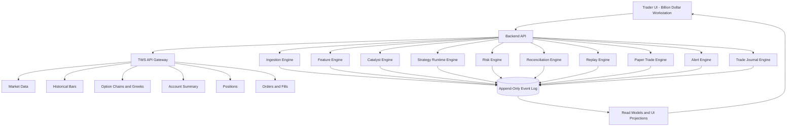
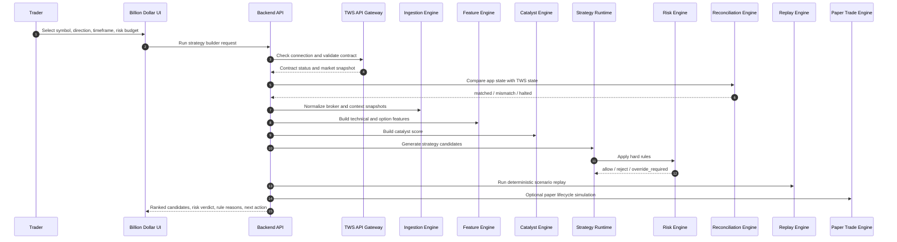
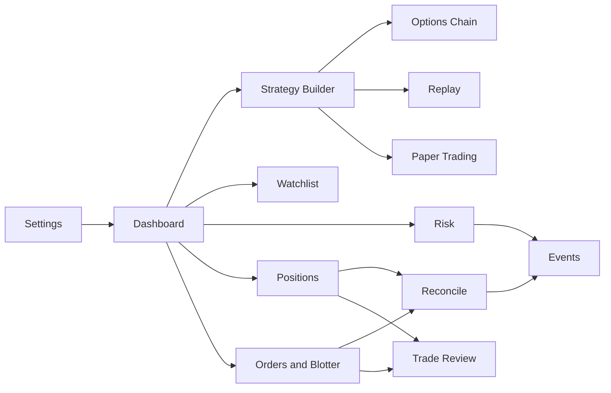
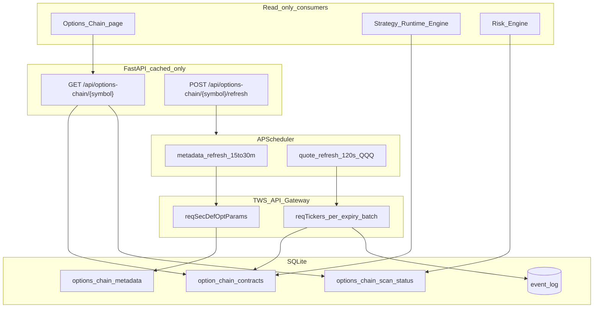
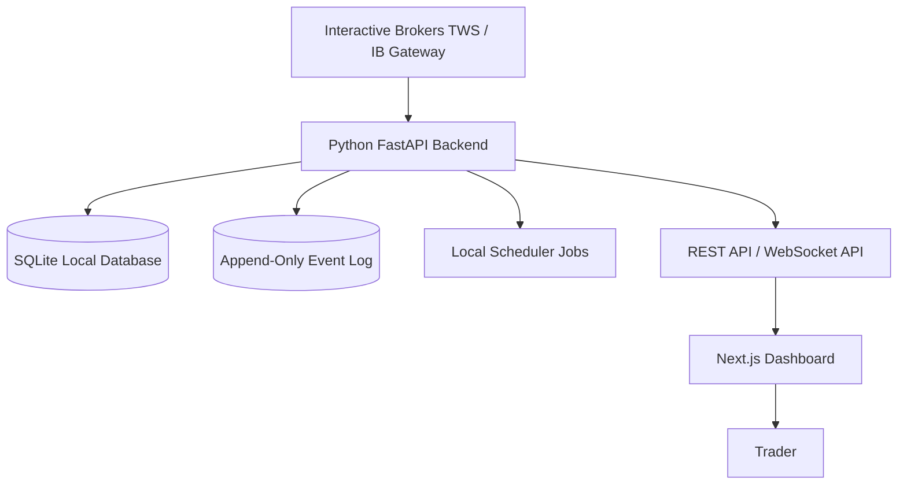

# Billion Dollar Trading App Architecture

## 1. Purpose

Billion Dollar is a U.S. stock and options decision-support platform built around Interactive Brokers TWS API.

It is not an autonomous trading bot. It is a broker-grade trading assistant that helps the user decide what to watch, what to reject, what strategy is valid, what the maximum loss is, and what conditions must be true before entering a trade.

The goal is not to create another noisy stock dashboard. The goal is to build a disciplined trading workstation that behaves like a broker, risk analyst, options strategist, and trade-review assistant combined.

The application must answer these questions clearly:

- What is worth watching today?
- Is the symbol tradable through TWS?
- Is broker data fresh?
- Is the option chain liquid enough?
- Which strategy fits the current setup?
- What is the maximum loss?
- What is the expected reward?
- What is the probability of profit?
- What invalidates the trade?
- What should be rejected and why?
- Are current positions and orders aligned with broker truth?
- What should the user do next: wait, enter, reject, take profit, close, or review?

The app must prefer no trade over a bad trade.

## 2. Core Principle

Billion Dollar must be designed as a human-in-the-loop broker decision system.

The user makes the final decision. The system provides structure, risk checks, strategy ranking, broker validation, replay, paper simulation, and clear explanation.

The system must not produce blind buy/sell calls. Every recommendation must include the trade reason, risk status, maximum loss, entry trigger, invalidation rule, profit plan, and rule reasons.

## 3. Broker Integration: TWS API

The system will use Interactive Brokers TWS API as the primary broker interface.

TWS is the source of broker truth.

If app state disagrees with TWS positions, orders, fills, executions, margin, buying power, or account balance, TWS wins.

If TWS data is stale, disconnected, delayed, or unavailable, the app must not mark a trade as allowed. It should downgrade the output to watch-only, data unavailable, or reject.

### 3.1 TWS API Responsibilities

TWS API should be used for:

- Contract validation
- Market data snapshot
- Streaming market data
- Historical bars
- Option chain discovery
- Option Greeks where available
- Account summary
- Buying power
- Margin details
- Open orders
- Executions
- Fills
- Positions
- Order placement later, only after manual approval is implemented safely

### 3.2 TWS Connectivity Modes

MVP should support:

- TWS paper trading connection
- TWS live connection in read-only mode first
- Localhost connection to TWS or IB Gateway
- Manual approval before any live order placement

Typical TWS API settings:

```text
Host: 127.0.0.1
Paper Port: 7497
Live Port: 7496
Client ID: configurable
Read-only Mode: enabled for early MVP
```

The app should clearly show connection mode in the UI:

```text
Broker: TWS Connected
Mode: Paper
Trading: Manual Approval Required
Data Status: Fresh
Reconciliation: Clean
```

## 4. Trading Scope

### 4.1 Supported Markets

- U.S. stocks
- U.S. ETFs
- U.S. listed options

### 4.2 Supported Trade Types

MVP should support decision recommendations for:

- Long stock
- Long call
- Long put
- Bull call debit spread
- Bear put debit spread
- Watch-only setup
- Reject setup

Later versions may support:

- Covered call
- Cash-secured put
- Protective put
- Collar
- Iron condor
- Earnings-defined risk setup

### 4.3 Preferred Trading Horizon

The main focus is short-term swing trading:

- 2 days to 4 weeks
- Options expiry selection usually 3 to 5 weeks out
- Intraday signals are used for entry timing, not impulse buying

### 4.4 Excluded by Default

The app must reject or hide by default:

- Penny stocks
- Illiquid options
- Contracts with wide bid/ask spreads
- Contracts with low open interest
- Contracts with low option volume
- Setups without clear entry trigger
- Setups without max loss
- Trades blocked by reconciliation mismatch
- Naked short options
- Fully automated live trading

## 5. High-Level Architecture



## 6. End-to-End Decision Flow



## 7. Data Trust Policy

### 7.1 Authoritative Data

TWS API is authoritative for:

- Tradable contract validation
- Market bid, ask, and last price
- Option chain contract availability
- Account buying power
- Margin data
- Positions
- Orders
- Fills
- Executions

### 7.2 Supporting Data

External or derived data can support the decision, but cannot override risk rules.

Supporting data includes:

- Earnings calendar
- Analyst upgrades and downgrades
- News headlines
- Macro events
- Sector sentiment
- Historical volatility
- Relative strength calculations
- Technical indicators

### 7.3 Data Quality Status

Every recommendation should include data status:

| Status | Meaning |
|---|---|
| broker_verified | Validated from TWS |
| fresh | Updated within acceptable window |
| stale | Too old for new entry decision |
| partial | Some fields missing |
| unavailable | Critical data missing |
| fallback | Derived or mock data, not valid for live recommendation |

Hard rule:

If option chain data is fallback or stale, live recommendation must be rejected.

## 8. Backend Services

## 8.1 TWS API Gateway Service

This service owns all communication with TWS API.

Responsibilities:

- Manage TWS connection
- Handle reconnects
- Validate contracts
- Request market data
- Request historical bars
- Request option chains
- Request option Greeks
- Request account summary
- Request open orders
- Request executions
- Request positions
- Normalize TWS responses
- Publish broker snapshot events

The rest of the app should not directly call TWS API. It should call the TWS Gateway Service.

## 8.2 Ingestion Engine

The Ingestion Engine converts raw TWS and context data into normalized snapshots.

Events emitted:

- MarketSnapshotCaptured
- HistoricalBarsCaptured
- OptionsChainSnapshotCaptured
- BrokerAccountSnapshotCaptured
- BrokerPositionSnapshotCaptured
- BrokerOrderSnapshotCaptured
- ContextSnapshotCaptured

## 8.3 Feature Engine

The Feature Engine creates decision-ready features.

Market and technical features:

- Price change percentage
- Gap percentage
- Relative volume
- VWAP position
- 20 EMA position
- 50 SMA position
- 200 SMA position
- RSI
- MACD
- ATR
- Support zone
- Resistance zone
- Breakout status
- Pullback status
- Trend score
- Momentum score

Options features:

- DTE
- Bid/ask spread percentage
- Open interest
- Option volume
- Delta
- Gamma
- Theta
- Vega
- Implied volatility
- IV percentile
- Liquidity score
- Gamma risk score

## 8.4 Catalyst Engine

The Catalyst Engine adds context.

Inputs:

- Earnings date
- Earnings estimate
- Analyst revisions
- News events
- Macro calendar
- Fed events
- CPI, PCE, jobs data
- Sector ETF movement
- AI infrastructure events
- Semiconductor demand events
- Data center demand events

Catalyst score:

| Score | Meaning |
|---|---|
| 0 to 2 | No useful catalyst |
| 3 to 5 | Mild interest |
| 6 to 7 | Tradeable catalyst |
| 8 to 10 | Strong catalyst |

A catalyst improves confidence but must never override risk rejection.

## 8.5 Strategy Runtime Engine

The Strategy Runtime Engine builds candidate strategies.

Candidate types:

- stock_long
- long_call
- long_put
- bull_call_debit_spread
- bear_put_debit_spread
- watch_only
- reject

Each candidate must include:

- Symbol
- Direction
- Strategy type
- Expiry
- Strike or strikes
- Estimated entry debit
- Max loss
- Max profit
- Breakeven
- Reward-to-risk
- Probability of profit
- Expected value
- Technical score
- Catalyst score
- Liquidity score
- Risk score
- Final strategy score

## 8.6 Risk Engine

The Risk Engine decides whether a candidate is allowed, rejected, or requires manual override.

Possible risk statuses:

- allow
- reject
- override_required

### Hard Rejection Rules

Reject if:

- TWS is disconnected
- Broker data is stale
- Contract is not TWS validated
- Option chain is stale or missing
- Bid/ask spread is too wide
- Open interest is too low
- Option volume is too low
- DTE is below minimum
- Max loss exceeds risk budget
- Reward-to-risk is below minimum
- Probability of profit is below minimum
- Buying power is insufficient
- Reconciliation mismatch is active
- Trading halt flag is active
- Strategy is not approved
- Earnings risk violates configured rule

### Override Required Rules

Require manual override if:

- Gamma risk is high
- Earnings is close but trade is defined-risk
- IV is elevated but strategy is controlled
- Technical confirmation is incomplete
- Correlated portfolio exposure is high
- User is increasing size near max risk limit

### Allow Rules

Allow only if:

- TWS data is fresh
- Contract is validated
- Option liquidity is acceptable
- Max loss is inside risk budget
- Strategy has defined exit plan
- Reconciliation is clean
- Entry trigger is defined
- Invalidation rule is defined
- Profit-taking plan is defined

## 8.7 Reconciliation Engine

The Reconciliation Engine compares app state with TWS broker truth.

Inputs:

- Internal positions
- Internal orders
- Internal fills
- TWS positions
- TWS open orders
- TWS executions
- TWS account summary

Output:

```json
{
  "status": "matched",
  "mismatch_count": 0,
  "trading_halt": false,
  "last_checked_at": "2026-06-03T09:45:00-04:00"
}
```

If mismatch exists:

- Block new live entries
- Show mismatch reason
- Allow close-only workflow if needed
- Require broker refresh or manual resolution
- Emit MismatchDetected event
- Emit TradingHaltEvent if mismatch persists

## 8.8 Replay Engine

Replay tests strategy robustness before the trader trusts it.

Scenarios:

- Underlying moves up 1 ATR
- Underlying moves down 1 ATR
- Underlying remains flat
- IV expands
- IV crushes
- Time decay after 1 day
- Time decay after 1 week
- Gap up
- Gap down

Replay output:

```json
{
  "symbol": "MU",
  "strategy": "bull_call_debit_spread",
  "average_pnl": 142.50,
  "worst_case_pnl": -210.00,
  "best_case_pnl": 390.00,
  "verdict": "acceptable"
}
```

## 8.9 Paper Trade Engine

Paper Trade Engine validates the lifecycle without risking money.

Events:

- OrderIntentCreated
- BrokerOrderEvent
- FillEvent
- PositionOpened
- PositionAdjusted
- PositionClosed

Paper result:

```json
{
  "symbol": "MU",
  "strategy": "bull_call_debit_spread",
  "entry_cost": 210.00,
  "exit_value": 278.00,
  "realized_pnl": 68.00,
  "realized_pnl_pct": 32.38,
  "status": "closed"
}
```

## 9. Scoring Model

Scores help ranking, but they do not override risk.

Score components:

| Component | Weight |
|---|---|
| Technical score | 25% |
| Options liquidity score | 20% |
| Risk/reward score | 20% |
| Catalyst score | 15% |
| Market regime score | 10% |
| Portfolio fit score | 10% |

Score meaning:

| Score | Meaning |
|---|---|
| 85 to 100 | Strong candidate if risk allows |
| 70 to 84 | Good candidate, needs clean entry |
| 55 to 69 | Watch only |
| 40 to 54 | Weak setup |
| Below 40 | Avoid |

Important rule:

A score of 95 with risk_status reject is still a reject.

## 10. Event-Driven Storage Model

The app should use append-only events for auditability.

Event groups:

| Event Group | Events |
|---|---|
| Broker | TWSConnectionChanged, BrokerAccountSnapshotCaptured, BrokerPositionSnapshotCaptured |
| Market Data | MarketSnapshotCaptured, HistoricalBarsCaptured, OptionsChainSnapshotCaptured |
| Features | SymbolFeatureSnapshotBuilt |
| Strategy | StrategyCandidateGenerated, CandidateSignal |
| Risk | RiskDecision, ApprovalDecision |
| Reconciliation | ReconcileSnapshot, MismatchDetected, TradingHaltEvent |
| Paper Trading | OrderIntentCreated, BrokerOrderEvent, FillEvent, PositionOpened, PositionClosed |
| Review | TradeReviewed, LessonCaptured |

Storage choices:

MVP:

- SQLite or PostgreSQL
- Redis cache
- Local event log
- Read models for UI

Production:

- PostgreSQL
- Redis
- Kafka or Redpanda if needed
- Object storage for historical snapshots
- Prometheus, Grafana, Loki for observability

## 11. API Response Contract

Every recommendation response must be structured.

```json
{
  "as_of": "2026-06-03T09:45:00-04:00",
  "broker": {
    "name": "Interactive Brokers TWS API",
    "connection_status": "connected",
    "mode": "paper",
    "data_status": "fresh"
  },
  "reconciliation": {
    "status": "matched",
    "mismatch_count": 0,
    "trading_halt": false
  },
  "market_state": {
    "spy_bias": "Bullish",
    "qqq_bias": "Bullish",
    "vix_state": "Calm",
    "overall_sentiment": "Risk-on"
  },
  "selected_symbol": {
    "symbol": "MU",
    "last": 128.40,
    "bid": 128.30,
    "ask": 128.45,
    "volume": 32800000,
    "data_status": "broker_verified"
  },
  "top_candidate": {
    "rank": 1,
    "symbol": "MU",
    "strategy": "bull_call_debit_spread",
    "bias": "Bullish",
    "score": 86,
    "risk_status": "allow",
    "max_loss": 210,
    "max_profit": 390,
    "breakeven": 130.10,
    "probability_profit": 0.57,
    "expected_value": 142.50,
    "entry_trigger": "Enter only after resistance break with volume above 1.5x average or VWAP pullback hold.",
    "invalidation": "Exit if price closes below 20 EMA or loses VWAP with heavy selling.",
    "profit_plan": "Take partial profit at 30% to 50% gain.",
    "rule_reasons": [
      "TWS data is fresh.",
      "Contract is TWS validated.",
      "Bid/ask spread is acceptable.",
      "Open interest and volume are acceptable.",
      "Max loss is within configured risk budget.",
      "Reconciliation status is clean."
    ]
  }
}
```

## 12. UI Architecture

The UI should look like a broker workstation, not a toy dashboard.

The main design should be dense but clean, similar to a professional trading terminal, but with clearer explanations and risk verdicts.

## 13. Global UI Shell

The global shell must be visible on every page.

```text
+------------------------------------------------------------------------------------------------+
| BILLION DOLLAR                    Broker: TWS Connected       Mode: Paper                      |
| Time: 2026-06-03 09:45 ET          Reconcile: Clean            Buying Power: 38,420             |
| Market: Risk-on                    Risk Used Today: 0.8%        Trading: Manual Approval         |
+------------------------------------------------------------------------------------------------+
| Dashboard | Strategy Builder | Watchlist | Options Chain | Risk | Positions | Blotter | Reconcile |
| Replay | Paper Trading | Trade Review | Events | Settings                                             |
+------------------------------------------------------------------------------------------------+
```

Global shell rules:

- Broker status must always be visible.
- Reconciliation status must always be visible.
- Trading mode must always be visible.
- Buying power and risk used today must always be visible.
- If reconciliation is halted, the header must clearly show that new entries are blocked.

## 14. UI Page Map



## 15. Dashboard Page

The Dashboard page is the command center.

It should answer:

- What is the market mode?
- What are the top valid setups?
- What is rejected and why?
- Are there broker or reconciliation issues?
- What needs action now?

### Dashboard Wireframe

```text
+------------------------------------------------------------------------------------------------+
| DASHBOARD                                                                                      |
+------------------------------------------------------------------------------------------------+
| Market Regime: Risk-on | SPY: Bullish | QQQ: Bullish | VIX: Calm | TWS: Fresh | Reconcile: Clean |
+------------------------------------------------------------------------------------------------+
| WATCHLIST              | TOP VALID SETUPS                         | REJECTED / BLOCKED           |
|------------------------|------------------------------------------|------------------------------|
| QQQ    Bullish Watch   | 1. MU    Score 86   Bull Call Spread     | XYZ Reject: Low OI           |
| MU     Strong Bullish  | 2. QQQ   Score 78   Call Debit Spread    | ABC Reject: Wide spread      |
| NVDA   Watch Pullback  | 3. DELL  Score 74   Stock / Call Spread  | DEF Reject: Stale TWS data   |
| DELL   Breakout Watch  | 4. AVGO  Score 71   Watch Pullback       |                              |
+------------------------------------------------------------------------------------------------+
| ACTION CENTER                                                                                  |
| - MU setup is allowed for defined-risk spread.                                                 |
| - NVDA is watch-only until VWAP reclaim.                                                       |
| - One rejected option contract has low open interest.                                          |
| - No reconciliation mismatch.                                                                  |
+------------------------------------------------------------------------------------------------+
```

### Dashboard Example Output

```text
Billion Dollar Dashboard Summary

Market mode is risk-on. TWS data is fresh and reconciliation is clean.

Top valid setup is MU with score 86. The preferred strategy is a bull call debit spread because the setup is bullish, option liquidity is acceptable, and max loss is controlled.

QQQ is valid as a call debit spread only after VWAP hold or resistance break.

NVDA is watch-only. The theme is strong, but entry is not clean yet.

Rejected setups are blocked due to low open interest, wide spread, or stale TWS data.
```

## 16. Strategy Builder Page

The Strategy Builder is the most important screen.

It should answer:

- Can this symbol be traded?
- Which strategy is best?
- What is the maximum loss?
- Why is a strategy allowed, rejected, or override-required?
- What entry condition must happen first?

### Strategy Builder Wireframe

```text
+------------------------------------------------------------------------------------------------+
| STRATEGY BUILDER                                                                               |
+------------------------------------------------------------------------------------------------+
| Symbol: MU     Direction: Bullish     Timeframe: 2-4 weeks     Risk Budget: 1.0%                |
| TWS Contract: Valid               Data: Fresh                  Reconcile: Clean                 |
+------------------------------------------------------------------------------------------------+
| MARKET SNAPSHOT                  | TECHNICALS                     | CATALYST                     |
|----------------------------------|--------------------------------|------------------------------|
| Last: 128.40                     | VWAP: Above                    | AI memory demand: Strong     |
| Bid/Ask: 128.30 / 128.45         | 20 EMA: Above                  | Earnings risk: Medium        |
| Volume: 32.8M                    | RSI: 62                        | Sector: Semis bullish        |
| Relative Volume: 1.7x            | Breakout: Pending              | Catalyst Score: 82           |
+------------------------------------------------------------------------------------------------+
| STRATEGY CANDIDATES                                                                            |
| Strategy                   Expiry      Max Loss   Max Profit  POP    Score   Risk Status        |
| Bull Call Debit Spread      3-5 weeks   210        390         57%    86      allow              |
| Long Call                   3-5 weeks   480        unlimited   42%    69      override_required  |
| Stock Long                  n/a         rule-based rule-based  n/a    72      allow              |
+------------------------------------------------------------------------------------------------+
| SELECTED RECOMMENDATION                                                                        |
| Preferred: Bull Call Debit Spread                                                              |
| Entry: Break resistance with volume above 1.5x or pullback and hold VWAP.                       |
| Invalidation: Close below 20 EMA or lose VWAP with heavy selling.                               |
| Profit: Take partial at 30% to 50% gain.                                                       |
+------------------------------------------------------------------------------------------------+
| RISK RULE REASONS                                                                              |
| - TWS data is fresh.                                                                           |
| - Contract is TWS validated.                                                                   |
| - Bid/ask spread is acceptable.                                                               |
| - Open interest and volume are acceptable.                                                     |
| - Max loss is within risk budget.                                                             |
| - Reconciliation status is clean.                                                             |
+------------------------------------------------------------------------------------------------+
```

### Strategy Builder Example Output

```text
Billion Dollar Trade Decision

Symbol: MU
Final decision: Allowed for defined-risk strategy only.
Preferred strategy: Bull call debit spread.

Why:
MU has bullish technical structure, strong relative volume, acceptable options liquidity, and a positive catalyst backdrop. A naked long call has higher premium exposure and lower probability of profit. A bull call debit spread gives controlled downside and cleaner reward-to-risk.

Risk:
Max loss is 210. Max profit is 390. Probability of profit is 57%. Expected value is 142.50.

Entry:
Enter only if MU breaks above resistance with volume above 1.5x average or pulls back to VWAP and holds.

Invalidation:
Exit if MU closes below the 20 EMA or loses VWAP with heavy selling volume.
```

## 17. Watchlist Page

The Watchlist page should show symbol-level status without forcing the user to open every chart.

It should answer:

- Which symbols are active?
- Which ones are valid now?
- Which are watch-only?
- Which are blocked?
- Which have upcoming events?

### Watchlist Wireframe

```text
+------------------------------------------------------------------------------------------------+
| WATCHLIST                                                                                      |
+------------------------------------------------------------------------------------------------+
| Filter: All | Valid | Watch Only | Rejected | Earnings Soon | High Volume | High IV              |
+------------------------------------------------------------------------------------------------+
| Symbol | Bias            | Score | Status       | Event Risk | TWS Data | Preferred Action      |
|--------|-----------------|-------|--------------|------------|----------|-----------------------|
| MU     | Strong Bullish  | 86    | allow        | Medium     | Fresh    | Build spread          |
| QQQ    | Bullish Watch   | 78    | watch_only   | Low        | Fresh    | Wait for VWAP hold    |
| NVDA   | Watch Pullback  | 74    | watch_only   | Medium     | Fresh    | Wait for pullback     |
| DELL   | Breakout Watch  | 71    | watch_only   | Low        | Fresh    | Watch breakout        |
| XYZ    | Weak            | 31    | reject       | High       | Fresh    | Avoid                 |
+------------------------------------------------------------------------------------------------+
```

### Watchlist Example Output

```text
MU is currently the strongest watchlist symbol. It has an allowed defined-risk setup.

QQQ and NVDA are watch-only because entry confirmation is not complete.

XYZ is rejected because option liquidity is poor and the setup does not meet risk rules.
```

## 18. Options Chain Page

The Options Chain page should not merely show contracts. It should explain quality.

It should answer:

- Which expiry is usable?
- Which strikes are liquid?
- Which contracts are too wide?
- Which contract pair forms the cleanest spread?

### Options Chain Wireframe

```text
+------------------------------------------------------------------------------------------------+
| OPTIONS CHAIN: MU                                                                              |
+------------------------------------------------------------------------------------------------+
| Expiry Filter: 3-5 weeks | Strategy: Bull Call Spread | Min OI: 500 | Max Spread: 8%            |
+------------------------------------------------------------------------------------------------+
| Expiry     | Strike | Type | Bid  | Ask  | Spread % | OI    | Volume | Delta | IV   | Status     |
|------------|--------|------|------|------|----------|-------|--------|-------|------|------------|
| 2026-07-10 | 130    | Call | 4.10 | 4.25 | 3.6%     | 5200  | 1800   | 0.52  | 48%  | usable     |
| 2026-07-10 | 135    | Call | 2.15 | 2.25 | 4.5%     | 4100  | 1250   | 0.38  | 50%  | usable     |
| 2026-07-10 | 145    | Call | 0.55 | 0.75 | 30.8%    | 140   | 60     | 0.14  | 61%  | reject     |
+------------------------------------------------------------------------------------------------+
| SPREAD BUILDER                                                                                 |
| Buy 130C / Sell 135C | Debit: 2.10 | Max Loss: 210 | Max Profit: 290 | Breakeven: 132.10        |
+------------------------------------------------------------------------------------------------+
```

### Options Chain Example Output

```text
The 130C and 135C contracts are usable because bid/ask spread, open interest, and volume pass the liquidity rules.

The 145C is rejected because the bid/ask spread is too wide and open interest is too low.

Preferred spread: Buy 130C and sell 135C. Estimated debit is 2.10, max loss is 210, and breakeven is 132.10.
```

## 18.1 QQQ Options Chain Scanner Design

The Options Chain page and Strategy Builder must read **cached** option-chain snapshots from SQLite. Full chain fetching never runs inside a synchronous FastAPI request.

### Scanner flow



### Non-negotiable rules

1. Frontend never calls TWS; only backend REST.
2. `GET /api/options-chain/{symbol}` returns cache only; `POST .../refresh` enqueues background work and returns immediately.
3. Metadata discovery uses **`reqSecDefOptParams` only** — no broad `reqContractDetails` sweeps for full-chain discovery.
4. Metadata cached in `options_chain_metadata`; refresh at startup and every `metadata_refresh_minutes` (15–30).
5. Quote scan starts with **QQQ** (`options_chain.symbols` in `config.yaml`); other symbols keep legacy ingestion until enabled.
6. **Bounded MVP subset only** — do not scan the full dense QQQ chain:
   - DTE filter: **14–42 days** (2–6 weeks).
   - **Max 4 expiries** within that window (nearest first).
   - **8 listed $5 strikes below** spot and **12 listed $5 strikes above** spot (IBKR secdef only; exact $5 multiples).
   - Calls and puts; target **~100–200 contracts** per cycle.
   - **Hard cap 200** contracts per scan (`max_contracts_per_scan`); truncate expiries first, then widen interval — never blindly overrun.
7. Batch by expiry; **one expiry at a time**; **5 seconds** between expiry batches (`batch_delay_seconds`); full cycle ~**45–60 seconds**.
8. Quote refresh cycle ~**120 seconds** (`refresh_seconds`) when TWS connected and scanner enabled.
9. Quotes persisted to SQLite before Strategy Runtime reads them.
10. Risk Engine rejects strategies when chain snapshot is **stale, partial, unavailable, or fallback**.
11. Scanner status: `idle | scanning | fresh | stale | partial | failed`.
12. Missing Greeks/OI/volume must not crash the scanner; store what is available.
13. MVP remains paper-only and TWS read-only; degrade safely when disconnected.

### Scanner events

- `OptionsChainMetadataRefreshed`
- `OptionsChainScanStarted`
- `OptionsChainExpiryBatchScanned`
- `OptionsChainSnapshotCaptured`
- `OptionsChainScanFailed`

### API routes

```text
GET  /api/options-chain/{symbol}          # cached contracts + scanner status
POST /api/options-chain/{symbol}/refresh  # enqueue background scan, return immediately
```

### Configuration (`backend/config.yaml`)

```yaml
options_chain:
  enabled: true
  symbols: ["QQQ"]
  default_symbol: "QQQ"
  min_dte: 14
  max_dte: 42
  max_expiries: 4
  strikes_below: 8
  strikes_above: 12
  strike_interval: 5
  max_contracts_per_scan: 200
  allow_exceed_max_contracts: false
  batch_delay_seconds: 5
  refresh_seconds: 120
  metadata_refresh_minutes: 20
  max_spread_pct: 0.08
  min_open_interest: 500
  min_volume: 100
```

## 19. Risk Page

The Risk page should show exactly why trades are allowed or blocked.

It should answer:

- What rules are active?
- Which trades were rejected?
- Which trades require override?
- What is account-level exposure?

### Risk Page Wireframe

```text
+------------------------------------------------------------------------------------------------+
| RISK                                                                                            |
+------------------------------------------------------------------------------------------------+
| Account Risk Used Today: 0.8% | Max Per Trade: 1.0% | Open Option Risk: 2.4% | Halt: No         |
+------------------------------------------------------------------------------------------------+
| ACTIVE RISK RULES                                                                              |
| Rule                         | Limit                 | Status                                         |
|------------------------------|-----------------------|------------------------------------------------|
| Max loss per trade            | 1.0% account          | active                                         |
| Max bid/ask spread            | 8%                    | active                                         |
| Minimum open interest         | 500                   | active                                         |
| Minimum option volume         | 100                   | active                                         |
| Reconciliation block          | block on mismatch     | active                                         |
+------------------------------------------------------------------------------------------------+
| RECENT RISK DECISIONS                                                                          |
| Symbol | Strategy              | Status             | Reason                                         |
|--------|-----------------------|--------------------|------------------------------------------------|
| MU     | Bull Call Spread      | allow              | Max loss within budget                         |
| NVDA   | Long Call             | override_required  | High premium and gamma risk                    |
| XYZ    | Long Call             | reject             | Low OI and wide spread                         |
+------------------------------------------------------------------------------------------------+
```

### Risk Page Example Output

```text
Risk status is healthy. No trading halt is active.

MU passed all hard rules. NVDA requires override because the long call has high premium and gamma risk. XYZ is rejected because liquidity is below minimum threshold.
```

## 20. Positions Page

The Positions page should show current broker-aligned exposure.

It should answer:

- What do I hold?
- Is the position matched with TWS?
- What is the P/L?
- What is the exit rule?
- Should I hold, reduce, or close?

### Positions Wireframe

```text
+------------------------------------------------------------------------------------------------+
| POSITIONS                                                                                      |
+------------------------------------------------------------------------------------------------+
| Broker Source: TWS | Reconcile: Clean | Total Unrealized P/L: +1,240 | Option Risk Open: 2.4%   |
+------------------------------------------------------------------------------------------------+
| Symbol | Instrument | Strategy          | Qty | Avg Cost | Current | P/L   | Status | Exit Rule     |
|--------|------------|-------------------|-----|----------|---------|-------|--------|---------------|
| MU     | Option     | Bull Call Spread  | 1   | 2.10     | 2.78    | +32%  | hold   | Exit < 20 EMA |
| QQQ    | Option     | Call Spread       | 1   | 3.40     | 3.10    | -9%   | hold   | Exit VWAP loss|
| DELL   | Stock      | Long              | 50  | 142.00   | 147.20  | +260  | hold   | Trail support |
+------------------------------------------------------------------------------------------------+
```

### Positions Example Output

```text
All positions match TWS.

MU is up 32%, so the app recommends partial profit according to the original plan. QQQ is down 9%, but the exit rule has not triggered because VWAP remains valid. DELL remains a hold while support is intact.
```

## 21. Orders and Blotter Page

The Blotter page should show order lifecycle and execution history.

It should answer:

- What orders were submitted?
- What filled?
- What was rejected?
- Which strategy decision created the order?

### Blotter Wireframe

```text
+------------------------------------------------------------------------------------------------+
| ORDERS AND BLOTTER                                                                             |
+------------------------------------------------------------------------------------------------+
| Filter: Today | Open | Filled | Rejected | Cancelled | Paper | Live Read-Only                  |
+------------------------------------------------------------------------------------------------+
| Time     | Symbol | Strategy         | Side | Qty | Limit | Fill | TWS Order ID | Status          |
|----------|--------|------------------|------|-----|-------|------|--------------|-----------------|
| 09:48 ET | MU     | Bull Call Spread | Buy  | 1   | 2.10  | 2.10 | 101928       | Filled Paper    |
| 10:15 ET | NVDA   | Long Call        | Buy  | 1   | 8.20  | -    | -            | Blocked Risk    |
| 10:40 ET | QQQ    | Call Spread      | Buy  | 1   | 3.40  | 3.40 | 101929       | Filled Paper    |
+------------------------------------------------------------------------------------------------+
```

### Blotter Example Output

```text
MU paper order filled at the planned debit. NVDA order was blocked before submission because risk status was override_required. QQQ paper order filled and is now visible in positions.
```

## 22. Reconcile Page

The Reconcile page is critical. It prevents the app from trusting its own fantasy over the broker.

It should answer:

- Do app positions match TWS?
- Do app orders match TWS?
- Do app fills match TWS?
- Is trading halted?

### Reconcile Wireframe

```text
+------------------------------------------------------------------------------------------------+
| RECONCILE                                                                                      |
+------------------------------------------------------------------------------------------------+
| Status: Clean | Last Checked: 09:45 ET | Trading Halt: No | Close-Only Mode: No                |
+------------------------------------------------------------------------------------------------+
| CHECK                  | APP STATE        | TWS STATE        | RESULT                            |
|------------------------|------------------|------------------|-----------------------------------|
| Positions              | 3                | 3                | matched                           |
| Open Orders            | 0                | 0                | matched                           |
| Fills Today            | 2                | 2                | matched                           |
| Buying Power           | 38,420           | 38,420           | matched                           |
+------------------------------------------------------------------------------------------------+
| MISMATCH DETAILS                                                                               |
| None                                                                                           |
+------------------------------------------------------------------------------------------------+
```

### Reconcile Example Output

```text
Reconciliation is clean. App positions, open orders, fills, and buying power match TWS.

New entries are allowed because no trading halt is active.
```

## 23. Replay Page

The Replay page should show strategy robustness before the trade is trusted.

It should answer:

- What happens if the underlying moves up?
- What happens if it moves down?
- What happens if time decay hurts the position?
- What is the worst-case scenario?

### Replay Wireframe

```text
+------------------------------------------------------------------------------------------------+
| REPLAY: MU Bull Call Debit Spread                                                              |
+------------------------------------------------------------------------------------------------+
| Entry Debit: 2.10 | Max Loss: 210 | Max Profit: 390 | Expiry: 3-5 weeks                    |
+------------------------------------------------------------------------------------------------+
| Scenario                    | Estimated P/L | Verdict                                               |
|-----------------------------|---------------|-------------------------------------------------------|
| Underlying up 1 ATR          | +260          | good                                                  |
| Underlying down 1 ATR        | -180          | acceptable within max loss                            |
| Flat after 1 week            | -75           | acceptable time decay                                 |
| IV crush                     | -95           | acceptable because spread limits Vega risk            |
| Gap down                     | -210          | max loss reached                                      |
+------------------------------------------------------------------------------------------------+
| Replay Summary: Average P/L +142.50 | Worst Case -210 | Best Case +390                         |
+------------------------------------------------------------------------------------------------+
```

### Replay Example Output

```text
Replay is acceptable. Worst-case loss stays inside the defined max loss of 210. Time decay is manageable because the strategy is a debit spread, not a naked long call.
```

## 24. Paper Trading Page

The Paper Trading page validates the lifecycle without real money.

It should answer:

- What would the order look like?
- What would the fill look like?
- What would the P/L be?
- Did the strategy behave as expected?

### Paper Trading Wireframe

```text
+------------------------------------------------------------------------------------------------+
| PAPER TRADING                                                                                  |
+------------------------------------------------------------------------------------------------+
| Strategy: MU Bull Call Debit Spread | Mode: Paper | Manual Approval: Required                 |
+------------------------------------------------------------------------------------------------+
| ORDER PREVIEW                                                                                  |
| Buy 1 MU 130C / Sell 1 MU 135C | Debit: 2.10 | Max Loss: 210 | Max Profit: 290              |
+------------------------------------------------------------------------------------------------+
| PAPER LIFECYCLE                                                                                |
| Event                 | Time     | Status                                                               |
|-----------------------|----------|----------------------------------------------------------------------|
| OrderIntentCreated    | 09:47 ET | created                                                              |
| BrokerOrderEvent      | 09:48 ET | accepted                                                             |
| FillEvent             | 09:48 ET | filled at 2.10                                                       |
| PositionOpened        | 09:48 ET | active                                                               |
| PositionClosed        | 14:20 ET | closed at 2.78                                                       |
+------------------------------------------------------------------------------------------------+
| RESULT: Realized P/L +68 | Realized P/L % +32.38%                                             |
+------------------------------------------------------------------------------------------------+
```

### Paper Trading Example Output

```text
Paper trade completed successfully. The spread opened at 2.10 and closed at 2.78, producing a 32.38% gain. The result should be saved into Trade Review for learning.
```

## 25. Trade Review Page

The Trade Review page converts trades into learning.

It should answer:

- Was the entry valid?
- Was the exit valid?
- Did the user follow the plan?
- What should be repeated or avoided?

### Trade Review Wireframe

```text
+------------------------------------------------------------------------------------------------+
| TRADE REVIEW                                                                                   |
+------------------------------------------------------------------------------------------------+
| Symbol: MU | Strategy: Bull Call Debit Spread | Result: +32.38% | Plan Followed: Yes             |
+------------------------------------------------------------------------------------------------+
| ENTRY REVIEW                                                                                   |
| Entry trigger met: Yes                                                                         |
| VWAP held: Yes                                                                                 |
| Volume confirmation: Yes                                                                       |
| Risk within budget: Yes                                                                        |
+------------------------------------------------------------------------------------------------+
| EXIT REVIEW                                                                                    |
| Profit plan followed: Partial profit at 30% to 50% gain                                        |
| Exit quality: Good                                                                             |
+------------------------------------------------------------------------------------------------+
| LESSON                                                                                         |
| This was a valid defined-risk trade. Repeat this setup when catalyst, technicals, and liquidity |
| align. Avoid converting this into a naked long call unless risk rules improve.                  |
+------------------------------------------------------------------------------------------------+
```

### Trade Review Example Output

```text
This was a good trade. Entry matched the plan, volume confirmed the breakout, and risk stayed within the defined budget. The lesson is to repeat this type of defined-risk spread when the setup aligns.
```

## 26. Events Page

The Events page is the audit trail.

It should answer:

- What happened?
- When did it happen?
- Which engine produced it?
- Which trade or symbol is linked?

### Events Wireframe

```text
+------------------------------------------------------------------------------------------------+
| EVENTS                                                                                         |
+------------------------------------------------------------------------------------------------+
| Filter: All | Broker | Market Data | Strategy | Risk | Reconcile | Paper | Review              |
+------------------------------------------------------------------------------------------------+
| Time     | Event Type                    | Symbol | Source Engine       | Summary                  |
|----------|-------------------------------|--------|---------------------|--------------------------|
| 09:44 ET | TWSConnectionChanged           | -      | TWS Gateway         | connected                |
| 09:45 ET | MarketSnapshotCaptured         | MU     | Ingestion Engine    | fresh broker snapshot    |
| 09:46 ET | StrategyCandidateGenerated     | MU     | Strategy Runtime    | 3 candidates generated   |
| 09:46 ET | RiskDecision                   | MU     | Risk Engine         | spread allowed           |
| 09:48 ET | FillEvent                      | MU     | Paper Engine        | filled at 2.10           |
+------------------------------------------------------------------------------------------------+
```

### Events Example Output

```text
The audit trail shows that TWS connected first, then market data was captured, the strategy was generated, risk allowed the spread, and the paper order filled at 2.10.
```

## 27. Settings Page

The Settings page controls user-level risk and TWS connectivity.

It should answer:

- Which TWS mode is active?
- What risk limits are configured?
- Which strategies are enabled?
- What data freshness rules apply?

### Settings Wireframe

```text
+------------------------------------------------------------------------------------------------+
| SETTINGS                                                                                       |
+------------------------------------------------------------------------------------------------+
| TWS CONNECTION                                                                                 |
| Host: 127.0.0.1 | Paper Port: 7497 | Live Port: 7496 | Client ID: 11 | Mode: Paper              |
+------------------------------------------------------------------------------------------------+
| RISK SETTINGS                                                                                  |
| Max risk per trade: 1.0%                                                                       |
| Max option exposure: 5.0%                                                                      |
| Max bid/ask spread: 8%                                                                         |
| Minimum open interest: 500                                                                     |
| Minimum option volume: 100                                                                     |
+------------------------------------------------------------------------------------------------+
| ENABLED STRATEGIES                                                                             |
| Long Stock: Enabled                                                                            |
| Long Call: Enabled with override rules                                                         |
| Long Put: Enabled with override rules                                                          |
| Bull Call Debit Spread: Enabled                                                                |
| Bear Put Debit Spread: Enabled                                                                 |
| Naked Short Options: Disabled                                                                  |
+------------------------------------------------------------------------------------------------+
```

### Settings Example Output

```text
The app is configured for TWS paper mode. Maximum risk per trade is 1% of account value. Naked short options are disabled. New entries are blocked automatically if TWS data is stale or reconciliation mismatch is active.
```

## 28. UI Priority Order

Build UI pages in this order:

1. Global shell
2. Dashboard
3. Strategy Builder
4. Options Chain
5. Risk
6. Positions
7. Orders and Blotter
8. Reconcile
9. Replay
10. Paper Trading
11. Trade Review
12. Events
13. Settings
14. Watchlist polish and filters

## 36. Recommended Local Technology Stack

Billion Dollar will run on the user's local laptop first. The stack must be simple, reliable, and easy for Cursor to implement incrementally.

Python must remain the backend and trading logic language.

### 36.1 Final Recommended Stack

| Layer | Recommended Choice | Reason |
|---|---|---|
| Backend language | Python 3.11 or 3.12 | Best fit for TWS API, analytics, options logic, data processing, and local automation |
| Backend API | FastAPI | Simple, typed, fast enough, easy local API docs, good for Cursor-generated services |
| TWS integration | ib_insync first, native ibapi only if needed | `ib_insync` is easier and cleaner for local development; native `ibapi` can be added for lower-level control later |
| Frontend | Next.js with TypeScript | Best balance of clean UI, routing, dashboard pages, component reuse, and local development |
| UI components | shadcn/ui or plain Tailwind components | Good table/card/dialog/drawer support without heavy custom UI work |
| Styling | Tailwind CSS | Fast dashboard styling and easy dark terminal-style layout |
| Charts | Lightweight Charts for price charts, Recharts for summary charts | TradingView Lightweight Charts is better for candlesticks; Recharts is fine for simple metrics |
| Local database | SQLite for MVP | Zero local setup, easy to inspect, good enough for laptop mode |
| Production-ready database option | PostgreSQL | Use later if data volume or multi-user deployment grows |
| ORM / migrations | SQLModel or SQLAlchemy + Alembic | Typed models and controlled schema changes |
| Background jobs | APScheduler for MVP | Simple local scheduled polling for TWS, reconciliation, and snapshot refresh |
| Cache | In-memory first, Redis optional later | Avoid extra local services until needed |
| Event log | SQLite append-only `events` table | Simple, auditable, replayable |
| Local config | `.env` and `config.yaml` | TWS host, ports, risk rules, strategy limits, watchlist settings |
| Local packaging | Docker optional, native local run preferred first | TWS desktop integration is easier when running locally |
| Testing | pytest for backend, Playwright later for UI | Backend correctness matters first |

### 36.2 Why This Stack

The first version should optimize for local correctness, broker safety, and fast iteration.

Do not overbuild with Kafka, Kubernetes, microservices, or cloud deployment in the first version. That would be architectural cosplay. The user needs a working local trading workstation, not a distributed system pretending to be a hedge fund.

Use a modular monolith first:

- One Python backend
- One Next.js frontend
- One local SQLite database
- One local TWS connection
- One event log
- Clear service modules inside the backend

This keeps the app easy to run, debug, and extend.

## 37. Local Laptop Runtime Architecture

The MVP should run locally on the user's laptop beside TWS or IB Gateway.



### 37.1 Local Ports

Suggested local ports:

| Service | Port |
|---|---:|
| TWS paper trading API | 7497 |
| TWS live trading API | 7496 |
| FastAPI backend | 8000 |
| Next.js frontend | 3000 |

### 37.2 Local Run Commands

Cursor should make the app runnable with simple commands.

Backend:

```bash
cd backend
python -m venv .venv
source .venv/bin/activate
pip install -r requirements.txt
uvicorn app.main:app --reload --port 8000
```

Frontend:

```bash
cd frontend
npm install
npm run dev
```

Optional all-in-one helper:

```bash
make dev
```

## 38. Recommended Repository Structure

Cursor should organize the app as a clean local monorepo.

```text
Billion_Dollars/
  README.md
  Billion Dollar Architecture.md
  .env.example
  config/
    config.yaml
    risk_rules.yaml
    watchlist.yaml
  backend/
    requirements.txt
    pyproject.toml
    app/
      main.py
      core/
        config.py
        logging.py
        time.py
      api/
        routes_health.py
        routes_tws.py
        routes_dashboard.py
        routes_strategy_builder.py
        routes_options_chain.py
        routes_risk.py
        routes_positions.py
        routes_blotter.py
        routes_reconcile.py
        routes_replay.py
        routes_paper.py
        routes_events.py
        routes_settings.py
      broker/
        tws_client.py
        contracts.py
        market_data.py
        option_chain.py
        account.py
        orders.py
        positions.py
      engines/
        ingestion_engine.py
        feature_engine.py
        market_regime_engine.py
        catalyst_engine.py
        strategy_runtime_engine.py
        risk_engine.py
        reconciliation_engine.py
        replay_engine.py
        paper_trade_engine.py
        alert_engine.py
        trade_review_engine.py
      models/
        broker_models.py
        market_models.py
        option_models.py
        strategy_models.py
        risk_models.py
        event_models.py
        ui_models.py
      storage/
        database.py
        repositories.py
        event_store.py
        migrations/
      tests/
        test_risk_engine.py
        test_strategy_runtime.py
        test_reconciliation.py
        test_tws_contract_mapping.py
  frontend/
    package.json
    next.config.js
    tsconfig.json
    src/
      app/
        layout.tsx
        page.tsx
        strategy-builder/
          page.tsx
        watchlist/
          page.tsx
        options-chain/
          page.tsx
        risk/
          page.tsx
        positions/
          page.tsx
        blotter/
          page.tsx
        reconcile/
          page.tsx
        replay/
          page.tsx
        paper-trading/
          page.tsx
        trade-review/
          page.tsx
        events/
          page.tsx
        settings/
          page.tsx
      components/
        GlobalHeader.tsx
        Navigation.tsx
        StatusBadge.tsx
        DataFreshnessBadge.tsx
        RiskBadge.tsx
        RecommendationDrawer.tsx
        OrderPreviewDrawer.tsx
        StrategyCandidateTable.tsx
        OptionsChainTable.tsx
        PositionTable.tsx
        EventTable.tsx
      lib/
        api.ts
        types.ts
        format.ts
```

## 39. Dynamic Dashboard Requirements

The UI must be dynamic. It should not be hardcoded mock cards after Phase 1.

### 39.1 Dynamic Data Sources

Every dashboard page should read from backend API endpoints backed by SQLite read models and TWS snapshots.

| UI Page | Backend Source |
|---|---|
| Dashboard | `/api/dashboard/summary` |
| Strategy Builder | `/api/strategy-builder/run` |
| Watchlist | `/api/watchlist` |
| Options Chain | `/api/options-chain/{symbol}` |
| Risk | `/api/risk/summary` |
| Positions | `/api/positions` |
| Blotter | `/api/blotter` |
| Reconcile | `/api/reconcile/status` |
| Replay | `/api/replay/run` |
| Paper Trading | `/api/paper/run` |
| Trade Review | `/api/trade-review` |
| Events | `/api/events` |
| Settings | `/api/settings` |

### 39.2 Refresh Behavior

Use a mix of polling and WebSocket updates.

MVP approach:

- Dashboard summary: poll every 5 seconds during market hours
- TWS connection status: poll every 5 seconds
- Positions: poll every 10 seconds
- Orders and fills: poll every 5 seconds
- Reconcile status: poll every 10 seconds
- Events: poll every 10 seconds
- Options chain: manual refresh plus 60-second stale warning
- Strategy Builder: run on user action, not constant background spam

Later improvement:

- Add WebSocket stream for TWS status, alerts, positions, orders, and events

### 39.3 Dashboard State Rules

The frontend must visually react to backend state:

- If `broker.connection_status != connected`, show red broker status and block strategy run.
- If `reconciliation.trading_halt == true`, show halted banner and block new entries.
- If `data_status == stale`, show amber stale badge and downgrade actions.
- If `risk_status == reject`, hide order preview and show rejection reasons.
- If `risk_status == override_required`, show override drawer before any order preview.
- If `risk_status == allow`, allow `Paper Run` and `Preview Order` actions depending on mode.

## 40. Backend API Design Rules

Cursor should implement APIs as typed FastAPI routes with Pydantic models.

### 40.1 Required API Behavior

- Every response must include `as_of` timestamp.
- Every broker-derived response must include `data_status`.
- Every strategy response must include `risk_status`.
- Every rejection must include `rule_reasons`.
- Every route should return structured JSON, not raw strings.
- Every route should be safe when TWS is disconnected.
- No endpoint should crash because TWS is not running.
- If TWS is unavailable, return `connection_status: disconnected` and a safe message.

### 40.2 Initial API Endpoints

```text
GET  /api/health
GET  /api/tws/status
POST /api/tws/connect
POST /api/tws/disconnect
GET  /api/dashboard/summary
GET  /api/watchlist
POST /api/watchlist/reload
POST /api/strategy-builder/run
GET  /api/options-chain/{symbol}
GET  /api/risk/summary
GET  /api/positions
GET  /api/blotter
GET  /api/reconcile/status
POST /api/reconcile/run
POST /api/replay/run
POST /api/paper/run
GET  /api/events
GET  /api/settings
POST /api/settings/update
```

## 41. Storage Design for Local Laptop

Use SQLite first. It is enough for local MVP and makes setup simple.

### 41.1 SQLite Database File

Suggested default:

```text
data/billion_dollar.db
```

The app should create the `data/` directory automatically if it does not exist.

### 41.2 Core Tables

| Table | Purpose |
|---|---|
| events | Append-only event log |
| market_snapshots | Latest and historical market snapshots |
| option_chain_snapshots | Option chain snapshots by symbol and expiry |
| feature_snapshots | Technical, options, and catalyst features |
| strategy_candidates | Generated strategy candidates |
| risk_decisions | Risk verdicts and rule reasons |
| positions_snapshot | Latest TWS-aligned positions |
| orders_snapshot | Latest TWS open orders |
| fills_snapshot | Latest TWS executions and fills |
| paper_trades | Paper trade lifecycle and results |
| trade_reviews | Post-trade review records |
| alerts | Generated alerts |
| settings | Local user settings |

### 41.3 Event Store Rule

Every important state transition must write an event first. Read models can be rebuilt from events later.

Important events:

- `TWSConnectionChanged`
- `MarketSnapshotCaptured`
- `OptionsChainSnapshotCaptured`
- `SymbolFeatureSnapshotBuilt`
- `StrategyCandidateGenerated`
- `RiskDecision`
- `OrderPreviewCreated`
- `PaperOrderCreated`
- `FillEvent`
- `PositionSnapshotCaptured`
- `ReconcileSnapshot`
- `MismatchDetected`
- `TradingHaltEvent`
- `AlertGenerated`
- `TradeReviewed`

## 42. Cursor Coding Instructions

Cursor should build this application in small vertical slices, not giant horizontal rewrites.

### 42.1 Implementation Order

1. Create backend FastAPI skeleton.
2. Create frontend Next.js shell.
3. Add global header with mock TWS status.
4. Add SQLite database and event store.
5. Add TWS status service using safe disconnected fallback.
6. Add Watchlist page from `config/watchlist.yaml`.
7. Add Dashboard summary from backend read model.
8. Add Strategy Builder with mock TWS-shaped response.
9. Add real TWS contract validation.
10. Add real TWS market snapshot.
11. Add options chain normalization.
12. Add risk engine rules.
13. Add reconciliation status.
14. Add replay and paper simulation.
15. Add order preview drawer.
16. Only after all of that, consider live manual approval.

### 42.2 Coding Rules

- Keep Python business logic in backend engines, not in frontend.
- Keep frontend as rendering, filtering, and user interaction layer.
- Do not call TWS directly from frontend.
- Do not hardcode mock data inside React components beyond Phase 1.
- Put all mock data behind backend routes so it can be replaced cleanly.
- Use Pydantic models for API contracts.
- Use TypeScript interfaces generated manually from the API models at first.
- Keep every risk rule testable with pytest.
- Do not build live order placement until paper and preview flows exist.
- Do not add external AI recommendations until deterministic risk and strategy outputs are working.
- Prefer boring readable code over clever abstractions.

### 42.3 Local Development Rule

The app must run locally even when TWS is closed.

When TWS is not available, the backend should return safe degraded responses:

```json
{
  "broker": {
    "connection_status": "disconnected",
    "data_status": "unavailable"
  },
  "trading_mode": "disabled",
  "message": "TWS is not connected. Market data and live trading actions are unavailable."
}
```

This allows UI development without requiring TWS to be open every time. Civilization advances slightly.

## 43. Non-Negotiable Cursor Rules

Cursor must not build a generic stock dashboard.

Cursor must build a TWS-backed broker decision assistant.

Every recommendation must include:

- TWS connection status
- Contract validation status
- Data freshness
- Reconciliation status
- Risk status
- Max loss
- Max profit
- Probability of profit
- Entry trigger
- Invalidation rule
- Profit plan
- Rule reasons

Every rejected trade must explain why.

Every override must capture a manual reason.

Every live order must require manual approval.

Every important action must emit an event.

The final product must feel like a cleaner, smarter, risk-aware layer over TWS, not a toy replacement for TWS.