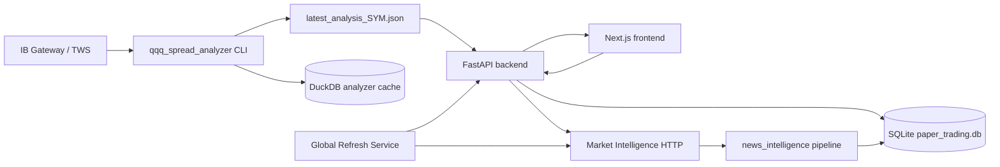

# Billion Dollar — Architecture Reference

**Last updated:** 2026-07-04

## 1. Purpose and scope

Billion Dollar is a **research-only options alpha research platform** (FastAPI + Next.js). It ingests market data from Interactive Brokers, scores setups, ranks spread candidates across multiple expiries, classifies market regime, recommends trade decisions, and tracks paper trades.

**In scope today:**

- QQQ and generic symbol spread analysis with multi-expiry scanning
- Market Regime (Phase 1 embedded in QQQ page; Phase 2 dashboard tab)
- Trade Decision Engine (client-side scoring with backend audit log)
- Paper Trading Lab with optional IBKR position sync
- News Intelligence (CLI pipeline + Market Intelligence HTTP API)
- Opportunity Scanner (lightweight symbol ranking — no IBKR)
- Market Open Refresh (one-click morning workflow)
- AI Report Export (consolidated JSON + Markdown)

**Out of scope:**

- Live order placement (`execution_mode: paper_only`)
- Auto-connect to IB on backend startup
- Legacy workstation pages (dashboard, strategy-builder, options-chain scanner, blotter, replay)

---

## 2. System context



**Data authority:** `latest_analysis_{SYMBOL}.json` is the contract between the analyzer CLI, FastAPI, and the frontend. SQLite holds paper trades, regime snapshots, trade decision audit rows, news items, and opportunity scan results.

---

## 3. Repo layout

```
Billion_Dollar/
├── run_local.sh                 # Start backend + frontend
├── README.md                    # User guide
├── PSEUDOCODE.md                # Algorithms and logic flows
├── Billion-Dollar-Architecture-Reference.md  # This file
├── backend/
│   ├── app/
│   │   ├── main.py              # FastAPI entry, router registration, service wiring
│   │   ├── db.py                # SQLite schema
│   │   ├── config.py            # Settings (stale thresholds, IBKR config, etc.)
│   │   ├── routes/
│   │   │   ├── spread_analyzer.py
│   │   │   ├── market_regime.py
│   │   │   ├── trade_decision.py
│   │   │   ├── paper_trading.py
│   │   │   ├── market_intelligence.py
│   │   │   ├── opportunity_scanner.py
│   │   │   ├── global_refresh.py      # Market Open Refresh + Analyze Top N
│   │   │   └── ai_report.py
│   │   ├── services/
│   │   │   ├── market_regime/         # Phase 2 dashboard engine
│   │   │   ├── market_intelligence/   # News orchestration
│   │   │   ├── opportunity_scanner/   # Lightweight symbol ranking
│   │   │   ├── trade_decision/        # Backend TDE mirror + audit
│   │   │   ├── ibkr/                  # Paper trading IBKR sync
│   │   │   ├── global_refresh_service.py  # Market Open Refresh orchestration
│   │   │   ├── ai_report_service.py
│   │   │   └── paper_trade_service.py
│   │   └── repositories/
│   └── news_intelligence/       # Offline news pipeline
├── frontend/
│   ├── app/
│   │   ├── qqq-spread-analyzer/
│   │   ├── options-spread-strategy/
│   │   ├── paper-trading-lab/
│   │   ├── market-regime/
│   │   ├── market-intelligence/
│   │   └── opportunity-scanner/
│   ├── hooks/
│   │   └── useSpreadAnalysisPage.ts  # Shared hook with ?autorun=true support
│   ├── lib/
│   │   ├── marketRegime.ts      # Phase 1 regime scoring
│   │   ├── tradeDecision.ts     # Trade Decision Engine
│   │   ├── globalRefreshApi.ts  # Market Open Refresh + Analyze Top N client
│   │   └── opportunityScannerApi.ts
│   └── components/
│       ├── qqq-spread/          # Analyzer panels + TDE + regime + ExpiryRanking
│       ├── opportunity-scanner/ # OpportunityTable + Technical Confidence badges
│       └── market-regime/       # Phase 2 dashboard widgets
└── qqq_spread_analyzer/
    └── src/                     # IBKR fetch, indicators, scoring, spreads, expiry engine
```

---

## 4. Data stores

### SQLite (`backend/paper_trading.db`)

| Table | Purpose |
|-------|---------|
| `paper_trades` | Paper trade ledger with IBKR sync fields |
| `paper_trade_snapshots` | Mark-to-market history per trade |
| `paper_trade_reviews` | Post-trade qualitative review |
| `paper_trade_sync_logs` | IBKR sync audit |
| `market_regime_snapshots` | Phase 2 daily regime history |
| `trade_decisions` | Trade Decision Engine audit log |
| `news_items` | News Intelligence pipeline storage |
| `news_fetch_log` | Per-provider fetch run audit |
| `market_intelligence_watchlist` | Editable watchlist (17 defaults) |
| `opportunity_scan_results` | Opportunity Scanner scan batches |

### DuckDB (`qqq_spread_analyzer/data/analyzer.duckdb`)

| Table | Purpose |
|-------|---------|
| `bars` | Cached OHLCV bars |
| `option_snapshots` | Option quote snapshots by date |
| `analysis_runs` | Run metadata + full payload JSON |

### File artifacts

| Path | Purpose |
|------|---------|
| `qqq_spread_analyzer/data/latest_analysis_{SYMBOL}.json` | Primary analysis contract |
| `qqq_spread_analyzer/data/analyzer_last_run.log` | Subprocess stderr from API-triggered runs |
| `backend/reports/` | AI Report JSON + Markdown exports |

---

## 5. QQQ Spread Analyzer

### Invocation

The FastAPI spread analyzer route spawns a background thread:

```text
poetry run python -m src.main --symbol {SYMBOL} --mode analyze [--no-cache]
```

On success it writes `latest_analysis_{SYMBOL}.json` and triggers mark-to-market for open paper trades on that symbol.

### Scoring model (`qqq_spread_analyzer/src/scoring.py`)

**Daily bull checklist (7 checks):** close > EMA20, EMA20 > EMA50, EMA50 > SMA200, RSI > 50, MACD > signal, MACD expanding, above week high or near support.

**Daily bear checklist (6 checks):** close < EMA20, EMA20 < EMA50, RSI < 50, MACD < signal, MACD weakening, reject resistance or break support.

**Intraday timing:** 4 bull checks and 4 bear checks.

### Expiry + Spread Search Engine

After scoring, the `ExpirySpreadOrchestrator` runs:

1. **ExpirySearchEngine** — scans DTE buckets (15-21, 22-35, 36-45, 46-60), scores each expiry (DTE fit 25%, liquidity 25%, strike availability 15%, bid-ask quality 15%, event risk 10%, IV fit 10%)
2. **SpreadSearchEngine** — builds delta-targeted verticals per valid expiry, scores spreads (liquidity 30%, delta fit 20%, risk/reward 20%, breakeven 10%, expiry score 10%, event risk 10%)
3. **Force WAIT** — if zero spreads pass filters across all expiries, TDE must output WAIT

### API contract

| Method | Path | Behavior |
|--------|------|----------|
| GET | `/api/qqq-spread-analyzer/latest?symbol=` | Read JSON snapshot |
| POST | `/api/qqq-spread-analyzer/run` | Queue analyzer job, return `job_id` |
| GET | `/api/qqq-spread-analyzer/run/{job_id}` | Poll job status |

Options Spread Strategy uses identical logic at `/api/options-spread-strategy/*`.

---

## 6. Market Regime Phase 1 (QQQ embed)

**Location:** `frontend/lib/marketRegime.ts` — runs in the browser on analysis JSON.

### Component scores

| Component | Range | Logic |
|-----------|-------|-------|
| Trend | ±40 | `bull_count * 10` or `-bear_count * 10` from 4 EMA/RSI checks |
| Momentum | −25..+25 | Daily MACD ±15, expanding ±5, intraday MACD ±5 |
| Volatility | 5–14 | Bollinger width + ATR → risk level |
| Intraday timing | 0–20 | `intraday_timing_bull * 5`, penalized if below EMA21 |

### Labels (6)

Strong Bull, Bull Pullback, Bull Trend with Momentum Warning, Sideways, Bear Pullback, Bear Trend.

---

## 7. Market Regime Phase 2 (dashboard tab)

**Location:** `backend/app/services/market_regime/` — server-side for `/market-regime`.

### Weighted composite

| Component | Weight |
|-----------|--------|
| Trend | 30% |
| Momentum | 20% |
| Volatility | 20% |
| Breadth | 15% |
| Macro | 10% |
| News / catalyst | 5% |

### Labels (8)

Strong Bull Trend, Bull Trend, Bull Pullback, Sideways Range, High Volatility Range, Bear Rally, Bear Trend, Strong Bear Trend.

---

## 8. Trade Decision Engine

**Primary runtime:** `frontend/lib/tradeDecision.ts`

### Nine weighted components (default weights sum to 100)

| Component | Weight |
|-----------|--------|
| Trend | 30 |
| Momentum | 20 |
| Market Regime | 15 |
| Volatility | 10 |
| Options Liquidity | 10 |
| Risk/Reward | 5 |
| Macro Events | 5 |
| News | 5 |
| Paper Trading Statistics | 5 |

### Decision logic

- **Trade score** = weighted sum (0–100)
- **Force WAIT** if `expiry_search.force_wait == true` → cap score at 55
- **Final decision** = top-ranked strategy if `trade_score >= 50`
- **WAIT override** if score < 50 or top is WAIT with score < 65

### Backend role

- `POST /api/trade-decision/record` — persists audit row
- `backend/app/services/trade_decision/` — mirror logic for AI Report

---

## 9. Opportunity Scanner

**Purpose:** Rank watchlist symbols using lightweight signals. **NEVER downloads option chains or builds spreads.**

### Scoring (Market Opportunity Score)

| Input | Weight |
|-------|--------|
| News Intelligence | 25% |
| Market Regime | 20% |
| Relative Strength | 20% |
| Sector Strength | 15% |
| Catalyst/Earnings | 10% |
| Paper Trading feedback | 10% |

### Output

- `market_opportunity_score` (0-100) — from non-technical inputs
- `technical_confidence` — "Fresh" / "Stale" / "Not Evaluated" (metadata only)
- `direction_candidate` — Bullish / Bearish / Neutral
- `technical_hint` — user guidance message

### Dependency validation

On each scan, validates upstream freshness (news, regime) against configurable thresholds. Returns `upstream_warnings` if data is stale.

---

## 10. Global Refresh Service

**Location:** `backend/app/services/global_refresh_service.py` + `backend/app/routes/global_refresh.py`

### Market Open Refresh

Sequential execution: Market Intelligence → Market Regime → Opportunity Scanner. Returns per-module timestamps, durations, errors, and `next_recommended_refresh_at`.

**Explicitly excluded:** IBKR connections, option chain fetches, spread building, TDE evaluation.

### Analyze Top N

Sequential IBKR analysis for top N symbols by Market Opportunity Score. Stops on connection failure. Does not place trades.

### Stale thresholds (configurable in `backend/app/config.py`)

| Config key | Default | Purpose |
|------------|---------|---------|
| `technical_stale_minutes` | 60 | Analyzer snapshot |
| `news_stale_minutes` | 30 | News data |
| `regime_stale_minutes` | 60 | Market Regime |
| `scanner_stale_minutes` | 60 | Scanner data |

---

## 11. News Intelligence

**Pipeline package:** `backend/news_intelligence/`  
**HTTP layer:** `backend/app/services/market_intelligence/`  
**IBKR News:** `backend/app/services/news_intelligence/`

### Market Intelligence Center (`/market-intelligence`)

Event-driven dashboard: news, SEC filings, catalyst calendar, watchlist, sentiment analytics, API budget, IBKR provider status, activity log.

### Pipeline (`run_news_pipeline`)

0. **IBKR News** (optional, highest priority) — Dow Jones + Briefing.com via IB Gateway
1. Finnhub market news (general)
2. Finnhub company news (per symbol)
3. Alpha Vantage NEWS_SENTIMENT (max 3 tickers)
4. SEC EDGAR recent filings (stocks only)
5. Sentiment → relevance → impact → dedup → insert

### IBKR News Provider

| Component | Path |
|-----------|------|
| TWS Client | `backend/app/services/news_intelligence/ibkr_news_client.py` |
| Normalizer/Adapter | `backend/app/services/news_intelligence/ibkr_news_adapter.py` |

**Connection:** Native **`ibapi`** (`EClient`/`EWrapper` + daemon thread). **Not** `ib_insync` — ib_insync `reqHistoricalNews` timed out in production; ibapi callback pattern (same as `PlayRough/news.py`) is reliable.

| Setting | Default | Purpose |
|---------|---------|---------|
| Host/port | `127.0.0.1:4001` | Same as `tws_host` / `tws_port` in config |
| Client ID | **23** | `ibkr_news_client_id` — separate from analyzer (12) and paper sync (13) |
| Python env | `pyenv_global` | `run_local.sh` sets `VIRTUAL_ENV`; requires `ibapi` package |

**Available providers:** DJ-N, DJ-RT, DJNL, BRFUPDN, BRFG (+ DJ-RTA/RTE/RTG if subscribed).

**Default provider bundle per symbol:** first 3 from `BRFG → BRFUPDN → DJ-N` that IBKR reports available.

**Source quality weights:** DJ-N=0.95, DJ-RT/DJNL/BRFUPDN=0.90, BRFG=0.85 (vs Finnhub=0.70, AV=0.65).

**Fetch sequence (per symbol, sequential):**

1. `connect()` → start message loop thread, sleep 2s
2. `reqNewsProviders()` → sleep 4s
3. `reqContractDetails(STK)` → cache conId, sleep 4s
4. `reqHistoricalNews(conId, "BRFG+BRFUPDN+DJ-N", start, end, 20)` → sleep `ibkr_news_wait_seconds` (8s)
5. Collect headlines via `historicalNews` callback; empty → error (not cached)

**Behavior:**
- Market Open Refresh: fetches for top 5 priority watchlist **stocks** (ETFs skipped)
- Analyze Live: selected symbol only (when wired through pipeline refresh)
- Graceful fallback: if IBKR unavailable or empty, pipeline continues with Finnhub/AV/SEC
- 30-min in-memory cache per symbol (successful fetches only)
- Headlines cleaned of metadata tags (`{A:...}` patterns) before storage
- IBKR-specific event classification rules for analyst ratings, filings, earnings
- IBKR does **not** replace Finnhub/AV/SEC in pipeline yet — runs first, then other providers still fetch

---

## 12. Paper Trading Lab

**Page:** `/paper-trading-lab`  
**Service:** `backend/app/services/paper_trade_service.py`

- Create, bulk-create, update, close paper trades
- Mark-to-market after analyzer run completes
- Portfolio summary and strategy analytics (feeds TDE paper-stats)
- IBKR position fetch, price refresh, full sync (`tws_client_id: 13`)

---

## 13. AI Report Export

**Service:** `backend/app/services/ai_report_service.py`

Consolidates all module data into structured JSON + Markdown for external AI analysis. Computes freshness, evaluates backend TDE, detects conflicts between modules. Reports include expiry search diagnostics.

---

## 14. Config and environment

### Python runtime

Backend uses **`pyenv_global`** at repo sibling path (`git_codes/pyenv_global`). `run_local.sh` sets `VIRTUAL_ENV` and runs `poetry install` / `poetry run uvicorn` from that env. Required for `ibapi` (IBKR News).

### IBKR client IDs (one session per ID)

| Use | Client ID | Config |
|-----|-----------|--------|
| Spread analyzer | 12 | `qqq_spread_analyzer/.env` |
| Paper trading sync | 13 | `backend/config.yaml` → `tws_client_id` |
| IBKR News | 23 | `backend/app/config.py` → `ibkr_news_client_id` |

### `backend/config.yaml`

| Key | Default | Purpose |
|-----|---------|---------|
| `qqq_analyzer_poetry` | `/opt/homebrew/bin/poetry` | Poetry path for subprocess |
| `tws_client_id` | 13 | Paper trading IBKR sync |
| `tws_port` | 4001 | IB Gateway port |
| `database_url` | `sqlite:///./paper_trading.db` | SQLite path |
| `ibkr_news_enabled` | true | Enable IBKR News provider |
| `ibkr_news_client_id` | 23 | Separate TWS client ID for news (ibapi) |
| `ibkr_news_cache_ttl_seconds` | 1800 | News cache TTL |
| `ibkr_news_max_symbols_refresh` | 5 | Max symbols per Market Open Refresh |
| `ibkr_news_wait_seconds` | 8 | Wait after reqHistoricalNews (HMDS) |
| `ibkr_news_request_timeout_seconds` | 30 | Reserved config |

### Environment variables

| Variable | Purpose |
|----------|---------|
| `QQQ_ANALYZER_DATA_DIR` | Override analyzer output directory |
| `QQQ_ANALYZER_POETRY` | Override Poetry binary path |
| `FINNHUB_API_KEY` | News Intelligence |
| `ALPHA_VANTAGE_API_KEY` | News Intelligence (optional) |
| `SEC_USER_AGENT` | SEC EDGAR User-Agent header |

---

## 15. UI page map

| Route | Key components |
|-------|----------------|
| `/qqq-spread-analyzer` | SummaryBar, TDE, MarketRegimeSummary, ExpiryRankingPanel, SpreadCandidatesTable |
| `/options-spread-strategy` | Same + SymbolSelector + ?autorun=true support |
| `/opportunity-scanner` | Market Open Refresh, Analyze Top 5, Technical Confidence badges |
| `/paper-trading-lab` | Trade table, IBKR sync, analytics |
| `/market-regime` | Multi-instrument regime dashboard, strategy matrix, history |
| `/market-intelligence` | News, filings, catalysts, sentiment, API budget, IBKR News status |

---

## 16. Technology stack

| Layer | Choice |
|-------|--------|
| Backend | Python 3.12+, FastAPI |
| Frontend | Next.js, TypeScript |
| Analyzer | Poetry project, ib_insync (options chain), pandas |
| IBKR News | Native ibapi (headlines only) |
| Primary DB | SQLite (SQLAlchemy) |
| Analyzer cache | DuckDB |
| Charts | Recharts |

---

## 17. Known gaps

| Gap | Detail |
|-----|--------|
| News → TDE | Frontend uses `risk_notes` regex; not `NewsSignalService` |
| IBKR → API budget | IBKR not counted in Finnhub/AV daily limits; pipeline still calls Finnhub/AV/SEC after IBKR |
| IBKR headline quality | conId fetch includes macro/futures columns mentioning symbol; fuzzy dedup needed for edition dupes |
| IBKR Phase 2 | No `reqNewsArticle` full-text fetch yet |
| News → Phase 2 catalyst | Static calendar; not reading `news_items` |
| Phase 2 macro | Yields/DXY stubbed unavailable |
| Phase 2 multi-TF | 15m / 1H / Weekly placeholders |
| Backend TDE mirror | macro/news/volatility sub-scores stubbed in Python |
| Live earnings calendar | Stub — earnings from news headlines + catalyst stub |
