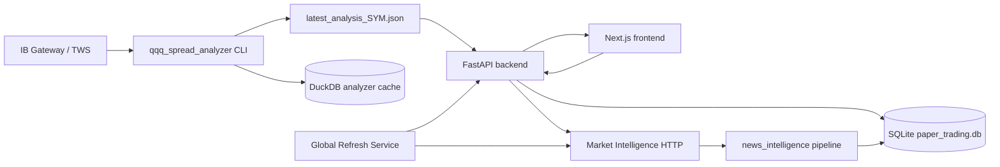

# Billion Dollar — Architecture Reference

**Last updated:** 2026-07-05

## 1. Purpose and scope

Billion Dollar is a **research-only options alpha research platform** (FastAPI + Next.js). It ingests market data from Interactive Brokers, scores setups, ranks spread candidates across multiple expiries, classifies market regime, recommends trade decisions, and tracks paper trades.

**In scope today:**

- QQQ and generic symbol spread analysis with multi-expiry scanning
- Market Regime (Phase 1 embedded in QQQ page; Phase 2 dashboard tab)
- Trade Decision Engine (client-side scoring with backend audit log)
- Paper Trading Lab with optional IBKR position sync
- News Intelligence (CLI pipeline + Market Intelligence HTTP API)
- Opportunity Scanner (lightweight symbol ranking — no IBKR)
- Market Open Refresh (one-click morning workflow)
- AI Report Export (consolidated JSON + Markdown)

**Out of scope:**

- Live order placement (`execution_mode: paper_only`)
- Auto-connect to IB on backend startup
- Legacy workstation pages (dashboard, strategy-builder, options-chain scanner, blotter, replay)

---

## 2. System context



**Data authority:** `latest_analysis_{SYMBOL}.json` is the contract between the analyzer CLI, FastAPI, and the frontend. SQLite holds paper trades, regime snapshots, trade decision audit rows, news items, and opportunity scan results.

---

## 3. Repo layout

```
Billion_Dollar/
├── run_local.sh                 # Start backend + frontend
├── README.md                    # User guide
├── PSEUDOCODE.md                # Algorithms and logic flows
├── Billion-Dollar-Architecture-Reference.md  # This file
├── backend/
│   ├── app/
│   │   ├── main.py              # FastAPI entry, router registration, service wiring
│   │   ├── db.py                # SQLite schema
│   │   ├── config.py            # Settings (stale thresholds, IBKR config, etc.)
│   │   ├── routes/
│   │   │   ├── spread_analyzer.py
│   │   │   ├── market_regime.py
│   │   │   ├── trade_decision.py
│   │   │   ├── paper_trading.py
│   │   │   ├── market_intelligence.py
│   │   │   ├── opportunity_scanner.py
│   │   │   ├── global_refresh.py      # Market Open Refresh + Analyze Top N
│   │   │   └── ai_report.py
│   │   ├── services/
│   │   │   ├── market_regime/         # Phase 2 dashboard engine
│   │   │   ├── market_intelligence/   # News orchestration
│   │   │   ├── opportunity_scanner/   # Lightweight symbol ranking
│   │   │   ├── trade_decision/        # Backend TDE mirror + audit
│   │   │   ├── ibkr/                  # Paper trading IBKR sync
│   │   │   ├── global_refresh_service.py  # Market Open Refresh orchestration
│   │   │   ├── ai_report_service.py
│   │   │   └── paper_trade_service.py
│   │   └── repositories/
│   └── news_intelligence/       # Offline news pipeline
├── frontend/
│   ├── app/
│   │   ├── qqq-spread-analyzer/
│   │   ├── options-spread-strategy/
│   │   ├── paper-trading-lab/
│   │   ├── market-regime/
│   │   ├── market-intelligence/
│   │   └── opportunity-scanner/
│   ├── hooks/
│   │   └── useSpreadAnalysisPage.ts  # Shared hook with ?autorun=true support
│   ├── lib/
│   │   ├── marketRegime.ts      # Phase 1 regime scoring
│   │   ├── tradeDecision.ts     # Trade Decision Engine
│   │   ├── globalRefreshApi.ts  # Market Open Refresh + Analyze Top N client
│   │   └── opportunityScannerApi.ts
│   └── components/
│       ├── qqq-spread/          # Analyzer panels + TDE + regime + ExpiryRanking
│       ├── opportunity-scanner/ # OpportunityTable + Technical Confidence badges
│       └── market-regime/       # Phase 2 dashboard widgets
└── qqq_spread_analyzer/
    └── src/                     # IBKR fetch, indicators, scoring, spreads, expiry engine
```

---

## 4. Data stores

### SQLite (`backend/paper_trading.db`)

| Table | Purpose |
|-------|---------|
| `paper_trades` | Paper trade ledger with IBKR sync fields |
| `paper_trade_snapshots` | Mark-to-market history per trade |
| `paper_trade_reviews` | Post-trade qualitative review |
| `paper_trade_sync_logs` | IBKR sync audit |
| `market_regime_snapshots` | Phase 2 daily regime history |
| `trade_decisions` | Trade Decision Engine audit log |
| `news_items` | Raw/legacy article-level News Intelligence storage |
| `news_fetch_log` | Per-provider fetch run audit |
| `news_events` | Ticker-level clustered news events (Part 6) |
| `ticker_news_signals` | Per-symbol aggregated News Signal (Part 7) |
| `market_intelligence_watchlist` | Editable watchlist (17 defaults) |
| `opportunity_scan_results` | Opportunity Scanner scan batches |

### DuckDB (`qqq_spread_analyzer/data/analyzer.duckdb`)

| Table | Purpose |
|-------|---------|
| `bars` | Cached OHLCV bars |
| `option_snapshots` | Option quote snapshots by date |
| `analysis_runs` | Run metadata + full payload JSON |

### File artifacts

| Path | Purpose |
|------|---------|
| `qqq_spread_analyzer/data/latest_analysis_{SYMBOL}.json` | Primary analysis contract |
| `qqq_spread_analyzer/data/analyzer_last_run.log` | Subprocess stderr from API-triggered runs |
| `backend/reports/` | AI Report JSON + Markdown exports |

---

## 5. QQQ Spread Analyzer

### Invocation

The FastAPI spread analyzer route spawns a background thread:

```text
poetry run python -m src.main --symbol {SYMBOL} --mode analyze [--no-cache]
```

On success it writes `latest_analysis_{SYMBOL}.json` and triggers mark-to-market for open paper trades on that symbol.

### Scoring model (`qqq_spread_analyzer/src/scoring.py`)

**Daily bull checklist (7 checks):** close > EMA20, EMA20 > EMA50, EMA50 > SMA200, RSI > 50, MACD > signal, MACD expanding, above week high or near support.

**Daily bear checklist (6 checks):** close < EMA20, EMA20 < EMA50, RSI < 50, MACD < signal, MACD weakening, reject resistance or break support.

**Intraday timing:** 4 bull checks and 4 bear checks.

### Expiry + Spread Search Engine

After scoring, the `ExpirySpreadOrchestrator` runs:

1. **ExpirySearchEngine** — scans DTE buckets (15-21, 22-35, 36-45, 46-60), scores each expiry (DTE fit 25%, liquidity 25%, strike availability 15%, bid-ask quality 15%, event risk 10%, IV fit 10%)
2. **SpreadSearchEngine** — builds delta-targeted verticals per valid expiry, scores spreads (liquidity 30%, delta fit 20%, risk/reward 20%, breakeven 10%, expiry score 10%, event risk 10%)
3. **Force WAIT** — if zero spreads pass filters across all expiries, TDE must output WAIT

### API contract

| Method | Path | Behavior |
|--------|------|----------|
| GET | `/api/qqq-spread-analyzer/latest?symbol=` | Read JSON snapshot |
| POST | `/api/qqq-spread-analyzer/run` | Queue analyzer job, return `job_id` |
| GET | `/api/qqq-spread-analyzer/run/{job_id}` | Poll job status |

Options Spread Strategy uses identical logic at `/api/options-spread-strategy/*`.

---

## 6. Market Regime Phase 1 (QQQ embed)

**Location:** `frontend/lib/marketRegime.ts` — runs in the browser on analysis JSON.

### Component scores

| Component | Range | Logic |
|-----------|-------|-------|
| Trend | ±40 | `bull_count * 10` or `-bear_count * 10` from 4 EMA/RSI checks |
| Momentum | −25..+25 | Daily MACD ±15, expanding ±5, intraday MACD ±5 |
| Volatility | 5–14 | Bollinger width + ATR → risk level |
| Intraday timing | 0–20 | `intraday_timing_bull * 5`, penalized if below EMA21 |

### Labels (6)

Strong Bull, Bull Pullback, Bull Trend with Momentum Warning, Sideways, Bear Pullback, Bear Trend.

---

## 7. Market Regime Phase 2 (dashboard tab)

**Location:** `backend/app/services/market_regime/` — server-side for `/market-regime`.

### Weighted composite

| Component | Weight |
|-----------|--------|
| Trend | 30% |
| Momentum | 20% |
| Volatility | 20% |
| Breadth | 15% |
| Macro | 10% |
| News / catalyst | 5% |

### Labels (8)

Strong Bull Trend, Bull Trend, Bull Pullback, Sideways Range, High Volatility Range, Bear Rally, Bear Trend, Strong Bear Trend.

---

## 8. Trade Decision Engine

**Primary runtime:** `frontend/lib/tradeDecision.ts`

### Nine weighted components (default weights sum to 100)

| Component | Weight |
|-----------|--------|
| Trend | 30 |
| Momentum | 20 |
| Market Regime | 15 |
| Volatility | 10 |
| Options Liquidity | 10 |
| Risk/Reward | 5 |
| Macro Events | 5 |
| News | 5 |
| Paper Trading Statistics | 5 |

### Decision logic

- **Trade score** = weighted sum (0–100)
- **Force WAIT** if `expiry_search.force_wait == true` → cap score at 55
- **Final decision** = top-ranked strategy if `trade_score >= 50`
- **WAIT override** if score < 50 or top is WAIT with score < 65

### Backend role

- `POST /api/trade-decision/record` — persists audit row
- `backend/app/services/trade_decision/` — mirror logic for AI Report

---

## 9. Opportunity Scanner

**Purpose:** Rank watchlist symbols using lightweight signals. **NEVER downloads option chains or builds spreads.**

### Scoring (Market Opportunity Score — Part 9 redesign)

Ranks **ticker-level opportunity magnitude**, not raw articles, using ticker-level News Intelligence (Parts 1-7) instead of article-level scoring:

| Input | Weight | Source |
|-------|--------|--------|
| Catalyst Strength | 30% | `ticker_news_signals.catalyst_strength_score` (falls back to 40 baseline pre-clustering) |
| Relative Strength / Momentum | 25% | symbol vs. QQQ/SPY benchmark |
| Market Regime Fit | 20% | Market Regime service |
| News Quality | 15% | `ticker_news_signals.news_quality_score` (falls back to legacy news score) |
| Earnings/Event Timing | 5% | next earnings date + presence of a qualifying top catalyst |
| Paper Trading feedback | 5% | symbol's closed paper-trade win rate |

Direction (bull/bear split, used only for `direction_candidate`) is a **separate axis**, unchanged by the Part 9 redesign — still News/Regime/Relative-Strength/Sector/Catalyst-Risk/Paper-Feedback weighted 25/20/20/15/10/10.

### Output

- `market_opportunity_score` (0-100) — from the weighted formula above
- `catalyst_strength_score`, `news_quality_score` (0-100) — surfaced as their own columns
- `technical_confidence` — "Fresh" / "Stale" / "Not Evaluated" (metadata only)
- `direction_candidate` — Bullish / Bearish / Neutral / **Mixed** (both bull and bear sub-scores elevated and tied — conflicting strong signals, not "no signal")
- `trade_readiness` — "Ready" (fresh analyzer snapshot + a Trade Decision Engine record within the staleness window) / "Needs Analyze Live" / "Blocked" (IBKR broker unavailable this scan)
- `top_catalyst` / `top_risk` — from the ticker's News Signal; `top_catalyst` is never a weak/unrelated article — falls back to `"No high-quality ticker-specific catalyst"` when nothing qualifies
- `technical_hint` — user guidance message

### Dependency validation

On each scan, validates upstream freshness (news, regime) against configurable thresholds. Returns `upstream_warnings` if data is stale.

---

## 10. Global Refresh Service

**Location:** `backend/app/services/global_refresh_service.py` + `backend/app/routes/global_refresh.py`

### Market Open Refresh

Sequential execution: Market Intelligence → Market Regime → Opportunity Scanner. Returns per-module timestamps, durations, errors, and `next_recommended_refresh_at`.

**Explicitly excluded:** IBKR connections, option chain fetches, spread building, TDE evaluation.

### Analyze Top N

Sequential IBKR analysis for top N symbols by Market Opportunity Score. Stops on connection failure. Does not place trades.

### Stale thresholds (configurable in `backend/app/config.py`)

| Config key | Default | Purpose |
|------------|---------|---------|
| `technical_stale_minutes` | 60 | Analyzer snapshot |
| `news_stale_minutes` | 30 | News data |
| `regime_stale_minutes` | 60 | Market Regime |
| `scanner_stale_minutes` | 60 | Scanner data |

---

## 11. News Intelligence

**Pipeline package:** `backend/news_intelligence/`  
**HTTP layer:** `backend/app/services/market_intelligence/`  
**IBKR News:** `backend/app/services/news_intelligence/`

### Market Intelligence Center (`/market-intelligence`)

Event-driven dashboard: news, SEC filings, catalyst calendar, watchlist, sentiment analytics, API budget, IBKR provider status, activity log.

### Pipeline (`run_news_pipeline`)

0. **IBKR News** (optional, highest priority) — Dow Jones + Briefing.com via IB Gateway
1. Finnhub market news (`general`) — market-context only, see "Ticker-level intelligence" below
2. Finnhub company news — **fallback only**: skipped for any symbol IBKR already covered this run
3. Alpha Vantage NEWS_SENTIMENT (max 3 tickers) — earnings/sentiment fallback
4. SEC EDGAR recent filings (stocks only)
5. Sentiment scoring → legacy relevance/impact (`news_items`, unchanged scale) → dedup (headline similarity **0.86** within **72h**) → insert
6. **New:** primary-ticker resolution → canonical event classification → clustering → ticker signal build (see below) — best-effort, never blocks the legacy steps above

### Ticker-level intelligence (news_events / ticker_news_signals)

Article-level headlines are noisy (repeated wire copies, wrong-symbol attribution, low-quality syndication). A second stage on top of the legacy pipeline consolidates deduped items into **one row per symbol** consumed by Opportunity Scanner and the Trade Decision Engine.

**Pipeline package:** `backend/news_intelligence/` (`news_categories.py`, `ticker_registry.py`, `primary_ticker_detector.py`, `news_clusterer.py`, `ticker_signal_builder.py`) · **Persistence:** `backend/app/repositories/news_events_repository.py`

1. **Primary ticker detection** (`primary_ticker_detector.compute_primary_ticker_score`) — scores 0-100 how strongly a headline is *about* a candidate symbol (ticker/company name in headline vs. only in a related-symbols list, provider metadata, broad-market/sector keyword caps, different-company-detected caps). `resolve_primary_symbol` picks the best-scoring candidate among `item.symbol` + `item.symbols`, so e.g. a "Palantir upgraded to Buy" headline fetched under an NVDA query resolves to **PLTR**, not NVDA. Thresholds: **&lt;40 excluded** from ticker-level scoring entirely, **&lt;60 excluded** from being a top catalyst/risk (still counted, just not surfaced).
2. **Canonical event classification** (`news_relevance.classify_event_category`) — 14 categories checked in strict priority order: `SEC_FILING → LEGAL_REGULATORY → EARNINGS → GUIDANCE → ANALYST_ACTION → PRODUCT → PARTNERSHIP → M_AND_A → INSIDER_ACTIVITY → INSTITUTIONAL_OWNERSHIP → MACRO → INDUSTRY_SECTOR → GENERAL_MARKET → OTHER`. EARNINGS requires a strong phrase (e.g. "beats estimates", "reports quarterly earnings") — not just the bare word "earnings". A legacy mapping shim (`news_categories.to_legacy_event_type`) keeps `news_items.event_type` unchanged for old consumers.
3. **Clustering** (`news_clusterer.cluster_events`) — groups by `(resolved_symbol, category)`; headline similarity **≥0.70** by default, or **≥0.55** only when both items also share the same source family (e.g. both IBKR). Finnhub **general** market news (category `market_news`) is excluded from clustering entirely — it can never become a symbol's top catalyst, it only feeds market-wide context.
4. **Impact scoring** (`news_relevance.compute_impact_score`) — `sentiment × (primary_ticker/100) × (importance/100) × source_quality × recency`, scaled to **-100..+100**. Importance per category: SEC_FILING/GUIDANCE=90, LEGAL_REGULATORY=85, EARNINGS/M_AND_A=80, ANALYST_ACTION=70, PRODUCT/PARTNERSHIP=65, MACRO/INSIDER_ACTIVITY=60, INSTITUTIONAL_OWNERSHIP/INDUSTRY_SECTOR=45, GENERAL_MARKET=20, OTHER=10. Recency decays linearly from full weight (≤24h) to a 0.3 floor at 7 days.
5. **Ticker signal build** (`ticker_signal_builder.build_ticker_signals`) — aggregates a symbol's clusters into one `ticker_news_signals` row: `net_impact_score` (sum of qualifying — primary_ticker_score ≥60 — cluster impact scores, clamped ±100), `news_bias` (Bullish `>+20` / Bearish `<-20` / Mixed if both sides material / else Neutral), `news_quality_score`, `top_catalyst`/`top_risk` (highest-impact qualifying clusters), `confidence`.
6. **Consumers** — `NewsSignalService.signal_for_symbol()` reads `ticker_news_signals` first (external dict shape unchanged), falling back to the legacy per-item aggregation when no row exists yet. `TradeScoreCalculator` maps `net_impact_score` onto the TDE news sub-score (`clamp(50 + net/2, 0, 100)`), falling back to a **neutral 50** (not 70) when there's no signal row for the symbol.
7. **API:** `GET /api/market-intelligence/ticker-signals` — all symbols' current ticker-level signal rows.
8. **Optional OpenAI cluster summary** (`news_intelligence/openai_summary.py`, Part 8) — runs inside `_run_ticker_signal_pipeline`, on top of step 5's rule-based sentence. Filters again before sending anything to an LLM: only Critical/High-importance clusters with `primary_ticker_score ≥70`, capped at the top 10 by importance then `|impact_score|`. If nothing qualifies, the rule-based `llm_summary` from step 5 is left untouched. If something qualifies: calls OpenAI (`gpt-4o-mini` by default, `OPENAI_MODEL` env override) for a structured JSON summary (`ticker_summary`, `bullish_factors`, `bearish_factors`, `key_catalyst`, `key_risk`, `sentiment_label`, `confidence`, `one_sentence_trade_context`), stored in `ticker_news_signals.llm_summary_json`; `llm_summary` (plain string, backward compatible) is set to the LLM's `ticker_summary`. **Cached** via `llm_cluster_hash` — only regenerated when the qualifying cluster set actually changes, never on every pipeline run. **Missing `OPENAI_API_KEY`** (or any request failure) → deterministic rule-based structured summary instead (same shape, `"source": "rule_based"`) — this layer can never break the pipeline.

Ticker-level table UI, drawer, and revised Opportunity Scanner columns (Parts 9-10) are now live — see "Tab 5 — Market Intelligence" and "Tab 6 — Opportunity Scanner" below, and section 9 above for the scoring formula.

### IBKR News Provider

| Component | Path |
|-----------|------|
| TWS Client | `backend/app/services/news_intelligence/ibkr_news_client.py` |
| Normalizer/Adapter | `backend/app/services/news_intelligence/ibkr_news_adapter.py` |

**Connection:** Native **`ibapi`** (`EClient`/`EWrapper` + daemon thread). **Not** `ib_insync` — ib_insync `reqHistoricalNews` timed out in production; ibapi callback pattern (same as `PlayRough/news.py`) is reliable.

| Setting | Default | Purpose |
|---------|---------|---------|
| Host/port | `127.0.0.1:4001` | Same as `tws_host` / `tws_port` in config |
| Client ID | **23** | `ibkr_news_client_id` — separate from analyzer (12) and paper sync (13) |
| Python env | `pyenv_global` | `run_local.sh` sets `VIRTUAL_ENV`; requires `ibapi` package |

**Available providers:** DJ-N, DJ-RT, DJNL, BRFUPDN, BRFG (+ DJ-RTA/RTE/RTG if subscribed).

**Default provider bundle per symbol:** first 3 from `BRFG → BRFUPDN → DJ-N` that IBKR reports available.

**Source quality weights:** DJ-N=0.95, DJ-RT/DJNL/BRFUPDN=0.90, BRFG=0.85 (vs Finnhub=0.70, AV=0.65).

**Fetch sequence (per symbol, sequential):**

1. `connect()` → start message loop thread, sleep 2s
2. `reqNewsProviders()` → sleep 4s
3. `reqContractDetails(STK)` → cache conId, sleep 4s
4. `reqHistoricalNews(conId, "BRFG+BRFUPDN+DJ-N", start, end, 20)` → sleep `ibkr_news_wait_seconds` (8s)
5. Collect headlines via `historicalNews` callback; empty → error (not cached)

**Behavior:**
- Market Open Refresh: fetches for top 5 priority watchlist **stocks** (ETFs skipped)
- Analyze Live: selected symbol only (when wired through pipeline refresh)
- Graceful fallback: if IBKR unavailable or empty, pipeline continues with Finnhub/AV/SEC
- 30-min in-memory cache per symbol (successful fetches only)
- Headlines cleaned of metadata tags (`{A:...}` patterns) before storage
- IBKR-specific event classification rules for analyst ratings, filings, earnings
- IBKR does **not** replace Finnhub/AV/SEC in pipeline yet — runs first, then other providers still fetch

---

## 12. Paper Trading Lab

**Page:** `/paper-trading-lab`  
**Service:** `backend/app/services/paper_trade_service.py`

- Create, bulk-create, update, close paper trades
- Mark-to-market after analyzer run completes
- Portfolio summary and strategy analytics (feeds TDE paper-stats)
- IBKR position fetch, price refresh, full sync (`tws_client_id: 13`)

---

## 13. AI Report Export

**Service:** `backend/app/services/ai_report_service.py`

Consolidates all module data into structured JSON + Markdown for external AI analysis. Computes freshness, evaluates backend TDE, detects conflicts between modules. Reports include expiry search diagnostics.

---

## 14. Config and environment

### Python runtime

Backend uses **`pyenv_global`** at repo sibling path (`git_codes/pyenv_global`). `run_local.sh` sets `VIRTUAL_ENV` and runs `poetry install` / `poetry run uvicorn` from that env. Required for `ibapi` (IBKR News).

### IBKR client IDs (one session per ID)

| Use | Client ID | Config |
|-----|-----------|--------|
| Spread analyzer | 12 | `qqq_spread_analyzer/.env` |
| Paper trading sync | 13 | `backend/config.yaml` → `tws_client_id` |
| IBKR News | 23 | `backend/app/config.py` → `ibkr_news_client_id` |

### `backend/config.yaml`

| Key | Default | Purpose |
|-----|---------|---------|
| `qqq_analyzer_poetry` | `/opt/homebrew/bin/poetry` | Poetry path for subprocess |
| `tws_client_id` | 13 | Paper trading IBKR sync |
| `tws_port` | 4001 | IB Gateway port |
| `database_url` | `sqlite:///./paper_trading.db` | SQLite path |
| `ibkr_news_enabled` | true | Enable IBKR News provider |
| `ibkr_news_client_id` | 23 | Separate TWS client ID for news (ibapi) |
| `ibkr_news_cache_ttl_seconds` | 1800 | News cache TTL |
| `ibkr_news_max_symbols_refresh` | 5 | Max symbols per Market Open Refresh |
| `ibkr_news_wait_seconds` | 8 | Wait after reqHistoricalNews (HMDS) |
| `ibkr_news_request_timeout_seconds` | 30 | Reserved config |

### Environment variables

| Variable | Purpose |
|----------|---------|
| `QQQ_ANALYZER_DATA_DIR` | Override analyzer output directory |
| `QQQ_ANALYZER_POETRY` | Override Poetry binary path |
| `FINNHUB_API_KEY` | News Intelligence |
| `ALPHA_VANTAGE_API_KEY` | News Intelligence (optional) |
| `SEC_USER_AGENT` | SEC EDGAR User-Agent header |

---

## 15. UI user guide (SOP)

**Audience:** Non-technical traders and researchers. **Research only — no live orders.**

**Prerequisites:** `./run_local.sh` running; IB Gateway on port **4001** only when you run **full options analysis** (Run analysis / Analyze Live / Analyze Top 5).

---

### Daily workflow (5 steps)

**Example — Tuesday open, you want to paper-trade NVDA:**

| Step | Where | Action | Why |
|------|--------|--------|-----|
| 1 | **Opportunity Scanner** | **Market Open Refresh** | Updates news, regime, and rankings (~1–2 min). No IBKR option chains. |
| 2 | Same tab | Scan **Opportunity Rankings** table | Find symbols with high **Market Opportunity** and **Fresh** technical badge. |
| 3 | Row for NVDA | **Analyze Live** | Opens Options Spread Strategy and runs full IBKR analysis (~1–2 min). |
| 4 | **Options Spread Strategy** | Read **Trade Decision Engine** (TDE) | Only TDE gives the final strategy (e.g. Bull Call Spread or WAIT). |
| 5 | **Spread Candidates** table | **Save to Paper** on one row | Logs a paper trade for tracking — still no real order. |

**Skip step 3–5** if you only want “what looks interesting today” — stop after step 2.

**Refresh vs Run analysis:** **Refresh** reloads the last saved snapshot. **Run analysis** / **Analyze Live** fetches new IBKR data (slow, needs Gateway).

---

### Global header (every page)

| Control | What it does | When to use |
|---------|----------------|-------------|
| **Tab links** | Switch modules | Main navigation — see tabs below. |
| **AI Report** | Builds one JSON/Markdown file from all modules | End of day or before sharing with an external AI tool. |
| **Theme toggle** | Light / dark | Preference only. |

---

### Tab 1 — QQQ Spread Analyzer (`/qqq-spread-analyzer`)

**Purpose:** Full technical + options analysis for **QQQ only**.

| Button / area | Meaning | When / why |
|---------------|---------|------------|
| **Refresh** | Reload saved QQQ snapshot | After a run finished; quick check without IBKR. |
| **Run analysis** | New IBKR fetch + scoring (~1–2 min) | Before QQQ spread ideas; needs Gateway. |
| **Summary bar** | Price, bias, confidence, suggested action | First glance — bullish/bearish/neutral. |
| **Market Regime Summary** | Short regime context for QQQ | Align idea with broader market. |
| **News Intelligence** card | News signal for QQQ | Headline risk before spreads. |
| **Quick Refresh** (news) | 24h news for QQQ | Faster than full MIC refresh. |
| **Daily / Intraday panels** | Indicator checklist | Why bias scored as it did. |
| **Key Levels** | Support / resistance | Strike context. |
| **Expiry Search Results** | Expiry buckets that passed filters | Where the engine searched. |
| **Spread Candidates** table | Ranked vertical spreads | Pick a row; **Save to Paper** logs it. |
| **Bulk Save** | Save multiple candidates | Journal several ideas. |
| **Trade Decision Engine** | Final score + recommended strategy | **Authoritative** go/no-go — respect **WAIT**. |
| **Re-evaluate** (TDE) | Re-score after refresh | After new Run analysis. |
| **Save decision to Paper** (TDE) | Log TDE outcome | Audit trail. |

---

### Tab 2 — Options Spread Strategy (`/options-spread-strategy`)

**Purpose:** Same as QQQ tab for **any symbol** (NVDA, SPY, …).

| Button / area | Meaning | When / why |
|---------------|---------|------------|
| **Symbol selector** | Type ticker + Go | Switch symbol. |
| **Refresh / Run analysis** | Same as QQQ tab | **Analyze Live** from Scanner opens here with auto-run. |
| Remaining panels | Same as QQQ tab | Use for non-QQQ names. |

---

### Tab 3 — Paper Trading Lab (`/paper-trading-lab`)

**Purpose:** Track paper spreads; optional IBKR sync.

| Button / area | Meaning | When / why |
|---------------|---------|------------|
| **Fetch Open Positions** | Pull option positions from IBKR | Mirror Gateway positions. |
| **Refresh Market Prices** | Update mids/P&amp;L | During session; needs Gateway. |
| **Recalculate All** | Recompute P&amp;L from stored mids | After price refresh. |
| **Sync From IBKR** | Full position + price sync | End-of-day reconciliation. |
| **Export** | CSV download | External reporting. |
| **Auto refresh** | Poll IBKR 1/5/15 min | Active monitoring only. |
| **Summary cards** | Open count, P&amp;L, win rate | Portfolio snapshot. |
| **Open / Closed tabs** | Trade lists | **Close** when idea is done. |
| **Performance dashboard** | Stats by strategy | What’s working over time. |

---

### Tab 4 — Market Regime (`/market-regime`)

**Purpose:** Market environment — which spread **types** fit today.

| Button / area | Meaning | When / why |
|---------------|---------|------------|
| **Refresh Regime** | Recompute from cached data | After analyzer runs on majors. |
| **Refresh All Market Data** | Force live prices (slow) | Missing snapshots; needs Gateway. |
| **Save Snapshot** | Store today to history | Once daily for journal. |
| **Export** | JSON download | External use. |
| **Summary cards** | Regime, score, risk, **preferred strategy** | **Start here** — e.g. Bull Trend → Bull Call Spread. |
| **Broader Market Snapshot** | QQQ, SPY, IWM, VIX cards | Index alignment. |
| **Score Breakdown** | Weighted components | Why this regime label. |
| **Multi-Timeframe Trend** | Daily / intraday / weekly | Trend alignment. |
| **Market Breadth** | Indexes above EMA20 | Broad vs narrow rally. |
| **Volatility and Risk** | VIX, ATR, IV | Sizing and calm vs chaotic days. |
| **Macro Panel** | Yields, DXY, CPI/FOMC dates | Macro event risk. |
| **Catalyst Calendar** | Upcoming events | Plan around dates. |
| **Strategy Matrix** | Regime → spread type | Quick lookup. |
| **History charts** | Past regime scores | Trend in environment. |

---

### Tab 5 — Market Intelligence (`/market-intelligence`)

**Purpose:** News, filings, sentiment — **headline risk**, not option prices.

| Button / area | Meaning | When / why |
|---------------|---------|------------|
| **Quick Refresh** | 24h news, top symbols | Fast headline check. |
| **Standard Refresh** | 7d news, full watchlist | Default daily refresh. |
| **Deep Refresh** | Standard + full SEC sweep | Earnings / event weeks. |
| **Export** | JSON snapshot | Archive/share. |
| **Summary cards** | Sentiment, news score, event counts | Headline tone at a glance. |
| **Market Regime Context** | Cached regime snippet + link | Connect news to regime. |
| **Ticker-Level News Intelligence** (Parts 9-10, primary table) | One consolidated `MicTickerSignal` row per symbol — bias, quality, catalyst strength, top catalyst/risk | Default view; click a row → detail drawer with full signal + raw source articles. |
| **Watchlist Manager** | Enable symbols, set priority | Control fetch scope; **Reset** = defaults. |
| **Raw Articles (Diagnostics)** | Article-level headlines feeding the ticker signals | Collapsible — only for auditing/debugging a signal, not the primary view. |
| **Earnings &amp; Catalyst Calendar** | Dated events | Scheduling. |
| **SEC Filings** | 8-K, 10-Q, … | Official disclosures. |
| **Sentiment Analytics** | Bull/bear/neutral trends | Mood shift. |
| **API Budget** | API usage vs daily limits | Protect free tiers; IBKR news status. |
| **Refresh Activity Log** | Past fetch runs | Troubleshooting. |
| **News Signal Output** | Signals fed to TDE / Regime | Downstream context. |

**Note:** Tab load uses cache (fast). Refreshes hit APIs/IBKR (slow).

---

### Tab 6 — Opportunity Scanner (`/opportunity-scanner`)

**Purpose:** **Rank watchlist** — who to analyze next. Not final spread picks.

| Button / area | Meaning | When / why |
|---------------|---------|------------|
| **Market Open Refresh** | MIC → Regime → Scanner | **First click each morning.** |
| **Analyze Top 5** | Full IBKR analysis on top 5 | Deep dive on leaders (slow). |
| **Refresh Scanner** | Re-rank only | News/regime already fresh. |
| **Refresh News** | Re-rank with new headlines | Breaking news. |
| **Export** | JSON rankings | Offline review. |
| **Filters** | Sector, direction, score, technical | Shorten the list. |
| **Opportunity Rankings** | Ranked table | Pick symbols to analyze. |
| **Analyze Live** (row) | Open Options Spread Strategy + run | Daily workflow step 3. |
| **Row click** | Detail drawer | Score breakdown. |

| Column | Meaning |
|--------|---------|
| **Market Opportunity** | 0–100 — Catalyst Strength 30% + Momentum 25% + Regime Fit 20% + News Quality 15% + Event Timing 5% + Paper Feedback 5% (Part 9; no option chain). |
| **Direction Bias** | Bullish / Bearish / Neutral / **Mixed** (both sides elevated and tied) — hint only. |
| **News Quality** / **Catalyst Strength** | From the symbol's ticker-level News Signal. |
| **Technical** | **Fresh** = recent analyzer; **Stale** = run analysis; **Not Evaluated** = never run. |
| **Trade Readiness** | **Ready** (fresh analysis + a recent TDE record) / **Needs Analyze Live** / **Blocked** (IBKR broker unavailable this scan). |
| **Top Catalyst** / **Top Risk** | From the ticker's News Signal — never a weak/unrelated article; shows "No high-quality ticker-specific catalyst" if nothing qualifies. |

---

### Quick reference

| I want to… | Use |
|------------|-----|
| Start my morning | **Market Open Refresh** |
| Bull or bear day? | **Market Regime** tab |
| Headline risk | **Market Intelligence** → Standard Refresh |
| What to analyze next | **Opportunity Scanner** table |
| Spreads + final call | **Analyze Live** → **Trade Decision Engine** |
| Log an idea | **Save to Paper** |
| Track P&amp;L | **Paper Trading Lab** |
| Export for AI | **AI Report** (header) |

---

### UI page map (routes)

| Route | Key components |
|-------|----------------|
| `/qqq-spread-analyzer` | SummaryBar, TDE, MarketRegimeSummary, ExpiryRankingPanel, SpreadCandidatesTable |
| `/options-spread-strategy` | SymbolSelector + same as QQQ + `?autorun=true` |
| `/opportunity-scanner` | Market Open Refresh, Analyze Top 5, OpportunityTable |
| `/paper-trading-lab` | Trade tables, IBKR toolbar, analytics |
| `/market-regime` | Regime cards, breadth, volatility, strategy matrix, history |
| `/market-intelligence` | News, filings, catalysts, watchlist, API budget |

---

## 16. Technology stack

| Layer | Choice |
|-------|--------|
| Backend | Python 3.12+, FastAPI |
| Frontend | Next.js, TypeScript |
| Analyzer | Poetry project, ib_insync (options chain), pandas |
| IBKR News | Native ibapi (headlines only) |
| Primary DB | SQLite (SQLAlchemy) |
| Analyzer cache | DuckDB |
| Charts | Recharts |

---

## 17. Known gaps

| Gap | Detail |
|-----|--------|
| News → TDE (frontend) | Frontend still uses `risk_notes` regex; backend Python TDE now reads `ticker_news_signals` (neutral-50 fallback) |
| Opportunity Scanner summary buckets | `Mixed` direction rows count toward `summary.neutral_count` in the header card — no separate `mixed_count` bucket yet |
| OpenAI cluster summary cost/quality | Live end-to-end (Part 8) but unverified against a real `OPENAI_API_KEY` in this environment (sandboxed, no outbound network) — rule-based fallback path is what's actually been exercised |
| IBKR → API budget | IBKR not counted in Finnhub/AV daily limits; Finnhub company-news is now skipped per-symbol when IBKR already covered it this run, but budget accounting doesn't reflect the skip |
| IBKR headline quality | conId fetch includes macro/futures columns mentioning symbol; primary-ticker scoring + clustering now down-weights/dedupes these, but no fuzzy cross-edition dedup at the IBKR-provider level itself |
| IBKR Phase 2 | No `reqNewsArticle` full-text fetch yet |
| News → Phase 2 catalyst | Static calendar; not reading `news_items` / `news_events` |
| Phase 2 macro | Yields/DXY stubbed unavailable |
| Phase 2 multi-TF | 15m / 1H / Weekly placeholders |
| Backend TDE mirror | macro/volatility sub-scores still stubbed in Python (news sub-score is no longer stubbed — reads `ticker_news_signals`) |
| Live earnings calendar | Stub — earnings from news headlines + catalyst stub (Alpha Vantage/Finnhub earnings-calendar endpoints not yet wired) |
