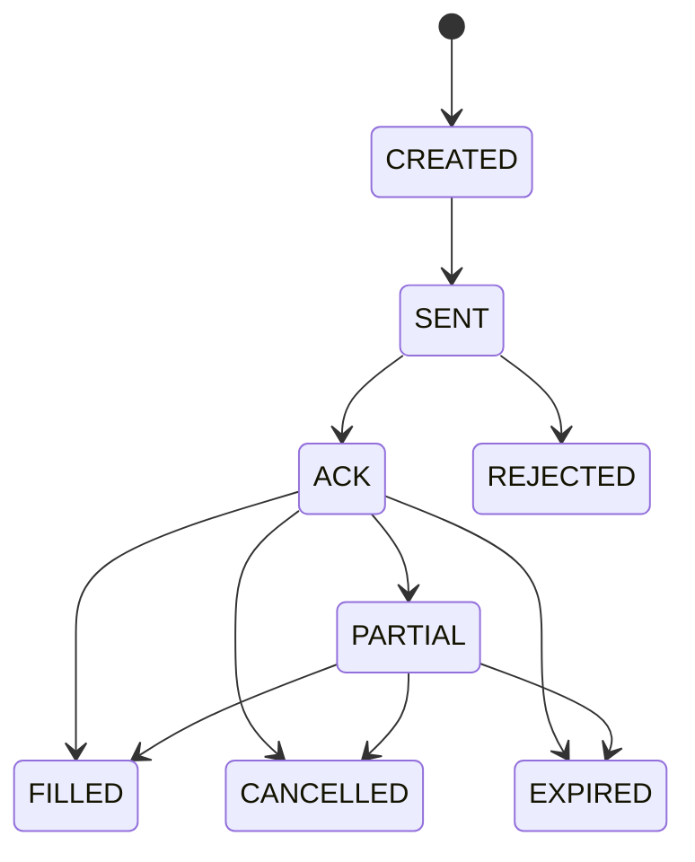

# Stock Tiger Event Log Schema

## Purpose

Define the canonical event model and SQL schema for append-only auditability, deterministic projections, and idempotent execution.

---

## Core Principles

- Append-only event facts; never mutate historical events.
- Commands are idempotent; retries must not duplicate broker actions.
- Event ordering is per aggregate stream (`aggregate_type + aggregate_id`).
- Projections/read models are derived and replaceable.

---

## Event Envelope (Required for Every Event)

```json
{
  "event_id": "uuid",
  "event_type": "CandidateSignal",
  "event_version": 1,
  "occurred_at": "2026-02-12T15:04:12.345Z",
  "recorded_at": "2026-02-12T15:04:12.500Z",
  "producer": "signal_engine",
  "correlation_id": "uuid",
  "causation_id": "uuid",
  "aggregate_type": "signal",
  "aggregate_id": "sig_20260212_NVDA_001",
  "idempotency_key": "optional-string",
  "schema_ref": "st.events.signal.v1",
  "payload": {}
}
```

Field requirements:
- `event_id`: globally unique UUID.
- `event_type`: enum defined below.
- `event_version`: integer schema version per event type.
- `occurred_at`: business time; `recorded_at`: write time.
- `correlation_id`: traces one request/workflow.
- `causation_id`: upstream triggering event ID.
- `aggregate_type/aggregate_id`: stream boundary for ordering.

---

## Canonical Field Names (No Aliases)

Use one canonical field name per concept. Do not emit alias variants in new events.

- Cost fields in `RiskDecision` use top-level keys:
  - `expected_commission_usd`
  - `expected_fees_usd`
  - `expected_slippage_usd`
  - `expected_total_cost_usd`
  - `expected_edge_after_cost_usd`
- Stress fields use:
  - `spy_down_3pct_loss_usd`
  - `spy_down_5pct_loss_usd`
  - `vol_up_20pct_loss_usd`
  - `spread_widen_3x_loss_usd`
- Decision quote fields in `OrderIntentCreated` use:
  - `underlying_bid_at_decision`, `underlying_ask_at_decision`, `underlying_last_at_decision`, `underlying_quote_time`
  - `option_bid_at_decision`, `option_ask_at_decision`, `option_mid_at_decision`, `option_quote_time`
- Exit plan fields use:
  - `instrument_key`
  - `exit_time_stop_days`
  - `exit_invalidation_level`
  - `exit_profit_targets`
  - `exit_trailing_rule`
  - `event_exit_rule`
- Assignment summary field uses:
  - `positions_after_summary`
- Config version fields use:
  - `signal_config_version`
  - `risk_config_version`
  - `execution_config_version`
- Trading mode fields use:
  - `trading_mode`
  - `trading_mode_at_request`

---

## Event Types (v1)

Universe:
- `UniverseUploaded`
- `UniverseActivated`

Market and research:
- `DataHealthEvaluated`
- `MarketSnapshot`
- `OptionsChainSnapshot`
- `NewsSnapshot`
- `CorporateActionSnapshot`
- `FeatureSnapshot`

Signal and risk:
- `CandidateSignal`
- `StrategyStructureProposed`
- `RiskDecision`
- `PositionOpened`
- `PositionClosed`

Approval:
- `ApprovalRequestCreated`
- `ApprovalDecision`

Execution:
- `OrderIntentCreated`
- `BrokerRequestResponseRecorded`
- `BrokerOrderEvent`
- `FillEvent`

Portfolio truth:
- `ReconcileSnapshot`
- `MismatchDetected`
- `PortfolioValuationSnapshot`

Operations:
- `AlertRaised`
- `SystemHealthEvent`
- `ExecutionQualityEvaluated`
- `ExitPlanCreated`
- `TradingHaltEvent`
- `ExerciseAssignmentEvent`
- `DataQualityBlocked`

Governance:
- `AdjustmentPolicyChanged`
- `RiskConfigChanged`
- `TradingModeChanged`

---

## Canonical Payload Schemas

## 0) UniverseUploaded

UniverseUploaded stores the uploaded ticker universe as a versioned input. Validation results must be stored per ticker and ambiguous secdef outcomes must be explicitly represented.

```json
{
  "universe_version_id": "uv_20260221_sp500_top20_001",
  "universe_id": "sp500_top20",
  "as_of": "2026-02-21",
  "source": "human_trader",
  "upload_contract": {
    "content_type": "application/json",
    "multipart_field": "file",
    "max_tickers": 200,
    "max_file_size_bytes": 1048576
  },
  "tickers_requested": ["AAPL", "MSFT"],
  "validation_results": [
    {
      "ticker": "AAPL",
      "status": "validated",
      "ibkr_conid": "265598",
      "security_type": "STK",
      "primary_exchange": "NASDAQ",
      "currency": "USD",
      "ambiguity": {
        "is_ambiguous": false,
        "candidates": []
      }
    },
    {
      "ticker": "BRK.B",
      "status": "ambiguous",
      "ibkr_conid": null,
      "security_type": "STK",
      "primary_exchange": null,
      "currency": "USD",
      "ambiguity": {
        "is_ambiguous": true,
        "candidates": [
          {"display": "BRK B", "conid": "...", "exchange": "..."},
          {"display": "BRK/B", "conid": "...", "exchange": "..."}
        ]
      }
    }
  ],
  "upload_status": "failed",
  "upload_errors": [
    {"code": "SECCDEF_AMBIGUOUS", "detail": "One or more tickers returned ambiguous secdef results"}
  ]
}
```

## 0b) UniverseActivated

UniverseActivated marks one uploaded universe version as the active universe used for ingestion and signal cycles.

```json
{
  "universe_version_id": "uv_20260221_sp500_top20_001",
  "universe_id": "sp500_top20",
  "activated_at": "2026-02-21T10:00:00Z",
  "activated_by": "human_trader",
  "activation_policy": {
    "allow_partial_activation": false,
    "ambiguous_secdef_default": "hard_fail"
  }
}
```

## 1) `CandidateSignal`

`CandidateSignal` must record the model version, feature version, and regime label used at decision time to make results reproducible and to support weekly calibration.

```json
{
  "signal_id": "sig_20260212_NVDA_001",
  "ticker": "NVDA",
  "strategy_sleeve": "options_defined_risk",
  "side": "bullish",
  "signal_config_version": "sig_cfg_v12",
  "signal_config_ref": "s3://stock-tiger/config/signal/sig_cfg_v12.json",
  "model_version": "sig_model_2026_02_12_a",
  "feature_version": "feat_v3",
  "feature_contract_version": "feature_contract_v2",
  "regime_label": "trend_low_vol",
  "data_sources_used": ["IBKR", "YahooFinance"],
  "snapshot_refs": {
    "market_snapshot_ref": "evt:MarketSnapshot:ms_20260212_NVDA_150401",
    "options_snapshot_ref": "evt:OptionsChainSnapshot:ocs_20260212_NVDA_150401",
    "news_snapshot_ref": "evt:NewsSnapshot:ns_20260212_NVDA_150350",
    "corporate_action_snapshot_ref": "evt:CorporateActionSnapshot:cas_20260212_NVDA_000000"
  },
  "determinism_key": "sha256:...",
  "confidence_total": 78.4,
  "confidence_components": {
    "technical": 82,
    "options_quality": 76,
    "event_sentiment": 70,
    "fundamental_sector": 74,
    "regime_fit": 80,
    "execution_quality": 72
  },
  "penalties": [
    { "code": "SECTOR_CONCENTRATION_WARNING", "points": 2 }
  ],
  "thesis": "pullback in uptrend with favorable IV context",
  "entry_zone": "890-900",
  "invalidation": "< 865",
  "targets": ["930", "950"],
  "expected_hold_days": 28
}
```

Note: ETFs are first-class tickers. CandidateSignal.ticker may be an ETF symbol (for example SPY/QQQ/XLK) and uses the same snapshot_refs, confidence, risk, approval, and execution flow as equities.

## 1b) StrategyStructureProposed

StrategyStructureProposed records the concrete options structure for a strategy (for example a bull call spread) with pricing sanity checks and payoff summary. This event is the canonical replacement for any informal “StructureProposed” naming.

```json
{
  "structure_id": "ss_20260212_NVDA_001",
  "signal_id": "sig_20260212_NVDA_001",
  "ticker": "NVDA",
  "structure_label": "bull_call_spread",
  "expiry": "2026-03-20",
  "legs": [
    {"ticker": "NVDA", "expiry": "2026-03-20", "right": "C", "strike": 900, "action": "BUY", "qty": 1},
    {"ticker": "NVDA", "expiry": "2026-03-20", "right": "C", "strike": 940, "action": "SELL", "qty": 1}
  ],
  "pricing": {
    "buy_leg": {"bid": 12.10, "ask": 12.50, "mid": 12.30},
    "sell_leg": {"bid": 5.10, "ask": 5.40, "mid": 5.25},
    "net_debit_mid": 7.05,
    "net_debit_realistic": 7.20,
    "spread_width_buy": 0.40,
    "spread_width_sell": 0.30
  },
  "payoff": {
    "max_loss_usd": -720.0,
    "max_gain_usd": 3280.0,
    "breakeven_price": 907.20
  },
  "liquidity": {
    "liquidity_score": 78,
    "oi_ok": true,
    "volume_ok": true,
    "spread_ok": true
  },
  "sanity": {
    "is_pricing_sane": true,
    "sanity_flags": []
  },
  "override_flag": false,
  "override_reason": null
}
```

## 2) `RiskDecision`

RiskDecision must be computed without assuming any future human override. If a rule is violated but overrideable, emit decision=override_required with rule codes and numeric values; ApprovalDecision may later record an override with a typed reason and a final risk re-check must occur before OrderIntentCreated.

```json
{
  "risk_decision_id": "rd_20260212_NVDA_001",
  "signal_id": "sig_20260212_NVDA_001",
  "risk_config_version": "risk_cfg_v9",
  "risk_config_ref": "s3://stock-tiger/config/risk/risk_cfg_v9.json",
  "trading_mode": "micro_live",
  "status": "override_required",
  "rule_reasons": [{"rule_code": "NEG_EDGE_AFTER_COST", "message": "edge after costs <= 0", "observed_value": -12.4, "threshold_value": 0}],
  "overrideable_rule_codes": ["NEG_EDGE_AFTER_COST"],
  "data_health": {
    "market": "OK",
    "options": "OK",
    "news": "DEGRADED"
  },
  "portfolio_state": {
    "drawdown_pct": -4.1,
    "per_ticker_after_pct": 6.3,
    "per_sector_after_pct": 17.4,
    "beta_to_spy": 0.82,
    "net_delta": 1400,
    "cluster_exposure_top3": [
      {"cluster": "AI_SEMIS", "percent": 18.1},
      {"cluster": "MEGA_CAP_TECH", "percent": 16.3},
      {"cluster": "CLOUD_INFRA", "percent": 9.2}
    ]
  },
  "risk_budget_impact": {
    "dollar_risk": 650,
    "account_risk_pct": 0.65
  },
  "expected_commission_usd": 1.8,
  "expected_fees_usd": 0.5,
  "expected_slippage_usd": 6.4,
  "expected_total_cost_usd": 8.7,
  "expected_edge_after_cost_usd": 92.3,
  "worst_case_stress_loss_usd": -640.0,
  "worst_case_stress_loss_nav_pct": -0.64,
  "stress": {
    "spy_down_3pct_loss_usd": -380.0,
    "spy_down_5pct_loss_usd": -640.0,
    "vol_up_20pct_loss_usd": -210.0,
    "spread_widen_3x_loss_usd": -170.0
  }
}
```

## 3) `ApprovalDecision`

```json
{
  "approval_request_id": "ar_20260212_NVDA_001",
  "signal_id": "sig_20260212_NVDA_001",
  "risk_decision_id": "rd_20260212_NVDA_001",
  "exit_plan_id": "ep_20260212_NVDA_001",
  "decision": "approved",
  "actor": "human_trader",
  "override": false,
  "override_rule_codes": [],
  "override_reason": null,
  "checklist": {
    "thesis_complete": true,
    "liquidity_ok": true,
    "event_risk_ok": true,
    "risk_budget_ok": true
  },
  "notes": "meets checklist, proceed with limit order"
}
```

## `ApprovalRequestCreated`

```json
{
  "approval_request_id": "ar_20260212_NVDA_001",
  "signal_id": "sig_20260212_NVDA_001",
  "risk_decision_id": "rd_20260212_NVDA_001",
  "exit_plan_id": "ep_20260212_NVDA_001",
  "trading_mode_at_request": "micro_live",
  "risk_config_version": "risk_cfg_v9",
  "risk_summary": "within drawdown and exposure caps",
  "cost_summary": {
    "expected_total_cost_usd": 8.7,
    "expected_edge_after_cost_usd": 92.3
  },
  "stress_summary": {
    "spy_down_5pct_loss_usd": -640.0,
    "vol_up_20pct_loss_usd": -210.0
  },
  "checklist_required_fields": [
    "thesis_complete",
    "liquidity_ok",
    "event_risk_ok",
    "risk_budget_ok"
  ]
}
```

## 4) `OrderIntentCreated`

If quote snapshots are missing or delayed, `OrderIntentCreated` must be blocked unless manually overridden and recorded.

```json
{
  "order_intent_id": "oi_20260212_NVDA_001",
  "signal_id": "sig_20260212_NVDA_001",
  "broker_route": "IBKR",
  "execution_config_version": "exec_cfg_v5",
  "execution_config_ref": "s3://stock-tiger/config/execution/exec_cfg_v5.json",
  "snapshot_refs": {
    "market_snapshot_ref": "evt:MarketSnapshot:ms_20260212_NVDA_150401",
    "options_snapshot_ref": "evt:OptionsChainSnapshot:ocs_20260212_NVDA_150401"
  },
  "trading_mode": "micro_live",
  "instrument_type": "option_spread",
  "underlying_bid_at_decision": 896.10,
  "underlying_ask_at_decision": 896.30,
  "underlying_last_at_decision": 896.22,
  "underlying_quote_time": "2026-02-12T15:04:01.100Z",
  "option_bid_at_decision": 12.10,
  "option_ask_at_decision": 12.50,
  "option_mid_at_decision": 12.30,
  "option_quote_time": "2026-02-12T15:04:01.300Z",
  "spread_pct_at_decision": 3.2,
  "expiry_risk_window_flag": false,
  "ex_div_window_flag": false,
  "assignment_risk_flag": false,
  "pin_risk_flag": false,
  "legs": [
    { "ticker": "NVDA", "expiry": "2026-03-20", "right": "C", "strike": 900, "action": "BUY", "qty": 1 },
    { "ticker": "NVDA", "expiry": "2026-03-20", "right": "C", "strike": 940, "action": "SELL", "qty": 1 }
  ],
  "time_in_force": "DAY",
  "limit_price": 12.30
}
```

## 5) `BrokerOrderEvent`

```json
{
  "order_intent_id": "oi_20260212_NVDA_001",
  "broker_order_id": "ibkr_77881231",
  "client_order_id": "client_oi_20260212_NVDA_001",
  "submit_attempt": 1,
  "status": "PARTIAL",
  "status_reason": "partial liquidity",
  "broker_event_seq": 1044,
  "exchange_time": "2026-02-12T15:04:03.551Z",
  "status_time": "2026-02-12T15:04:03.560Z",
  "filled_qty": 1,
  "remaining_qty": 1,
  "avg_fill_price": 12.25
}
```

## 6) `FillEvent`

```json
{
  "order_intent_id": "oi_20260212_NVDA_001",
  "broker_order_id": "ibkr_77881231",
  "broker_execution_id": "exec_9827171",
  "fill_qty": 1,
  "fill_price": 12.25,
  "fees_usd": 0.35,
  "commission_usd": 1.25,
  "venue": "SMART",
  "fill_time": "2026-02-12T15:04:04.110Z"
}
```

## 7) `ReconcileSnapshot`

```json
{
  "reconcile_id": "rc_20260212_150500",
  "broker": "IBKR",
  "positions_hash": "sha256...",
  "broker_snapshot_ref": "s3://stock-tiger/reconcile/2026-02-12/broker_150500.json",
  "local_snapshot_ref": "s3://stock-tiger/reconcile/2026-02-12/local_150500.json",
  "diff_summary": "NVDA spread qty mismatch; one fill pending local projection",
  "cash_balance": 43825.42,
  "open_orders_count": 3,
  "mismatch_count": 0
}
```

If `mismatch_count > 0`, a `MismatchDetected` event must be emitted with severity and `action_taken`.

## `MismatchDetected`

```json
{
  "mismatch_id": "mm_20260212_150500",
  "broker": "IBKR",
  "detected_at": "2026-02-12T15:05:00Z",
  "mismatch_type": "positions",
  "local_snapshot_hash": "sha256_local...",
  "broker_snapshot_hash": "sha256_broker...",
  "details": "Position quantity mismatch on NVDA option spread",
  "severity": "high",
  "action_taken": {
    "halted_entries": true
  }
}
```

## 8) `ExecutionQualityEvaluated`

Emit this event after every completed fill (or final order state) to measure execution quality and to auto-trigger trading halts if slippage persists.
Definitions: `slippage_usd` is positive when fill is worse than `decision_mid_price`, negative when better, after side normalization (buy/sell); `slippage_vs_expected_usd = slippage_usd - expected_slippage_usd`.
Use contract `multiplier` (for US options usually 100; use strategy-specific effective multiplier for spreads).

```json
{
  "order_intent_id": "oi_20260212_NVDA_001",
  "broker_order_id": "ibkr_77881231",
  "decision_mid_price": 12.30,
  "decision_spread": 0.40,
  "fill_price": 12.25,
  "fill_qty": 1,
  "fill_time": "2026-02-12T15:04:04.110Z",
  "slippage_usd": -5.0,
  "slippage_bps": -40.7,
  "expected_slippage_usd": 3.0,
  "slippage_vs_expected_usd": -8.0,
  "order_latency_ms": 2810,
  "notes": "filled better than expected"
}
```

## `PositionOpened`

```json
{
  "position_event_id": "po_20260212_NVDA_001",
  "signal_id": "sig_20260212_NVDA_001",
  "instrument_key": "NVDA_2026-03-20_C_900x940",
  "order_intent_id": "oi_20260212_NVDA_001",
  "broker_order_id": "ibkr_77881231",
  "fill_event_ids": ["fe_20260212_001"],
  "opened_at": "2026-02-12T15:04:04.110Z",
  "qty_opened": 1,
  "avg_entry_price": 12.25,
  "total_fees_usd": 0.35,
  "total_commission_usd": 1.25
}
```

## `PositionClosed`

Recommended `close_reason` values: `target_hit`, `invalidation`, `time_stop`, `event_exit`, `manual_override`.

```json
{
  "position_event_id": "pc_20260301_NVDA_001",
  "signal_id": "sig_20260212_NVDA_001",
  "instrument_key": "NVDA_2026-03-20_C_900x940",
  "close_order_intent_id": "oi_20260301_NVDA_exit_001",
  "close_broker_order_id": "ibkr_9912711",
  "close_fill_event_ids": ["fe_20260301_003"],
  "close_reason": "target_hit",
  "entry_time": "2026-02-12T15:04:04.110Z",
  "exit_time": "2026-03-01T15:32:10.000Z",
  "qty_closed": 1,
  "avg_entry_price": 12.25,
  "avg_exit_price": 16.40,
  "realized_pnl_usd": 415.0,
  "total_fees_usd": 1.1,
  "total_commission_usd": 2.5,
  "realized_pnl_after_costs_usd": 411.4,
  "mae_usd": -120.0,
  "mfe_usd": 490.0
}
```

## 9) `ExitPlanCreated`

No position should be opened without an `ExitPlanCreated` linked to the `signal_id`.

```json
{
  "signal_id": "sig_20260212_NVDA_001",
  "instrument_key": "NVDA_2026-03-20_C_900x940",
  "exit_type": "time_stop",
  "exit_time_stop_days": 28,
  "exit_invalidation_level": "-35%",
  "exit_profit_targets": ["+25%", "+45%"],
  "exit_trailing_rule": "activate trail after +20%, trail by 10%",
  "event_exit_rule": "exit 1 day before earnings unless event strategy",
  "created_by": "system"
}
```

## 10) `TradingHaltEvent`

When a `TradingHaltEvent` is active, RiskEngine must reject new entries for the affected scope.

```json
{
  "scope": "sleeve",
  "reason_code": "slippage",
  "reason_detail": "execution slippage breached threshold for 5 consecutive fills",
  "trigger_metrics": "rolling slippage_vs_expected_usd=-210 > threshold=-120",
  "start_time": "2026-02-12T16:00:00Z",
  "end_time": null,
  "cleared_by": null
}
```

## 11) `ExerciseAssignmentEvent`

This event must be recorded any time the broker reports assignment or exercise.

```json
{
  "broker": "IBKR",
  "broker_event_id": "ibkr_event_7781",
  "broker_execution_id": "exec_991928",
  "option_contract_id": "NVDA_20260320_C_900",
  "underlying_symbol": "NVDA",
  "event_type": "assignment",
  "qty": 1,
  "strike": 900,
  "expiry": "2026-03-20",
  "event_time": "2026-03-20T20:05:00Z",
  "cash_impact_usd": -90000.0,
  "positions_after_summary": "long 100 NVDA shares; short call removed"
}
```

## `DataQualityBlocked`

```json
{
  "ticker": "NVDA",
  "calendar_session_id": "2026-02-12_US_REGULAR",
  "blocked_stage": "signal",
  "blocked_action": "CandidateSignal",
  "source": "IBKR",
  "problem": "stale",
  "observed_at": "2026-02-12T14:59:50Z",
  "staleness_ms": 95000,
  "decision": "blocked",
  "confidence_cap": 40,
  "penalty_code": "STALE_QUOTE_HARD",
  "data_health_event_ref": "evt:DataHealthEvaluated:dh_20260212_NVDA_150352"
}
```

## `PortfolioValuationSnapshot`

```json
{
  "timestamp": "2026-02-12T16:00:00Z",
  "nav_usd": 100842.25,
  "cash_usd": 43825.42,
  "gross_exposure_usd": 78210.0,
  "net_exposure_usd": 64100.0,
  "realized_pnl_day_usd": 315.2,
  "unrealized_pnl_usd": 527.05,
  "total_fees_day_usd": 9.7
}
```

## `MarketSnapshot`

```json
{
  "ticker": "NVDA",
  "timestamp": "2026-02-12T15:04:01.300Z",
  "data_contract_version": "market_contract_v4",
  "calendar_session_id": "2026-02-12_US_REGULAR",
  "source": "IBKR",
  "quote_type": "real_time",
  "is_delayed": false,
  "source_ts": "2026-02-12T15:04:01.300Z",
  "ingest_ts": "2026-02-12T15:04:01.420Z",
  "staleness_ms": 120,
  "bid": 896.10,
  "ask": 896.30,
  "last": 896.22,
  "mid": 896.20,
  "bid_size": 900,
  "ask_size": 700,
  "last_size": 100,
  "volume": 18273450,
  "vwap": 892.55
}
```

## `OptionsChainSnapshot`

This snapshot records the normalized options chain inputs used for features, confidence, and risk checks. Large payloads should be stored by reference.

```json
{
  "ticker": "NVDA",
  "timestamp": "2026-02-12T15:04:01.300Z",
  "data_contract_version": "options_contract_v1",
  "calendar_session_id": "2026-02-12_US_REGULAR",
  "source": "IBKR",
  "is_delayed": false,
  "source_ts": "2026-02-12T15:04:01.300Z",
  "ingest_ts": "2026-02-12T15:04:01.520Z",
  "staleness_ms": 220,
  "underlying_last": 896.22,
  "chain_ref": "s3://stock-tiger/options/2026-02-12/NVDA_150401.parquet",
  "summary": {
    "atm_iv": 0.46,
    "iv_rank_52w": 0.62,
    "put_call_oi_ratio": 0.88,
    "nearest_expiry": "2026-02-14"
  }
}
```

## `NewsSnapshot`

This snapshot records news and sentiment inputs used for confidence components. Large payloads should be stored by reference.

```json
{
  "ticker": "NVDA",
  "timestamp": "2026-02-12T15:03:50.000Z",
  "data_contract_version": "news_contract_v1",
  "calendar_session_id": "2026-02-12_US_REGULAR",
  "source": "Finnhub",
  "is_delayed": false,
  "source_ts": "2026-02-12T15:03:40.000Z",
  "ingest_ts": "2026-02-12T15:03:50.000Z",
  "staleness_ms": 10000,
  "news_ref": "s3://stock-tiger/news/2026-02-12/NVDA_150350.json",
  "summary": {
    "sentiment_score": 0.18,
    "headline_count_24h": 12,
    "earnings_within_days": 6
  }
}
```

## `CorporateActionSnapshot`

Corporate actions and adjustment policy are versioned inputs. This snapshot is required for reproducible backtests.

```json
{
  "ticker": "NVDA",
  "as_of_date": "2026-02-12",
  "data_contract_version": "corp_actions_contract_v1",
  "source": "primary_corp_actions",
  "actions_ref": "s3://stock-tiger/corp_actions/NVDA.json",
  "latest_split": null,
  "latest_dividend": null
}
```

## `AdjustmentPolicyChanged`

Emit whenever the system changes how it treats prices for features/backtests (raw vs adjusted), including the effective date.

```json
{
  "old_value": {"price_mode": "adjusted"},
  "new_value": {"price_mode": "raw"},
  "changed_by": "human_trader",
  "changed_at": "2026-02-12T08:30:00Z",
  "effective_from": "2026-02-13",
  "reason": "switch to raw for intraday feature parity"
}
```

## `BrokerRequestResponseRecorded`

Record broker request/response metadata for forensic replay. Payloads should be stored by reference and redacted as needed.

```json
{
  "order_intent_id": "oi_20260212_NVDA_001",
  "broker": "IBKR",
  "request_ref": "s3://stock-tiger/broker/2026-02-12/oi_20260212_NVDA_001_request.json",
  "response_ref": "s3://stock-tiger/broker/2026-02-12/oi_20260212_NVDA_001_response.json",
  "request_hash": "sha256...",
  "response_hash": "sha256...",
  "recorded_at": "2026-02-12T15:04:02.000Z",
  "status": "ok",
  "error_code": null,
  "error_detail": null
}
```

## `DataHealthEvaluated`

Emit this event whenever the Data Quality Gate evaluates inputs for a ticker (and optionally per sleeve). This is diagnostic and is used by downstream gates to allow, degrade, or block actions.

```json
{
  "ticker": "NVDA",
  "calendar_session_id": "2026-02-12_US_REGULAR",
  "evaluated_at": "2026-02-12T15:03:52.000Z",
  "market": {
    "status": "OK",
    "source": "IBKR",
    "is_delayed": false,
    "source_ts": "2026-02-12T15:03:51.900Z",
    "ingest_ts": "2026-02-12T15:03:52.000Z",
    "staleness_ms": 100,
    "missing_fields": []
  },
  "options": {
    "status": "OK",
    "source": "IBKR",
    "is_delayed": false,
    "source_ts": "2026-02-12T15:03:50.000Z",
    "ingest_ts": "2026-02-12T15:03:52.000Z",
    "staleness_ms": 2000,
    "missing_fields": []
  },
  "news": {
    "status": "DEGRADED",
    "source": "Finnhub",
    "is_delayed": false,
    "source_ts": "2026-02-12T14:59:00.000Z",
    "ingest_ts": "2026-02-12T15:03:52.000Z",
    "staleness_ms": 292000,
    "missing_fields": ["sentiment_score"]
  },
  "decision": {
    "signal": "ALLOW",
    "risk": "ALLOW",
    "execution": "ALLOW"
  }
}
```

## `FeatureSnapshot`

```json
{
  "ticker": "NVDA",
  "timestamp": "2026-02-12T16:00:00Z",
  "feature_version": "feat_v3",
  "feature_contract_version": "feature_contract_v2",
  "features_ref": "s3://stock-tiger/features/2026-02-12/nvda_1600.parquet"
}
```

## `RiskConfigChanged`

```json
{
  "old_value": {"per_ticker_cap_pct": 0.08},
  "new_value": {"per_ticker_cap_pct": 0.07},
  "changed_by": "human_trader",
  "changed_at": "2026-02-12T08:30:00Z",
  "reason": "reduce concentration ahead of CPI"
}
```

## `TradingModeChanged`

```json
{
  "old_value": "micro_live",
  "new_value": "paper",
  "changed_by": "human_trader",
  "changed_at": "2026-02-12T09:10:00Z",
  "reason": "persistent reconciliation mismatches"
}
```

---

## Order State Machine

Allowed states:
- `CREATED`
- `SENT`
- `ACK`
- `PARTIAL`
- `FILLED`
- `CANCELLED`
- `REJECTED`
- `EXPIRED`

Allowed transitions:



Invalid transition handling:
- reject write
- emit `AlertRaised` with severity `high`

---

## Idempotency Rules

- `OrderIntentCreated` unique on `idempotency_key`.
- Broker submit command key derived from `order_intent_id`.
- Retries must reuse the same key.
- `idempotency_key` must be globally unique across all producers and event types.
- Recommended key format: `{producer}:{event_type}:{stable_id}` (example: `execution_engine:OrderIntentCreated:oi_20260212_NVDA_001`).
- Duplicate broker ACK/fill events are deduplicated by:
  - `broker_order_id + broker_event_seq` if available
  - else `broker_order_id + status + occurred_at bucket`

---

## SQL DDL (Postgres)

```sql
CREATE TABLE IF NOT EXISTS event_log (
  seq_id BIGSERIAL PRIMARY KEY,
  event_id UUID NOT NULL UNIQUE,
  event_type TEXT NOT NULL,
  event_version INT NOT NULL,
  occurred_at TIMESTAMPTZ NOT NULL,
  recorded_at TIMESTAMPTZ NOT NULL DEFAULT now(),
  producer TEXT NOT NULL,
  correlation_id UUID,
  causation_id UUID,
  aggregate_type TEXT NOT NULL,
  aggregate_id TEXT NOT NULL,
  idempotency_key TEXT,
  schema_ref TEXT,
  payload JSONB NOT NULL
);

CREATE INDEX IF NOT EXISTS idx_event_log_type_occurred
  ON event_log(event_type, occurred_at DESC);

CREATE INDEX IF NOT EXISTS idx_event_log_aggregate_seq
  ON event_log(aggregate_type, aggregate_id, seq_id);

CREATE UNIQUE INDEX IF NOT EXISTS uq_event_log_idempotency
  ON event_log(idempotency_key)
  WHERE idempotency_key IS NOT NULL;

CREATE TABLE IF NOT EXISTS command_lock (
  idempotency_key TEXT PRIMARY KEY,
  first_seen_at TIMESTAMPTZ NOT NULL DEFAULT now(),
  last_seen_at TIMESTAMPTZ NOT NULL DEFAULT now(),
  status TEXT NOT NULL
);
```

---

## Minimal Projection Tables

```sql
CREATE TABLE IF NOT EXISTS rm_recommendations (
  signal_id TEXT PRIMARY KEY,
  ts TIMESTAMPTZ NOT NULL,
  ticker TEXT NOT NULL,
  strategy_sleeve TEXT NOT NULL,
  confidence_total DOUBLE PRECISION NOT NULL,
  thesis TEXT NOT NULL,
  entry_zone TEXT NOT NULL,
  invalidation TEXT NOT NULL,
  targets JSONB NOT NULL,
  risk_decision TEXT,
  approval_decision TEXT
);

CREATE TABLE IF NOT EXISTS rm_orders (
  order_intent_id TEXT PRIMARY KEY,
  signal_id TEXT NOT NULL,
  broker_route TEXT NOT NULL,
  broker_order_id TEXT,
  status TEXT NOT NULL,
  status_reason TEXT,
  filled_qty DOUBLE PRECISION DEFAULT 0,
  remaining_qty DOUBLE PRECISION DEFAULT 0,
  avg_fill_price DOUBLE PRECISION,
  updated_at TIMESTAMPTZ NOT NULL DEFAULT now()
);

CREATE TABLE IF NOT EXISTS rm_portfolio_truth (
  snapshot_ts TIMESTAMPTZ PRIMARY KEY,
  broker TEXT NOT NULL,
  cash_balance DOUBLE PRECISION,
  open_orders_count INT,
  mismatch_count INT NOT NULL
);
```

---

## Retention and Partitioning

- Keep raw event log for at least 2 years.
- Partition by month on `occurred_at` when volume grows.
- Keep projection tables fully rebuildable from event log.

---

## Validation Rules

- Required fields must be present before write.
- `confidence_total` bounded `0-100`.
- Risk-approved and human-approved events are required before `OrderIntentCreated`.
- Block `OrderIntentCreated` when drawdown mode is `PAUSE_NEW_ENTRIES`.
- Every decision event must record active config versions used to compute it.
- `CandidateSignal` must include `snapshot_refs` and `determinism_key`.
- `RiskDecision` must record `data_health` statuses for the inputs used by the candidate.
- `OrderIntentCreated` must include `snapshot_refs` and be blocked if `DataHealthEvaluated.decision.execution` is not `ALLOW` unless explicit human override is recorded.
- `MarketSnapshot` must include `source_ts`, `ingest_ts`, `is_delayed`, and `staleness_ms`.
- Sign convention:
  - all `*_loss_usd` fields must be negative values
  - `realized_pnl_after_costs_usd` is positive for profit and negative for loss
  - `slippage_usd` is positive when worse than decision mid and negative when better after side normalization

---

## Example Query Snippets

Latest signal + decision chain for one ticker:

```sql
SELECT seq_id, event_type, occurred_at, payload
FROM event_log
WHERE payload->>'ticker' = 'NVDA'
ORDER BY seq_id DESC
LIMIT 50;
```

Find orders with invalid lifecycle jumps:

```sql
-- Implement via projection validator job; alert on impossible transitions.
SELECT order_intent_id
FROM rm_orders
WHERE status NOT IN ('CREATED','SENT','ACK','PARTIAL','FILLED','CANCELLED','REJECTED','EXPIRED');
```


