# Billion Dollar — System Pseudocode (living doc)

**Last updated:** 2026-06-23  
**Status:** MVP / decision-review engine  
**Audience:** ChatGPT or any reviewer — paste this file for architecture review without opening the full repo.

**Canonical spec:** `Billion-Dollar-Architecture-Reference.md`  
**User guide:** `README.md`  
**Cursor rules:** `.cursor/rules/billion-dollar-project.mdc`

---

## 1. System boundaries

### What the app DOES

- Ingest market/options context from TWS (read-only) or mock/seed data
- Rank and display **candidate signals** as recommendations
- Let user **save a trade decision** with legs, thesis, and rule reasons
- Run **paper simulation** linked to `decision_id`
- Show blotter, positions, reconcile status, explain feed
- Classify review outcomes (good / bad / lucky / invalid) and dashboard learning metrics

### What the app DOES NOT do (MVP)

- Place or modify live broker orders (`execution_mode: paper_only`)
- Auto-connect to TWS on backend startup (user must Connect Broker)
- Guarantee live IBKR-ranked recommendations without running signal generation
- Fully wire replay metrics back to every `decision_id` (partial — see gaps)

---

## 2. High-level flow

```mermaid
flowchart LR
  subgraph ingest [Ingest]
    TWS[TWS_connect]
    Ingestion[ingestion_run_once]
    Signals[generate_from_ibkr]
  end
  subgraph decide [Decide]
    Rec[CandidateSignal_events]
    Dash[Dashboard_recommendations]
    Card[Trade_Card]
    Save[POST_decisions_save]
  end
  subgraph execute [Execute_and_learn]
    Paper[POST_paper_run]
    Blotter[blotter_positions]
    Review[trade_review_classifier]
    Metrics[dashboard_summary]
  end
  TWS --> Ingestion --> Signals --> Rec --> Dash --> Card --> Save
  Save --> Paper --> Blotter --> Review --> Metrics
```



---

## 3. Decision lifecycle pseudocode

```text
HUB_TABLE: trade_decisions
  fields: decision_id, signal_id, ticker, status, legs, rule_reasons,
          paper_status, review_status, outcome_class, timestamps, ...

ON user_opens_dashboard:
  LOAD enriched_recommendations FROM latest CandidateSignal events
  JOIN optional trade_decisions FOR decision_status per signal
  SHOW broker_connected, data_status, reconcile_blocking FROM shell_status

ON user_opens_trade_card(ticker):
  LOAD signal + risk + strategy context FROM event_log views
  DISPLAY thesis, entry_zone, invalidation, confidence, edge

ON user_runs_strategy_builder_runtime(ticker):
  IF ticker IN options_chain.symbols (scanner MVP, e.g. QQQ):
    REQUIRE fresh broker-backed SQLite chain (validate_chain_quality)
    mock / non-broker / far-strike / stale → runtime_allowed=false, candidates=[]
    allow_mock_option_chain is IGNORED for scanner symbols
    allow_stale_runtime_dev (config) relaxes stale broker cache for local dev only
  ELSE (legacy tickers):
    REQUIRE broker_connected OR allow_mock_option_chain (config)
  RUN ingestion/features IF needed (legacy path)
  BUILD strategy candidates FROM filtered option chain + probability engine
  RETURN partitioned StrategyRuntimeOut (top_recommendations, allowed, rejected, chain_diagnostics)
  SEE §5c for full gate + build pipeline

ON user_saves_decision(payload):
  VALIDATE signal_id, legs, trading_mode
  IF payload.rejected:
    WRITE decision WITH status rejected
  ELSE:
    WRITE decision WITH status saved
  EMIT explain_feed + link decision_id

ON user_runs_paper(mode):
  IF mode == "decision":
    REQUIRE decision_id EXISTS in trade_decisions
    RUN paper_trade_engine WITH decision legs
    UPDATE decision.paper_status
    WRITE paper events TO event_log WITH decision_id
  IF mode == "quick":
    ALLOW dev test WITHOUT decision_id (explicit dev path only)

ON user_classifies_review(decision_id):
  LOAD decision + paper outcome context
  CLASSIFY outcome (review_engine)
  PATCH trade_decisions.review fields
  EMIT explain_feed category review

ON dashboard_summary:
  AGGREGATE decision counts, quality metrics, strategy health
  RETURN learning-oriented KPIs
```

---

## 4. Event model pseudocode

```text
STORE: event_log (append-only)
  each row: event_type, aggregate_id, payload JSON, producer, correlation_id

KEY_EVENT_TYPES:
  CandidateSignal     → ranked recommendation source
  RiskDecision        → approve / override_required / reject
  UniverseUploaded / UniverseActivated → ticker universe
  MarketSnapshotCaptured / OptionsChainSnapshotCaptured → ingestion
  StrategyCandidateGenerated → strategy builder output
  PaperOrderPlaced / PaperFill / ... → paper simulation (link decision_id when wired)
  TradingHaltEvent    → reconcile worker may emit

VIEWS (read models built FROM event_log + trade_decisions):
  list_recommendations_view()
  watchlist_view()
  trade_card_view(ticker)
  blotter_view()
  positions_view()
  explain_feed_view(scope, decision_id filter)
  review_queue FROM decisions + events

SEED_DATA:
  IF event_log empty ON startup:
    SEED one NVDA CandidateSignal + RiskDecision (bootstrap)
  bulk file sp29_candidate_signals.json may load many "Seeded candidate" rows
  THESE ARE NOT live TWS rankings
```

---

## 5. Key API pseudocode

```text
# Health and shell
GET  /health
GET  /api/ops/shell-status          → broker_connected, data_status, can_open_new_entries
GET  /api/ops/broker/status
GET  /api/ops/dev-flags             → allow_stale_runtime_dev (local dev banner)
POST /api/ops/broker/connect?refresh_ingestion=true|false
  IF connected:
    data_status = live
    IF refresh_ingestion:
      FOR ticker IN active_universe OR default_runtime_tickers:
        RUN _run_ingestion_once + _run_feature_build_once
  NOTE: sync TWS calls; may take minutes if refresh_ingestion=true

# Signals and recommendations
POST /api/signals/generate-from-ibkr
  FOR EACH ticker:
    qualify_stock(ticker) via TWS
    market_snapshot(ticker) via reqMktData + sleep
    BUILD CandidateSignalIn, score, rationale
  RANK by score, take top_n
  WRITE CandidateSignal events
  RETURN summaries (ticker, signal_id, confidence, thesis)

GET  /api/dashboard/recommendations  → enriched with decision_status, reason_preview
GET  /api/recommendations              → raw recommendation list
GET  /api/watchlist
GET  /api/tickers/{ticker}/trade-card

# Decisions (hub)
POST /api/decisions/save               → create/update trade_decisions row
GET  /api/decisions
GET  /api/decisions/{decision_id}
PATCH /api/decisions/{decision_id}

# Strategy and replay
POST /api/strategy-builder/candidates
POST /api/strategy-builder/runtime   # full algorithm: PSEUDOCODE.md §5c
POST /api/replay/run

# Paper
POST /api/paper/run
  body.mode = "decision" | "quick"
  body.decision_id REQUIRED when mode=decision

# Review
GET  /api/trade-review
POST /api/trade-review/{decision_id}/classify
POST /api/trade-review/{decision_id}/complete

# Ops / universe
POST /api/ops/ingestion/run-once
POST /api/ops/features/build
POST /api/universe/upload
POST /api/universe/activate
GET  /api/universe/active

# Options chain scanner (QQQ bounded subset — cache only)
GET  /api/options-chain/{symbol}           → cached contracts + scanner status
POST /api/options-chain/{symbol}/refresh   → enqueue background scan, return immediately

# Portfolio views
GET  /api/blotter
GET  /api/positions
GET  /api/reconcile/mismatches
GET  /api/explain-feed?limit=&scope=&decision_id=

# Dashboard learning
GET  /api/dashboard/summary
GET  /api/strategy-health

# IBKR debug (sync; can block API worker)
GET  /api/ibkr/marketdata/snapshot?symbol=
GET  /api/ibkr/secdef/search?symbol=
```

---

## 5b. QQQ options chain scanner (bounded MVP)

```text
CONFIG (backend/config.yaml → options_chain):
  symbols: [QQQ]
  min_dte: 21, max_dte: 42, max_expiries: 4
  strikes_below: 8, strikes_above: 12
  strike_interval: 5                    # IBKR-listed $5 multiples only (700, 705 — not 706)
  max_contracts_per_scan: 200             # hard cap unless allow_exceed_max_contracts
  batch_delay_seconds: 5                 # between expiry batches (~45-60s full cycle)
  refresh_seconds: 120
  runtime_max_age_seconds: 900           # 15 min; mark_stale_if_needed flips fresh→stale after this
  metadata_refresh_minutes: 20
  allow_stale_runtime_dev: false         # local dev only; Tier 4 off-hours (see README)

TWS market data (config.yaml tws_market_data_type):
  1=live (RTH), 2=frozen, 3=delayed, 4=delayed frozen — use 1 during business hours

PLAN (options_chain_planner.plan_scan_scope):
  spot = market_snapshot(QQQ).last
  listed = IBKR secdef strikes filtered to exact $5 multiples only
  strikes = 8 nearest listed below spot + 12 nearest listed above spot
  IF planned_contracts > max_contracts_per_scan:
    DROP furthest expiries first
    THEN widen strike interval
    THEN narrow strike range — DO NOT fetch over cap

ON scheduler.start():
  IF broker_connected: run immediate metadata + quote job per symbol
  ELSE: skip immediate jobs (avoids clobbering seeded broker cache on boot)

ON scheduler quote job OR manual refresh enqueue:
  IF NOT broker_connected:
    refresh_metadata: IF broker-backed contracts exist → keep scanner_status, set last_error only
                      ELSE → scanner_status=failed
    run_quote_scan: early return with last_error; preserve status if cache exists
  IF empty quotes off-hours: _preserve_cached_chain → scanner_status=stale
  metadata = SQLite OR refresh via reqSecDefOptParams (no broad reqContractDetails)
  plan = plan_scan_scope(...)
  EMIT OptionsChainScanStarted with planned_contracts
  FOR EACH expiry IN plan.expiries (one batch at a time):
    rows = broker.fetch_expiry_quotes(strikes=plan.strikes)  # pre-filtered only
    classify rows (missing Greeks/OI OK)
    sleep batch_delay_seconds
  REPLACE SQLite option_chain_contracts
  EMIT OptionsChainSnapshotCaptured

OFF-HOURS UI (no TWS quotes): seed_qqq_chain_snapshot.py + fixtures/qqq_broker_snapshot.json
  OR allow_stale_runtime_dev: true (Strategy Builder only; does not bypass failed/empty)

GET /api/options-chain/QQQ → cache only (never sync-fetch in handler)
POST /api/options-chain/QQQ/refresh → enqueue APScheduler job, return immediately
GET /api/ops/dev-flags → { allow_stale_runtime_dev }

Strategy runtime for QQQ → read SQLite scanner cache only
Frontend /options-chain → GET snapshot + POST refresh; poll while scanner_status=scanning
```

---

## 5c. Strategy Builder runtime algorithm (detailed)

**Source of truth (code):**

- `backend/app/main.py` — `_run_strategy_runtime_once`, `_partition_runtime_candidates`, `_build_chain_diagnostics`, `_prioritize_spreads_for_top`, `_resolve_scanner_underlying_price`
- `backend/app/services/option_chain_quality.py` — `validate_chain_quality` (QQQ scanner gate)
- `backend/app/services/broker_status.py` — `chain_runtime_gate_status`, `runtime_gate_status`, `scan_age_seconds`
- `backend/app/engines/strategy_runtime_engine.py` — `run_strategy_runtime` (leg filter + builder)
- `backend/app/engines/option_leg_filter.py` — `filter_usable_legs`
- `backend/app/engines/strategy_builder_engine.py` — `build_and_rank_candidates`, spread generation, `dedupe_candidates`
- `backend/app/engines/probability_engine.py` — POP approximations (incl. breakeven-distance for spreads)
- `backend/app/engines/options_risk_rules.py` — `apply_risk_rules`
- `backend/app/engines/greek_risk_engine.py` — gamma label / safety score
- `backend/app/workers/options_chain_scheduler.py` — interval jobs; skip immediate scan if broker disconnected
- `backend/scripts/seed_qqq_chain_snapshot.py` — off-hours broker cache injection
- `backend/app/models.py` — `StrategyRuntimeOut` partitioned response fields

```text
POST /api/strategy-builder/runtime
  INPUT: ticker, direction (bullish|bearish), reconciliation_mismatch_active,
         thresholds { max_loss_per_trade_usd, min_probability_profit, max_spread_pct, min_dte, ... }

# --- A. Load inputs + gates (main._run_strategy_runtime_once) ---

IF ticker IN options_chain.symbols (scanner MVP, e.g. QQQ):
  mark_stale_if_needed(ticker)
  snapshot = get_latest_snapshot(SQLite)
  option_chain_rows = snapshot.contracts → chain rows (bid, ask, strike, delta, ...)
  market = latest MarketSnapshotCaptured OR underlying_price from scan status
  feature = latest SymbolFeatureSnapshotBuilt OR build features on demand
  data_status, chain_source, scanner_status from snapshot
  contracts_usable = scan_status.contracts_usable
  underlying_price, underlying_price_source = _resolve_scanner_underlying_price(
    scan_st, market, feature)   # scanner → market → feature → none
  snapshot_age_seconds = scan_age_seconds(last_scan_completed_at)

  # A1. Strict chain quality gate (scanner only; ignores allow_mock_option_chain)
  quality_ok, quality_reason, quality_diag = validate_chain_quality(
    symbol, option_chain_rows, underlying_price,
    chain_source, scanner_status, data_status,
    snapshot_age_seconds, max_runtime_age_seconds=900,
    contracts_usable, min_usable_contracts=10, max_nearest_strike_pct=0.10,
    allow_stale_runtime_dev=options_chain.allow_stale_runtime_dev
  )
  effective_scanner_status rules:
    partial + contracts_usable >= 10 → partial_with_enough_usable
    IF allow_stale_runtime_dev AND stale AND broker AND contracts_usable >= 10
      → partial_with_enough_usable (dev only)
  FAIL IF:
    data_status == mock                    → option_chain_quality_failed_mock_data
    chain_source != broker                 → option_chain_quality_failed_non_broker
    effective_scanner_status NOT IN {fresh, partial_with_enough_usable}
                                           → option_chain_quality_failed_scanner_status
    underlying_price <= 0                  → option_chain_quality_failed_no_underlying
    no well-formed rows                    → option_chain_quality_failed_malformed
    no rows with bid>0 AND ask>0           → option_chain_quality_failed_no_quotes
    nearest quoted strike > 10% from spot  → option_chain_quality_failed_far_strikes
    snapshot_age_seconds > 900             → option_chain_quality_failed_stale
      # unless allow_stale_runtime_dev + stale broker cache with enough contracts

  # A2. Broker cache gate (15 min usable broker cache with warning)
  chain_ok, chain_reason, runtime_warning = chain_runtime_gate_status(
    scanner_status, data_status, chain_source,
    allow_mock_option_chain=FALSE,
    last_scan_completed_at, contracts_usable, max_runtime_age_seconds=900,
    allow_stale_runtime_dev=options_chain.allow_stale_runtime_dev
  )
  # dev stale: runtime_warning = "Dev mode: using stale broker cache from last session"
  IF dev stale active: LOG dev_stale_runtime_mode event
  runtime_allowed, runtime_block_reason = runtime_gate_status(
    broker_connected, data_status, reconciliation_mismatch_active,
    allow_mock_option_chain=FALSE,
    allow_cached_chain = chain_ok AND runtime_warning IS NOT NULL
  )
  IF NOT quality_ok:
    runtime_allowed = FALSE; runtime_block_reason = quality_reason; runtime_warning = NULL
    candidates = []; SKIP candidate engine
  ELIF NOT chain_ok:
    runtime_allowed = FALSE; runtime_block_reason = chain_reason; runtime_warning = NULL

ELSE (legacy tickers: SPY, NVDA, etc.):
  LOAD market, options_payload, feature from event_log
  IF missing: run ingestion + feature build once
  runtime_allowed = runtime_gate_status(broker_connected, data_status,
    allow_mock_option_chain per config)
  quality_diag = {}; leg_diag = NULL

# --- B. Leg filter (strategy_runtime_engine.run_strategy_runtime) ---

IF runtime_allowed AND feature present:
  # main passes underlying_price from scanner resolution into run_strategy_runtime
  last_price = underlying_price (scanner) IF > 0
            ELSE feature.last_price OR market.last
  filtered_chain, leg_diag = filter_usable_legs(option_chain_rows, underlying=last_price,
    max_spread_pct from thresholds OR config (default 0.08),
    strikes_below=8, strikes_above=12, strike_interval=5.0)
  LOG leg_diag counts:
    raw_contracts, usable_contracts,
    rejected_for_bad_bid_ask, rejected_for_spread,
    rejected_for_far_strike, rejected_for_malformed
  candidates = build_and_rank_candidates(symbol, direction, last_price, feature,
    option_chain=filtered_chain, reconciliation_mismatch_active, thresholds)

# --- C. Parse filtered chain → OptionLeg[] (build_and_rank_candidates) ---

FOR EACH row IN filtered option_chain:
  TRY parse: expiry, dte, option_type, strike, bid, ask, volume, OI, delta, gamma, theta, vega, iv
  SKIP malformed rows

calls = legs WHERE option_type == call
puts  = legs WHERE option_type == put
underlying = last_price

DEFAULT cfg (from OptionsChainConfig + UI thresholds merge):
  min_dte=21, max_spread_pct=0.08, min_open_interest=500,
  min_option_volume=100, max_loss_per_trade_usd=500,
  min_reward_risk=0.60, min_probability_profit=0.40, high_iv_percentile=70

ALLOWED_SPREAD_WIDTHS = {5, 10, 15, 20, 25, 30}  # tolerance 0.01

# --- D. Generate strategy candidates (spreads first, long options lower priority) ---

raw_candidates = []

IF direction == bullish:
  # D1. Bull call debit spreads (primary)
  buy_strike IN [underlying*0.97, underlying*1.05]
  sell_strike > buy_strike AND sell_strike <= underlying*1.10
  same expiry; width = sell_strike - buy_strike IN ALLOWED_SPREAD_WIDTHS
  FOR each valid pair: spread = CALC_BULL_CALL_SPREAD(...); IF spread NOT NULL: append

  # D2. Long calls (secondary; only if max_loss <= max_loss_per_trade_usd)
  call strike IN [underlying*0.97, underlying*1.05]
  FOR leg: long = CALC_LONG_CALL(...); IF long NOT NULL AND max_loss <= budget: append

ELSE direction == bearish:
  # D3. Bear put debit spreads (primary)
  buy_strike IN [underlying*0.95, underlying*1.03]
  sell_strike < buy_strike AND sell_strike >= underlying*0.90
  same expiry; width = buy_strike - sell_strike IN ALLOWED_SPREAD_WIDTHS
  FOR each valid pair: spread = CALC_BEAR_PUT_SPREAD(...); IF spread NOT NULL: append

  # D4. Long puts (secondary; only if max_loss <= budget)
  put strike IN [underlying*0.95, underlying*1.03]
  FOR leg: long = CALC_LONG_PUT(...); IF long NOT NULL AND max_loss <= budget: append

# --- E. De-duplicate before scoring ---

dedupe_key = (symbol, direction, strategy_type, expiry,
              buy_strike, sell_strike, buy_right, sell_right)
candidates = dedupe_candidates(raw_candidates)   # skip duplicate keys

# --- F. Payoff + POP + EV per strategy type ---

FUNCTION VALID_SPREAD_PAYOFF(debit, width, max_loss, max_profit):
  RETURN debit>0 AND width>0 AND max_profit>0 AND max_loss>0

FUNCTION CALC_LONG_CALL(symbol, underlying, leg, feature):
  debit = leg.ask; IF debit<=0: RETURN NULL
  max_loss = debit * 100; breakeven = leg.strike + debit
  target_price = underlying + (2.0 * feature.atr_14)
  max_profit = (target_price - breakeven) * 100; IF max_profit<=0: RETURN NULL
  POP = probability_profit_long_call(leg.delta, debit, underlying, leg.strike)
  expected_value = (POP * max_profit) - ((1-POP) * max_loss)
  RETURN { strategy_type: long_call, direction: bullish, legs: [BUY call], ... }

FUNCTION CALC_LONG_PUT(...):
  debit = leg.ask; IF debit<=0: RETURN NULL
  max_loss = debit * 100; breakeven = leg.strike - debit
  floor = max(0, underlying - 2*atr_14)
  max_profit = (breakeven - floor) * 100; IF max_profit<=0: RETURN NULL
  POP = probability_profit_long_put(|delta|, debit, underlying, strike)
  expected_value = (POP * max_profit) - ((1-POP) * max_loss)
  RETURN { strategy_type: long_put, direction: bearish, ... }

FUNCTION CALC_BULL_CALL_SPREAD(buy_leg, sell_leg):
  debit = buy_leg.ask - sell_leg.bid          # NO max(0.01, ...) floor
  width = sell_leg.strike - buy_leg.strike
  max_loss = debit * 100; max_profit = (width - debit) * 100
  IF NOT VALID_SPREAD_PAYOFF(debit, width, max_loss, max_profit): RETURN NULL
  breakeven = buy_leg.strike + debit
  iv = avg(buy_leg.iv, sell_leg.iv) where iv>0
  POP = probability_profit_debit_spread_breakeven(
    underlying, breakeven, dte, iv, direction=bullish, buy_delta, sell_delta)
  expected_value = (POP * max_profit) - ((1-POP) * max_loss)
  spread_pct = max(buy_leg.spread_pct, sell_leg.spread_pct)
  RETURN { strategy_type: bull_call_debit_spread, spread_width: width,
           legs: [BUY call K1, SELL call K2], ... }

FUNCTION CALC_BEAR_PUT_SPREAD(buy_leg, sell_leg):
  debit = buy_leg.ask - sell_leg.bid          # NO max(0.01, ...) floor
  width = buy_leg.strike - sell_leg.strike    # buy higher strike put
  max_loss = debit * 100; max_profit = (width - debit) * 100
  IF NOT VALID_SPREAD_PAYOFF(...): RETURN NULL
  breakeven = buy_leg.strike - debit
  POP = probability_profit_debit_spread_breakeven(..., direction=bearish)
  ... same spread_pct / OI / volume / gamma aggregation as bull spread ...

# --- G. Probability of profit (probability_engine) ---

POP_LONG_CALL / POP_LONG_PUT: unchanged delta-distance approximations (clamp 0–1)

POP_DEBIT_SPREAD_BREAKEVEN(underlying, breakeven, dte, iv, direction):
  IF iv>0 AND dte>0:
    estimated_move = underlying * iv * sqrt(dte/365)
    bullish: distance = breakeven - underlying
    bearish: distance = underlying - breakeven
    z_like = distance / estimated_move
    RETURN clamp(0.50 - z_like*0.30, 0.05, 0.80)
  ELSE: fallback to delta-based bull/bear spread POP

# --- H. Risk rules (apply_risk_rules) — per candidate before ranking ---

FOR EACH candidate c:
  gamma_label = gamma_risk_label(c.gamma, c.dte)
  risk_status = "allow"; reasons = []

  IF reconciliation_mismatch_active → reject OPT-REC-001
  IF dte < min_dte → reject OPT-DTE-001
  IF spread_pct > max_spread_pct → reject OPT-LIQ-002
  IF open_interest < min_open_interest → reject OPT-LIQ-001
  IF volume < min_option_volume → reject OPT-LIQ-003
  IF max_loss > max_loss_per_trade_usd → reject OPT-EXP-001
  IF reward_risk < min_reward_risk → reject OPT-RR-001
  IF probability_profit < min_probability_profit → reject OPT-POP-001
  IF gamma_label IN {high, very_high} AND not already reject → override_required OPT-GRK-001
  IF iv_percentile >= high_iv_percentile AND strategy IN {long_call, long_put} → reject OPT-IV-001

  c.risk_status = risk_status; c.rule_reasons = reasons

# --- I. Scoring sub-scores (0–100) — unchanged weights ---

strategy_score = 25% alpha + 15% trend + 15% liquidity + 15% pop_score
               + 10% rr_score + 10% iv_score + 10% gamma_safety_score

Attach: strategy_score, alpha_score, beta_score, gamma_score, liquidity_score

# --- J. Rank, partition, return ---

WITHIN each risk subgroup SORT key =
  (strategy_score DESC, reward_risk DESC, expected_value DESC)

PARTITION scored BY risk_status:
  allowed_candidates          = risk_status == allow
  override_required_candidates = risk_status == override_required
  rejected_candidates       = risk_status == reject
  top_recommendations       = first 5 of allowed AFTER _prioritize_spreads_for_top
                              # debit spreads (bull_call / bear_put) before long options
  candidates                = rank(allowed) + rank(override) + rank(rejected)

chain_diagnostics = merge(quality_diag, leg_diag):
  data_status, chain_source, scanner_status, underlying_price,
  underlying_price_source,   # scanner | market | feature | none
  feature_last_price, feature_price_divergence_pct, underlying_price_warning,
  snapshot_age_seconds, nearest_strike_distance_pct,
  usable_contracts, rejected_contracts, leg filter counts,
  allow_stale_runtime_dev (from quality_diag when set)

RETURN StrategyRuntimeOut {
  candidates[], top_recommendations[], allowed_candidates[],
  override_required_candidates[], rejected_candidates[],
  chain_diagnostics{}, data_status, runtime_allowed,
  runtime_block_reason, runtime_warning, as_of
}

# --- K. UI display (Strategy Builder page) ---

BLOCKED state (runtime_allowed=false):
  Red banner with mapped block reason:
    mock, far strikes, stale, non-broker, scanner not fresh/partial
    (option_chain_quality_failed_scanner_status → "scanner data is not fresh or partially usable")
  Top Recommendations hidden; candidates empty

ALLOWED state:
  Amber dev banner if GET /api/ops/dev-flags allow_stale_runtime_dev=true
  Amber warning if runtime_warning (cached broker chain within 15 min or dev stale mode)
  Amber partial warning if scanner_status=partial with usable contracts
  Diagnostics panel: chain_source, scanner_status, underlying used, underlying_price_source,
    snapshot age, nearest strike distance, usable/rejected contract counts,
    feature vs underlying divergence when >1%
  Top Recommendations cards → top_recommendations only (spread-first, not candidates[:3])
  Default candidate table → allowed + override_required
  Rejected rows → collapsed behind toggle
  Column labels: Model POP, Model EV (not guaranteed profit)
  Per-row: DTE, debit, spread width, strike distance from underlying
  Save / Paper disabled for rejected rows

TICKER PATHS:
  QQQ (options_chain.symbols) → SQLite scanner cache (§5b) + strict §5c gates
  Other tickers → ingestion events / mock fallback + §5c build only (no quality gate)

RTH LIVE DATA (9:30–16:00 ET):
  config: tws_market_data_type=1, allow_stale_runtime_dev=false
  Open TWS/Gateway → Settings Connect Broker OR POST /api/ops/broker/connect
  Options Chain Refresh scan → wait scanner_status=fresh, chain_source=broker, contracts_usable>0
  Strategy Builder Run Runtime Flow — do NOT use seed script during RTH

OFF-HOURS:
  See README "Testing outside market hours" — seed script, dev stale mode, or frozen MD type 2/4
```

---

## 6. TWS data path pseudocode

```text
CONFIG (backend/app/config.py + config.yaml):
  broker_backend = "tws"
  tws_host = 127.0.0.1
  tws_port = 7496 (live) OR 7497 (paper) OR 4001/4002 (Gateway)
  tws_market_data_type = 1   # 1 live, 2 frozen, 3 delayed, 4 delayed frozen
  tws_read_only = true
  execution_mode = paper_only

ON backend startup:
  init_db()
  seed_if_empty()                    # bootstrap events only if DB empty
  reset_interrupted_option_scans()   # scanning → failed after crash/reload
  start reconcile_worker
  start tws_connection_worker      # heartbeat/reconnect IF already connected
  start options_chain_scheduler    # skips immediate scan if broker disconnected
  IF auto_ingestion_on_startup AND tickers available:
    TRY ingestion (may fail if not connected)
  DOES NOT auto-call connect()

ON connect_broker_session():
  ib.connect(host, port, clientId, readonly=true)
  IF success AND refresh_ingestion:
    run ingestion + feature build for active/default tickers

market_snapshot(symbol):
  IF NOT ib.isConnected(): RETURN null
  qualifyContracts(Stock)
  reqMktData → sleep(2) → read bid/ask/last
  cancelMktData
  IF last <= 0: RETURN null   # no subscription or market closed

option_chain(symbol, last_price):
  reqSecDefOptParams → pick expiry/strikes → qualify options → reqTickers
  RETURN legs, source, reason

KNOWN_ISSUE:
  Sync ib_insync on FastAPI worker thread can BLOCK other requests for 30s+
  until call completes. Mitigation: refresh_ingestion=false, single-ticker tests,
  future: executor/timeouts (not yet implemented).
```

---

## 7. Frontend page map

| Route | Role |
|-------|------|
| `/dashboard` | Shell status, live recommendations, decision quality summary |
| `/watchlist` | Opportunities from signals |
| `/tickers/[ticker]` | Ticker detail |
| `/strategy-builder` | Runtime flow, save decision before paper |
| `/paper` | Paper run: decision mode vs quick test |
| `/decisions` | Decision ledger |
| `/blotter` | Paper order history |
| `/positions` | Open positions view |
| `/review` | Review queue and classify |
| `/replay` | Replay runs |
| `/universe` | Upload/activate ticker universe |
| `/settings` | Connect broker, theme |
| `/reconcile` | Mismatch list |
| `/events` | Raw event browser |
| `/risk` | Risk status |
| `/options-chain` | Cached QQQ scanner snapshot (status, expiries, strikes, contracts); manual refresh enqueues background scan |

Global: `GlobalStatus` (broker/data pills), `ExplainFeedPanel`, `TradeCardDrawer`.

---

## 8. Config and run pseudocode

```text
./run_local.sh:
  KILL process on port 8000 if occupied
  START backend detached (nohup, PID in backend/.backend.pid, log .backend.log)
  START frontend (Ctrl+C stops frontend only; backend may keep running)

ENV:
  Python: pyenv_global / poetry in backend
  Frontend: npm on port 3000
  Backend: port 8000

TESTS:
  cd backend && poetry run pytest
  cd frontend && npm run build
```

---

## 9. Known gaps / honest TODO

```text
[x] QQQ Strategy Builder trustworthiness gates (§5c): validate_chain_quality,
    filter_usable_legs, near-spot spreads, dedupe, partitioned response,
    spread-first top_recommendations, scanner underlying for leg filter
[x] Off-hours UI: seed_qqq_chain_snapshot.py, allow_stale_runtime_dev, metadata preserve on disconnect
[ ] Replay fully attached to decision_id and replay_avg_pnl on trade_decisions
[ ] Physical tables paper_orders / trade_reviews separate from event_log (partial — hub is trade_decisions + events)
[ ] generate-from-ibkr / market_snapshot blocking — needs async or timeout wrapper
[ ] Dashboard cannot distinguish seed vs live signal without reading thesis text
[ ] Broker status message still mentions port 7497 in one code path (cosmetic)
[ ] README vs architecture: strategy-builder "run" endpoint name is /runtime not /run
```

---

## 10. ChatGPT review checklist

When reviewing this pseudocode against the codebase, verify:

1. **Workflow:** Is `Read → Save Decision → Replay → Paper → Review → Learn` still enforced? Is paper blocked without `decision_id` (except quick mode)?
2. **API paths:** Do listed routes still exist in `backend/app/main.py`?
3. **Hub model:** Is `trade_decisions` still the link table for paper, blotter, review, dashboard?
4. **Safety:** Is `execution_mode` still `paper_only`? Is TWS still read-only by default?
5. **Data truth:** Does TWS win on reconcile mismatch? Is stale/disconnected data blocking entries?
6. **Seed vs live:** Are seeded signals clearly not live IBKR rankings?
7. **Missing flows:** Any new pages/APIs not documented here?
8. **Gaps:** Are known gaps still accurate or fixed?
9. **Strategy Builder:** Does §5c still match code? Verify:
   - `validate_chain_quality` block reasons for QQQ scanner path
   - `filter_usable_legs` diagnostics (raw/usable/rejected counts)
   - spread moneyness windows and ALLOWED_SPREAD_WIDTHS {5,10,15,20,25,30}
   - no `max(0.01, debit)` floor; invalid payoff skips candidate
   - `probability_profit_debit_spread_breakeven` for spread POP
   - `dedupe_candidates` uniqueness key
   - `StrategyRuntimeOut` partitioned fields (top_recommendations, allowed, rejected, chain_diagnostics)
   - UI uses top_recommendations (spread-first); Model POP + Model EV labels; rejected toggle
   - scoring weights, risk rules, rank order (strategy_score, reward_risk, expected_value)
   - allow_stale_runtime_dev + effective_scanner_status for stale broker cache
   - underlying_price_source + feature divergence in chain_diagnostics
   - §5b min_dte=21, scheduler skip on disconnect, metadata preserve when broker down
   - RTH live path vs off-hours seed/dev-stale (§5c K)

**Prompt to paste with this file:**

> Review the attached Billion Dollar PSEUDOCODE.md against good trading-workstation architecture. List: (a) inconsistencies, (b) missing safety checks, (c) suggested next implementation priorities, (d) anything that contradicts a human-in-the-loop decision-review model.

---

*Update this file after major features. Ask Cursor: "Update PSEUDOCODE.md and the project rule if decision flow or APIs changed."*
