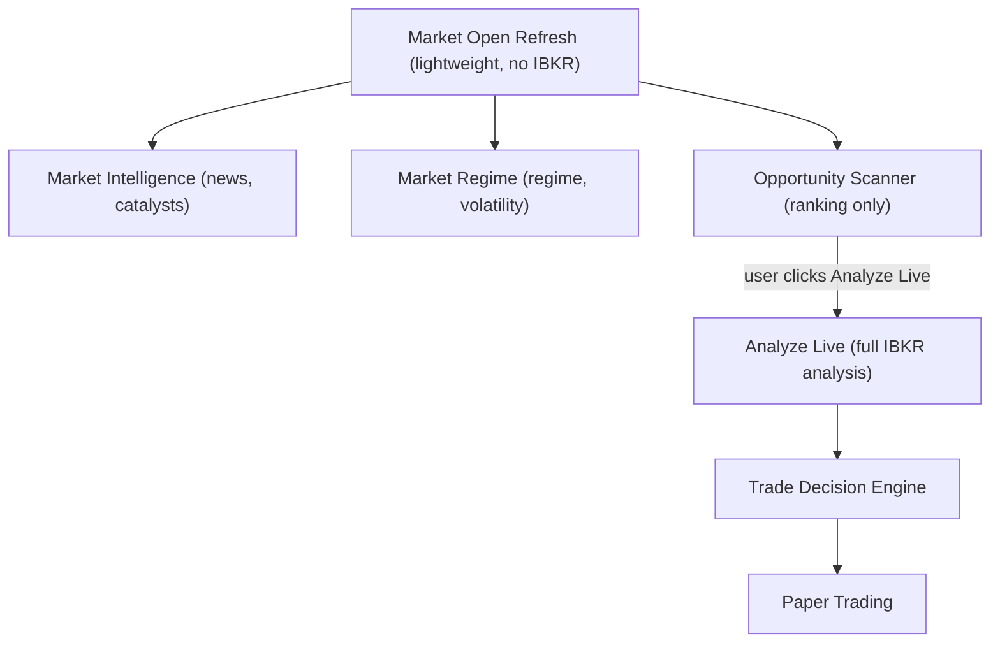

# Billion Dollar — System Pseudocode & Logic Flows

**Last updated:** 2026-07-05  
**Status:** Options alpha research platform (6 tabs + global refresh)  
**Audience:** ChatGPT or any reviewer — paste this file for architecture review without opening the full repo.

**Canonical spec:** `Billion-Dollar-Architecture-Reference.md`  
**User guide:** `README.md`  
**UI SOP (buttons, tables, daily workflow):** `Billion-Dollar-Architecture-Reference.md` §15

---

## 1. System boundaries

### What the app DOES

- Fetch market/options data from IBKR via `qqq_spread_analyzer` CLI (read-only)
- Score bullish/bearish setups and rank spread candidates across multiple expiries
- Classify market regime (Phase 1 on QQQ page; Phase 2 dashboard tab)
- Rank trade decisions with weighted scoring (Trade Decision Engine)
- Track paper trades with optional IBKR position sync
- Fetch and score news via CLI pipeline and Market Intelligence HTTP API (Finnhub, Alpha Vantage, SEC)
- Market Intelligence Center dashboard (`/market-intelligence`)
- Opportunity Scanner: lightweight symbol ranking using news/regime/relative-strength only
- Market Open Refresh: one-click morning workflow (MI + MR + OS — no IBKR)
- AI Report Export: consolidated JSON + Markdown for external analysis

### What the app DOES NOT do

- Place or modify live broker orders (`execution_mode: paper_only`)
- Auto-connect to IB on backend startup
- Use stale technical snapshots for opportunity scoring
- Allow any module except Trade Decision Engine to output final strategy recommendations

---

## 2. Data flow — single source of truth



**Rules:**
- Market Open Refresh = free/cheap (no IBKR, no option chains)
- Analyze Live = expensive (IBKR option chain download + full analysis)
- Only Trade Decision Engine may produce final recommendations (Bull Call / Bear Put / WAIT)
- Opportunity Scanner NEVER downloads option chains or builds spreads

---

## 3. QQQ Spread Analyzer algorithm

**Source:** `qqq_spread_analyzer/src/scoring.py`, `spread_builder.py`, `main.py`

```text
ON analyze(symbol):
  FETCH daily + intraday bars from IBKR (or DuckDB cache)
  COMPUTE indicators: EMA, RSI, MACD, BB, ATR
  COMPUTE support/resistance levels
  SCORE = score_setup(daily, intraday, levels)

# Daily bull checks (max 7)
  close > EMA20, EMA20 > EMA50, EMA50 > SMA200, RSI > 50,
  MACD > signal, MACD expanding, above week high OR near support

# Daily bear checks (max 6)
  close < EMA20, EMA20 < EMA50, RSI < 50, MACD < signal,
  MACD weakening, reject resistance OR break support

# Intraday timing (4 bull, 4 bear each)
  bull: EMA9 > EMA21, close > EMA21, RSI > 50, MACD expanding
  bear: EMA9 < EMA21, close < EMA21, RSI < 50, MACD weakening

IF bull >= 7 AND bear <= 3 AND intraday_bull >= 3:
  bias = Bullish; action = bull_call_spread
ELIF bear >= 6 AND bull <= 4 AND intraday_bear >= 3:
  bias = Bearish; action = bear_put_spread
ELSE:
  bias = Neutral; action = no_trade

RUN ExpirySpreadOrchestrator:
  ExpirySearchEngine → rank expiries across DTE buckets
  SpreadSearchEngine → build + score spreads per valid expiry
  IF zero valid spreads: force_wait = true

WRITE latest_analysis_{symbol}.json
```

---

## 4. Expiry + Spread Search Engine

**Source:** `qqq_spread_analyzer/src/expiry_search_engine.py`, `spread_search_engine.py`, `expiry_spread_orchestrator.py`

```text
DTE_BUCKETS = [
  {7-14},    # aggressive only
  {15-21},   # enabled
  {22-35},   # enabled (default)
  {36-45},   # enabled
  {46-60},   # enabled
]

FUNCTION ExpirySearchEngine.search(chain, config):
  FOR each available expiry in chain:
    IF expiry.dte NOT in any enabled bucket: SKIP
    score = weighted(
      dte_fit: 25%,
      liquidity: 25%,
      strike_availability: 15%,
      bid_ask_quality: 15%,
      event_risk: 10%,
      iv_fit: 10%
    )
    IF score >= threshold: accept
    ELSE: reject with reason
  SORT accepted by score DESC
  RETURN { best_expiry, alternatives, rejected }

FUNCTION SpreadSearchEngine.search(direction, expiries, chain):
  FOR each accepted expiry:
    IF direction == Bullish:
      BUILD bull call spreads (buy delta 0.35-0.45, sell delta 0.20-0.30)
    ELIF direction == Bearish:
      BUILD bear put spreads (buy delta -0.35 to -0.45, sell delta -0.20 to -0.30)
    SCORE each spread: liquidity 30%, delta_fit 20%, risk_reward 20%,
      breakeven 10%, expiry_score 10%, event_risk 10%
  RETURN top 5 spreads across all expiries

FUNCTION ExpirySpreadOrchestrator.run():
  expiry_result = ExpirySearchEngine.search(...)
  spread_result = SpreadSearchEngine.search(...)
  IF spread_result.valid_count == 0:
    force_wait = true
    wait_reason = "No valid spread passed expiry/liquidity/risk filters"
  RETURN { expiry_result, spread_result, force_wait }
```

---

## 5. Market Regime Phase 1 (`marketRegime.ts`)

**Runs client-side on QQQ analysis JSON.**

```text
FUNCTION computeMarketRegime(data):
  daily = data.daily_indicators
  intraday = data.intraday_indicators
  { bull, bear } = countTrendChecks(daily)   # 4 EMA/RSI checks

  trend = bull >= bear ? bull * 10 : -bear * 10
  momentum = daily MACD ±15, expanding ±5, intraday MACD ±5  (clamp -25..+25)
  volatility = BB width + ATR → risk level Low/Medium/High (score 5–14)
  intradayTiming = data.score.intraday_timing_bull * 5
    IF close < intraday.ema21: intradayTiming -= 8
    clamp 0..20

  final = trend + momentum + intradayTiming

  label = classifyRegime(bull, bear, daily, intraday, final)
    # 6 labels: Strong Bull, Bull Pullback, Bull Trend with Momentum Warning,
    #           Sideways, Bear Pullback, Bear Trend

  strategyFilter:
    Bull Call IF bull >= 3 AND RSI > 50 AND close > EMA21 AND intraday MACD bull
    Bear Put IF close < EMA20 AND RSI < 50 AND NOT daily MACD bull AND support break
    ELSE WAIT

  RETURN { label, scores, strategyFilter, confidence, riskLevel, whyBullets }
```

---

## 6. Market Regime Phase 2 (`market_regime_calculator.py`)

**Runs server-side for `/market-regime` dashboard.**

```text
WEIGHTS = { trend: 0.30, momentum: 0.20, volatility: 0.20,
            breadth: 0.15, macro: 0.10, news_catalyst: 0.05 }

ON GET /api/market-regime/latest:
  LOAD analyzer snapshots for QQQ, SPY, IWM, DIA, SMH, SOXX
  breadth_score = MarketBreadthCalculator.compute(...)
  volatility_score = VolatilityRegimeCalculator.compute(vix, qqq_daily)
  macro_score = MacroRiskCalculator.compute()
  news_catalyst_score = CatalystCalendarService.score()

  { bull, bear } = count_trend_checks(qqq_daily)
  trend = scale_to_century(trend_score_signed(bull, bear), -40, 40)
  momentum = scale_to_century(momentum_score_signed(...), -25, 25)

  final = weighted sum of 6 components
  regime_name = classify_regime(final, bull, bear, ...)  # 8 labels
  RETURN dashboard JSON
```

---

## 7. Trade Decision Engine (`tradeDecision.ts`)

**Runs client-side; auto-records to backend on analysis timestamp change.**

```text
DEFAULT_WEIGHTS = {
  trend: 30, momentum: 20, marketRegime: 15, volatility: 10,
  liquidity: 10, riskReward: 5, macro: 5, news: 5, paperStatistics: 5
}

FUNCTION computeTradeDecision(data, analytics?):
  regime = computeMarketRegime(data)
  sub_scores = compute 9 components
  trade_score = weighted sum

  # Expiry Search Engine override
  IF expiry_search.force_wait == true:
    trade_score = min(trade_score, 55)
    final_decision = WAIT
    reason += "No valid spread passed filters"

  final_decision:
    IF trade_score < 50: WAIT
    ELIF top == WAIT AND trade_score < 65: WAIT
    ELSE: top strategy

  RETURN TradeDecisionResult
```

---

## 8. Opportunity Scanner (`opportunity_score_calculator.py`)

**Purpose:** Rank watchlist symbols using lightweight data ONLY. Never downloads option chains.

```text
# Direction Bias axis (bull/bear split) — unchanged by the Part 9 redesign.
DIRECTION_WEIGHTS = {
  news: 0.25,
  regime: 0.20,
  relative_strength: 0.20,
  sector: 0.15,
  catalyst_risk: 0.10,
  paper_feedback: 0.10
}

# Market Opportunity Score axis (Part 9 redesign) — ticker-level magnitude,
# NOT raw articles, NOT direction.
OPPORTUNITY_WEIGHTS = {
  catalyst_strength: 0.30,   # ticker_news_signals.catalyst_strength_score (40 baseline pre-clustering)
  momentum: 0.25,            # max(rel.bull, rel.bear) — magnitude regardless of direction
  regime_fit: 0.20,          # max(regime.bull, regime.bear)
  news_quality: 0.15,        # ticker_news_signals.news_quality_score
  event_timing: 0.05,        # +20 if earnings within window, +15 if a qualifying top catalyst exists
  paper_feedback: 0.05
}

FUNCTION score_symbol(symbol, watchlist_row, news_signal, market_regime, ibkr_available, has_recent_trade_decision, ...):
  # NO technical snapshot in either scoring formula
  bull_raw = weighted sum (DIRECTION_WEIGHTS) of news.bull, regime.bull, rel.bull, sector.bull, ...
  bear_raw = weighted sum (DIRECTION_WEIGHTS) of news.bear, regime.bear, rel.bear, sector.bear, ...
  direction_candidate = "Bullish" if bull >= 70 and bull - bear >= 15
                        else "Bearish" if bear >= 70 and bear - bull >= 15
                        else "Mixed" if bull >= 65 and bear >= 65 and |bull - bear| < 15   # both elevated + tied
                        else "Neutral"

  market_opportunity_score = weighted sum (OPPORTUNITY_WEIGHTS) of catalyst_strength, momentum,
                                                                    regime_fit, news_quality,
                                                                    event_timing, paper_feedback
  # NOTE: risk is reported as its own column, no longer subtracted from the score

  # Technical Confidence (metadata only, NOT in score)
  IF snapshot exists AND age < TECHNICAL_STALE_MINUTES: "Fresh"
  ELIF snapshot exists AND age >= threshold: "Stale"
  ELSE: "Not Evaluated"

  trade_readiness = "Blocked" IF NOT ibkr_available   # checked once per scan, not per-symbol
                    ELSE "Ready" IF technical_confidence == "Fresh" AND has_recent_trade_decision
                    ELSE "Needs Analyze Live"

  top_catalyst = news_signal.top_catalyst ELSE "No high-quality ticker-specific catalyst"

  RETURN {
    market_opportunity_score, catalyst_strength_score, news_quality_score,
    technical_confidence, trade_readiness,
    direction_candidate,  # Bullish/Bearish/Neutral/Mixed
    bull_score, bear_score, top_catalyst, top_risk,
    technical_hint  # "Click Analyze Live" or "Will refresh on Analyze Live"
  }
```

---

## 9. Market Open Refresh (`global_refresh_service.py`)

**Purpose:** One-click morning workflow. Lightweight — no IBKR, no option chains.

```text
POST /api/global/market-open-refresh:
  1. Refresh Market Intelligence (standard mode)
  2. Refresh Market Regime (build dashboard)
  3. Refresh Opportunity Scanner (scan with fresh MI + MR)
  RETURN {
    timestamps: { news_refreshed_at, regime_refreshed_at, scanner_refreshed_at,
                  completed_at, next_recommended_refresh_at },
    modules: [ { module, status, duration_ms, error } ],
    scanner_payload
  }

POST /api/global/analyze-top-n { n: 5 }:
  symbols = top N by market_opportunity_score
  FOR each symbol SEQUENTIALLY:
    RUN full analyzer subprocess (poetry run python -m src.main --symbol X)
    IF IBKR unavailable: STOP, return partial results
  RETURN { completed_symbols, progress }
```

**Stale thresholds (configurable):**
- `TECHNICAL_STALE_MINUTES = 60`
- `NEWS_STALE_MINUTES = 30`
- `REGIME_STALE_MINUTES = 60`
- `SCANNER_STALE_MINUTES = 60`

---

## 10. Analyze Live (auto-run via `?autorun=true`)

```text
ON navigate to /options-spread-strategy?symbol=NVDA&autorun=true:
  1. Page detects autorun=true URL param
  2. Strip param from URL (replaceState)
  3. Auto-trigger handleRun() → POST /api/options-spread-strategy/run
  4. Full IBKR analysis runs:
     - Technical indicators
     - Option chain download
     - Expiry Search Engine
     - Spread Search Engine
     - Trade Decision Engine
  5. Result persisted as latest_analysis_NVDA.json
  6. TDE gives final recommendation
```

---

## 11. News Intelligence pipeline

**Pipeline package:** `backend/news_intelligence/`  
**HTTP orchestration:** `backend/app/services/market_intelligence/`  
**IBKR News:** `backend/app/services/news_intelligence/`

```text
FUNCTION run_news_pipeline(symbols?, from_date?, to_date?, ibkr_news_client?):
  # Step 0: IBKR News (optional, highest priority)
  IF ibkr_news_client is provided:
    available, msg = ibkr_news_client.is_available()
    IF available:
      FOR each symbol (max 5 stocks, no ETFs):
        result = ibkr_news_client.fetch_historical_news(symbol, lookback=10d, max=20)
        normalize → clean metadata tags → deduplicate by article_id
        all_items.extend(normalized_ibkr_items)
      Log fetch result
    ELSE:
      Log "IBKR unavailable — fallback to other providers"
  # Step 1: Finnhub market news
  # Step 2: Finnhub company news per symbol
  # Step 3: Alpha Vantage (max 3 tickers)
  # Step 4: SEC filings (stocks only)
  # Step 5: Score sentiment → classify event → relevance → deduplicate → insert
  RETURN NewsPipelineSummary

IBKR HEADLINE PROCESSING:
  raw_headline → remove {A:...:L:en} metadata tags (regex)
  → normalize into NewsItem(provider="IBKR", source=providerCode)
  → classify_ibkr_event (filing/analyst/earnings/guidance/product/partnership)
  → apply source quality weight (DJ-N=0.95, DJ-RT/DJNL/BRFUPDN=0.90, BRFG=0.85)
  → deduplicate by provider_code + article_id
  → feed into standard pipeline (score_sentiment → enrich_item → deduplicate_items)

PROVIDER PRIORITY (for scoring):
  1. SEC EDGAR (quality=1.00) — authoritative for filings
  2. IBKR DJ-N (quality=0.95) — Dow Jones equity news
  3. IBKR DJ-RT / DJNL / BRFUPDN (quality=0.90) — DJ trader / Briefing analyst
  4. IBKR BRFG (quality=0.85) — Briefing general market
  5. Finnhub (quality=0.70) — fallback news
  6. Alpha Vantage (quality=0.65) — sentiment backup

IBKR NEWS CLIENT (ibkr_news_client.py):
  Library: native ibapi (EClient/EWrapper) — NOT ib_insync
    ib_insync reqHistoricalNews timed out; ibapi callback pattern matches PlayRough/news.py
  Python env: pyenv_global (run_local.sh); dependency ibapi in backend/pyproject.toml
  Client ID: 23 (ibkr_news_client_id) — separate from analyzer 12, paper sync 13

  CLASS _IbkrNewsApi(EWrapper, EClient):
    callbacks: newsProviders, contractDetails, historicalNews, historicalNewsEnd
    ignore info farm codes: 2104, 2106, 2107, 2158

  FUNCTION connect():
    app.connect(host, port, clientId=23)
    start daemon thread app.run()
    sleep(2)

  FUNCTION fetch_providers():
    reqNewsProviders()
    sleep(4)
    RETURN provider codes list

  FUNCTION resolve_con_id(symbol):
    reqContractDetails(1, Contract STK SMART USD)
    sleep(4)
    RETURN conId (cached per symbol)

  FUNCTION fetch_historical_news(symbol, lookback=10d, max=20):
    IF cache hit AND not expired: RETURN cached
    conId = resolve_con_id(symbol)
    providers = first 3 from [BRFG, BRFUPDN, DJ-N, ...] that IBKR reports
    reqHistoricalNews(conId, "BRFG+BRFUPDN+DJ-N", start, end, max)
    sleep(ibkr_news_wait_seconds)  # default 8s — wait for HMDS/news farm
    IF headlines empty:
      RETURN error (do NOT cache)
    dedupe intra-batch by provider_code + article_id
    cache successful result (30 min TTL)
    RETURN IbkrNewsResult

  LIMITS:
    Market Open Refresh: max 5 stock symbols (skip ETFs)
    Sequential only; 0.5s pause between symbols
    Phase 1: headlines only — no reqNewsArticle
```

---

## 11a. Ticker-level news intelligence (news_events / ticker_news_signals)

**Package:** `backend/news_intelligence/` (`news_categories.py`, `ticker_registry.py`, `primary_ticker_detector.py`, `news_clusterer.py`, `ticker_signal_builder.py`) · **Persistence:** `backend/app/repositories/news_events_repository.py`

```text
# Runs after the legacy news_items pipeline (Section 11) on the same
# deduped item list. Best-effort: any failure here is caught and logged,
# never breaks the legacy pipeline.

FUNCTION run_ticker_signal_pipeline(deduped_items, run_symbols, repository):
  FOR each item in deduped_items:
    # 1. Primary ticker resolution (Part 4)
    candidates = dedupe([item.symbol] + item.symbols) excluding "MARKET"
    best_symbol, best_score = argmax_over(candidates,
        compute_primary_ticker_score(item, candidate))
    item.resolved_symbol = best_symbol
    item.primary_ticker_score = best_score        # 0-100

    # 2. Canonical classification (Part 5) — priority order, first match wins
    item.event_category = classify_event_category(item)
      # SEC_FILING > LEGAL_REGULATORY > EARNINGS > GUIDANCE > ANALYST_ACTION
      # > PRODUCT > PARTNERSHIP > M_AND_A > INSIDER_ACTIVITY
      # > INSTITUTIONAL_OWNERSHIP > MACRO > INDUSTRY_SECTOR > GENERAL_MARKET > OTHER
      # EARNINGS requires a strong phrase, not just the word "earnings"

    # 3. New impact score (Part 7), -100..100 scale (separate from legacy news_items.impact_score)
    item.source_quality = source_quality_weight(item)   # SEC=1.00, IBKR DJ-N=0.95, ... Finnhub=0.70, AV=0.65
    item.impact_score_v2 = compute_impact_score(
        sentiment_score, primary_ticker_score, category, source_quality, published_at)
      # = sentiment * (primary_ticker/100) * (importance/100) * source_quality * recency
      # recency: 1.0 for <=24h, linear decay to 0.3 floor at 7 days

  # 4. Clustering (Part 6) — excludes Finnhub GENERAL_MARKET items entirely,
  #    excludes items with primary_ticker_score < 40
  eligible = [i for i in items if not finnhub_general_market(i)
                                 and i.primary_ticker_score >= 40]
  GROUP eligible BY (resolved_symbol, event_category)
  WITHIN each group, merge into a cluster when headline similarity is:
    >= 0.70  (default), OR
    >= 0.55  (only if both items share the same source family, e.g. both IBKR)
  EACH cluster -> one news_events row:
    title = highest primary_ticker_score item's headline
    sentiment_score = primary_ticker_score-weighted average
    importance_score = IMPORTANCE_SCORES[category]
    primary_ticker_score = max across cluster items
    source_quality_score = max across cluster items
    impact_score = cluster item with largest |impact_score_v2|
    confidence = High/Medium/Low from source_count + primary_ticker_score

  # 5. Ticker signal build (Part 7) — one ticker_news_signals row per symbol
  FOR each symbol's clusters:
    qualifying = clusters WHERE primary_ticker_score >= 60   # catalyst threshold
    bullish = qualifying WHERE impact_score > 0
    bearish = qualifying WHERE impact_score < 0
    net_impact_score = clamp(sum(bullish.impact) + sum(bearish.impact), -100, 100)
    news_bias = "Bullish" IF net > +20
              ELSE "Bearish" IF net < -20
              ELSE "Mixed" IF both sides material
              ELSE "Neutral"
    top_catalyst = title of highest-impact bullish qualifying cluster (else null)
    top_risk     = title of lowest-impact bearish qualifying cluster (else null)
    news_quality_score = avg(source_quality_score across ALL clusters) * 100
    UPSERT ticker_news_signals row for symbol

  DELETE+INSERT news_events for (run_symbols UNION resolved cluster symbols)  # idempotent per run
  UPSERT ticker_news_signals rows

CONSUMERS (external dict shape unchanged either way):
  NewsSignalService.signal_for_symbol(sym):
    row = ticker_news_signals[sym]
    IF row exists: RETURN mapped dict (news_score = clamp(50 + net/2, 0, 100), label = news_bias, ...)
    ELSE: RETURN legacy per-item aggregation (as before)

  TradeScoreCalculator.component_scores(analysis, ...):
    row = ticker_news_signals[analysis.symbol]
    news_component = clamp(50 + row.net_impact_score/2, 0, 100) IF row exists
                     ELSE 50.0   # neutral fallback — NOT the old hardcoded 70.0

API: GET /api/market-intelligence/ticker-signals -> all symbols' current rows

  # 6. Optional OpenAI cluster summary (Part 8) — on top of step 5's rule-based sentence
  FOR each symbol's signal:
    qualifying_for_llm = clusters WHERE primary_ticker_score >= 70 AND importance_label IN (Critical, High)
    top 10 BY (importance_score, |impact_score|) DESC
    IF qualifying_for_llm is empty: SKIP (keep step 5's rule-based llm_summary untouched)
    fingerprint = sha256(sorted "{cluster_id}:{impact_score}" for qualifying_for_llm)
    IF fingerprint == cached llm_cluster_hash: REUSE cached llm_summary_json  # never regenerate unchanged clusters
    ELIF OPENAI_API_KEY missing OR request fails:
      llm_summary_json = rule_based_structured_summary(qualifying_for_llm)   # same shape, source="rule_based"
    ELSE:
      llm_summary_json = OpenAI(model=gpt-4o-mini) -> {ticker_summary, bullish_factors, bearish_factors,
                                                        key_catalyst, key_risk, sentiment_label,
                                                        confidence, one_sentence_trade_context}
    llm_summary = llm_summary_json.ticker_summary   # plain string, backward compatible
    llm_cluster_hash = fingerprint

DEFERRED: none — Parts 1-11 of the news/opportunity redesign are implemented
          (ticker-level table UI + drawer, revised Opportunity Scanner columns
          in Part 9 below, and the OpenAI layer above are all live)
```

---

## 12. Paper Trading Lab

```text
POST /api/paper-trading/trades → create trade
POST /api/paper-trading/trades/bulk → bulk create from spread candidates
GET  /api/paper-trading/analytics → win_rate, strategy_breakdown (feeds TDE)
POST /api/paper-trading/mark/{symbol} → mark-to-market after analysis
POST /api/paper-trading/ibkr/sync → merge live positions (client_id 13)
```

---

## 13. AI Report Export (`ai_report_service.py`)

```text
POST /api/ai-report/generate:
  GATHER from all services:
    - Market Regime (cached)
    - Market Intelligence (cached)
    - Opportunity Scanner (cached)
    - Analyzer snapshot (from file)
    - Trade Decision Engine (backend evaluate)
    - Paper Trading analytics
  COMPUTE freshness per module
  DETECT conflicts between modules
  WRITE JSON + Markdown to backend/reports/
  RETURN { status, files, warnings, errors }
```

---

## 14. API route index

```text
GET  /health

# Global Refresh
POST /api/global/market-open-refresh
GET  /api/global/market-open-refresh/status
POST /api/global/analyze-top-n
GET  /api/global/analyze-top-n/status

# Spread analyzer
GET  /api/qqq-spread-analyzer/latest?symbol=
POST /api/qqq-spread-analyzer/run
GET  /api/qqq-spread-analyzer/run/{job_id}
GET  /api/options-spread-strategy/latest?symbol=
POST /api/options-spread-strategy/run
GET  /api/options-spread-strategy/run/{job_id}

# Market regime
GET  /api/market-regime/latest
POST /api/market-regime/refresh
POST /api/market-regime/refresh-all
POST /api/market-regime/save-snapshot
GET  /api/market-regime/history?days=
GET  /api/market-regime/export

# Market Intelligence
GET  /api/market-intelligence/dashboard
POST /api/market-intelligence/refresh
GET  /api/market-intelligence/export
GET  /api/market-intelligence/watchlist
PATCH /api/market-intelligence/watchlist/{symbol}
POST /api/market-intelligence/watchlist/reset
GET  /api/market-intelligence/signal/{symbol}
GET  /api/market-intelligence/ticker-signals

# News Intelligence (QQQ embed)
POST /api/news-intelligence/quick-refresh
GET  /api/news-intelligence/signal/{symbol}

# Trade decision
POST /api/trade-decision/record
GET  /api/trade-decision/recent/{symbol}

# Opportunity Scanner
GET  /api/opportunity-scanner/latest
POST /api/opportunity-scanner/refresh
GET  /api/opportunity-scanner/export
GET  /api/opportunity-scanner/symbol/{symbol}

# AI Report
POST /api/ai-report/generate
GET  /api/ai-report/latest
GET  /api/ai-report/download/{format}

# Paper trading
POST /api/paper-trading/trades
POST /api/paper-trading/trades/bulk
GET  /api/paper-trading/trades
GET  /api/paper-trading/trades/{trade_id}
PATCH /api/paper-trading/trades/{trade_id}
POST /api/paper-trading/trades/{trade_id}/close
GET  /api/paper-trading/summary
GET  /api/paper-trading/analytics
GET  /api/paper-trading/export
POST /api/paper-trading/ibkr/fetch-positions
POST /api/paper-trading/ibkr/refresh-prices
POST /api/paper-trading/ibkr/recalculate
POST /api/paper-trading/ibkr/sync
GET  /api/paper-trading/ibkr/status
POST /api/paper-trading/ibkr/auto-sync
POST /api/paper-trading/mark/{symbol}
```

---

## 15. Frontend page map

```text
/qqq-spread-analyzer
  GlobalTabs, SummaryBar, TradeDecisionEngine, MarketRegimeSummary,
  DailyIndicatorsPanel, IntradayIndicatorsPanel, KeyLevelsPanel,
  ExpiryRankingPanel, SpreadCandidatesTable, OptionChainPanel,
  RiskNotesPanel, BacktestPanel, DiagnosticsPanel

/options-spread-strategy
  Same panels + SymbolSelector (sticky, recent tickers)
  Auto-runs on ?autorun=true

/opportunity-scanner
  Market Open Refresh button + Analyze Top 5 button
  Refresh timestamps bar
  OpportunitySummaryCards, OpportunityFilters,
  OpportunityTable (Market Opportunity + Technical Confidence columns)
  OpportunityDetailDrawer

/paper-trading-lab
  Trade table, create/close, IBKR sync panel, analytics

/market-regime
  Regime summary cards, instrument grid, score breakdown,
  breadth heatmap, volatility, macro, strategy matrix,
  catalyst watch, RegimeHistoryCharts

/market-intelligence
  Header (Quick / Standard / Deep / Export)
  MarketIntelligenceSummaryCards, MarketRegimeContextCard,
  WatchlistManagerTable, CriticalEventsTable, CatalystCalendarTable,
  SecFilingsTable, SentimentAnalyticsPanel, ApiBudgetPanel,
  RefreshActivityLog, NewsSignalOutputPanel
```

---

## 16. Module responsibility boundaries

| Module | Does | Does NOT |
|--------|------|----------|
| Market Intelligence | News, catalysts, earnings, sentiment | Recommend trades |
| Market Regime | Regime score, volatility, breadth | Recommend trades |
| Opportunity Scanner | Rank symbols, direction candidates | Download option chains, build spreads, recommend strategies |
| Options Spread Strategy | Full live analysis, expiry/spread search | Rank multiple symbols |
| Trade Decision Engine | Final recommendation (WAIT / Bull Call / Bear Put) | Run without fresh analysis |
| Paper Trading | Track trades, analytics | Place live orders |

---

## 17. Known gaps

| Gap | Detail |
|-----|--------|
| News → TDE (frontend) | Frontend still uses `risk_notes` regex; backend Python TDE now reads `ticker_news_signals` (neutral-50 fallback, Section 11a) |
| Opportunity Scanner summary buckets | `Mixed` direction rows count toward `summary.neutral_count` in the header card — no separate `mixed_count` bucket yet |
| OpenAI cluster summary cost/quality | Live end-to-end (Section 11a) but unverified against a real `OPENAI_API_KEY` in this environment (sandboxed, no outbound network) — rule-based fallback path is what's actually been exercised |
| IBKR → API budget | Finnhub company-news is now skipped per-symbol once IBKR covers it this run (Section 11a), but budget accounting doesn't reflect the skip |
| IBKR headline quality | Many DJ-N items are market-wide futures columns; primary-ticker scoring now caps/excludes these, but no cross-edition dedup at the IBKR-provider level itself |
| IBKR Phase 2 | No reqNewsArticle full-text fetch yet |
| News → Phase 2 catalyst | Static calendar; not reading `news_items` / `news_events` |
| Phase 2 macro | Yields/DXY stubbed unavailable |
| Phase 2 multi-TF | 15m / 1H / Weekly placeholders |
| Backend TDE mirror | macro/volatility sub-scores still stubbed in Python (news sub-score no longer stubbed) |
| Live earnings calendar | Stub — earnings from news headlines + catalyst stub |

---

## 18. Review checklist (agents)

Before reporting a task done:

```text
[ ] Code + tests pass (if applicable)
[ ] Billion-Dollar-Architecture-Reference.md updated OR N/A
[ ] PSEUDOCODE.md updated OR N/A
[ ] README.md updated if user-facing behavior changed
[ ] No new duplicate architecture/pseudocode files created
[ ] Documented APIs exist in backend/app/main.py
```
